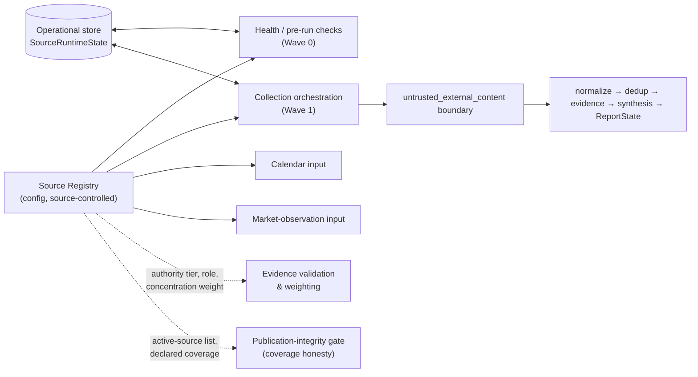
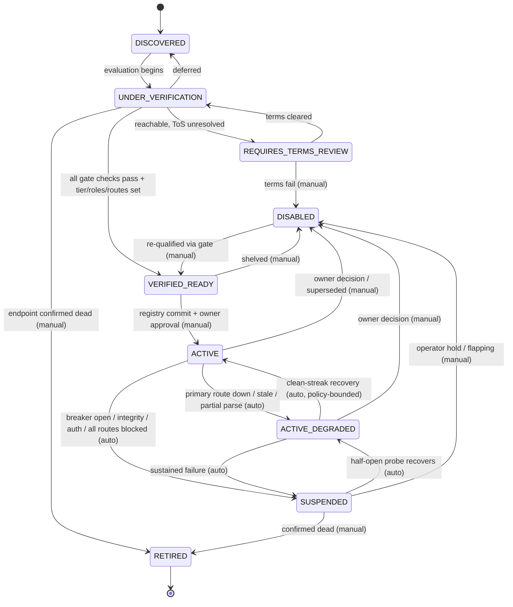

# NQ Premarket Environmental Intelligence Scanner
## Session 3 — Source Registry Architecture
### Deliverables T, U, V, W, X, Y, Z

---

## SESSION SCOPE CONFIRMATION

**Prior sessions read completely:**
- `planning/SESSION_01_ARCHITECTURE_FOUNDATION.md` — full (780 lines; Deliverables
  A–E, unresolved-decision register N.1–N.24, readiness assessment O).
- `planning/SESSION_02_SOURCE_VERIFICATION.md` — full (Deliverables P–S; live
  reachability results for BLS / Reuters / Treasury and the recommended candidate
  source set).

**Recorded Agent Reach commit SHA:** `93ae1d18c37b707dec053c7c4f9d91cd8ef8943d`
(2026-08-12; subject `fix(readme): update sponsor copy`). This session references
Agent Reach only as a **pinned external dependency at that SHA** (Session 1 §D.1,
master prompt Section 4). No Agent Reach code was read or changed this session
beyond what Sessions 1–2 already established.

**Session type:** architecture / planning only. This session:
- writes **no scanner code** and **no Agent Reach modification**;
- creates **no production files** (the only file produced is this planning
  document);
- defines **no database schema, JSON Schema, or YAML instance** — Deliverable X is
  a *logical field inventory* stated in prose and tables, deliberately not
  expressed as DDL / schema / config. Turning it into a concrete schema is a
  later, out-of-scope step;
- **activates no source** and **makes no owner decision** — every tier scheme,
  threshold, and rule below is a *proposal for owner/architect ratification*,
  flagged as such in Deliverable Z.

**Scope (this session):** source registry architecture; authority-tier framework;
source lifecycle states; source activation / deactivation rules; source metadata
requirements; source failure-state classification.

**Out of scope (unchanged from Sessions 1–2):** evidence model, extraction,
clustering, synthesis, directional/regime logic, report state, scheduling
mechanism, storage technology choice, LLM/consensus/market-data providers, and the
actual source list (Session 2 delivered *candidates*; activation remains an owner
decision per N.12 / N.13).

**Master-prompt anchors for this session:** Section 3 (composition preference),
Section 6 (trust boundary; secrets never in logs/reports; never obey content),
Section 8 (source registry + verification gate + `REQUIRES_TERMS_REVIEW` /
`VERIFIED_WORKING` states), Section 13 (source authority tiers, source roles,
source concentration), Section 22 (storage direction), Section 23 (config YAML
file list), Section 27 (retry by criticality tier, circuit breaker), Section 28
(publication-integrity gate; fail-visible), Section 36 (scanner as sibling
package).

**Labels used below:** `DESIGN` (a proposed rule/structure), `REUSE` (leans on a
verified Agent Reach primitive from Session 1), `EVIDENCE` (grounded in a Session
2 live result), `OWNER` (a decision explicitly deferred to the owner/architect).

---

## DELIVERABLE T — SOURCE REGISTRY ARCHITECTURE

### T.1 Purpose and non-purpose

`DESIGN` — The **source registry** is the scanner's single declared inventory of
*where environmental signal comes from* and *how much each source may influence a
report*. It answers, deterministically and before any collection begins:

- which sources exist and how to reach each one (ordered routes);
- what each source is authoritative for, and in what role;
- whether each source is currently permitted in the collection rotation;
- what to do when a source misbehaves.

**The registry is NOT:**

| Not… | Because… |
|---|---|
| Agent Reach's `ALL_CHANNELS` list or any `Channel` subclass | Session 1 §C item 1, §D.1: the `Channel` contract is `check()`-only and buys the scanner nothing; the registry is scanner-owned config, not an AR extension. |
| A reimplementation of `Channel.tier` | Session 1 §C item 18: AR's `tier` means *install-criticality UI grouping*; the registry's authority tier means *how much to trust the content*. Same word, unrelated concepts — see Deliverable U.1. |
| An operational datastore | Declared intent (registry) and observed runtime state (last success, breaker state) are **separated** — see T.3 / X.3. The registry file is source-controlled and human-edited; runtime state lives in the scanner's operational store (Section 22; technology deferred). |
| A discovery engine | Discovery (Exa, calendar crawl) *proposes* candidates; the registry *records* only what a human has evaluated and committed. |
| A secrets store | Routes reference credentials **by handle/name only**, never by value (Session 1 §A.16/§A.17; master prompt Section 6). |

### T.2 Placement and ownership

`DESIGN` — Per Session 1 §E and master prompt Section 23/36, the registry is a
**versioned, scanner-owned configuration artifact**, outside `agent_reach/`:

- Primary file: `config/source_registry.yaml` (one entry per source).
- Supporting files (Section 23 list): `authority_tiers.yaml` (tier definitions and
  per-tier capability caps — Deliverable U), `source_roles.yaml` (role vocabulary
  — U.5).
- Loaded and validated by a scanner module (`nq_scanner.registry`, Session 1 §D.2)
  that produces immutable in-memory `SourceDefinition` objects for the run.
- **Changed only by pull request**, reviewed, with owner approval recorded in the
  commit (Deliverable W.2). The scanner process **never writes** the registry
  file.

### T.3 Object model (logical — not a schema)

`DESIGN` — Three logical objects, deliberately separated by *who writes them* and
*how often they change*:

| Object | Written by | Lives in | Mutability | Purpose |
|---|---|---|---|---|
| **`SourceDefinition`** | humans, via PR | `config/source_registry.yaml` | changes on commit only | declared identity, authority, roles, routes, declared lifecycle state, metadata (Deliverable X.1) |
| **`RouteDefinition`** (0..n per source, ordered) | humans, via PR | nested in the source entry | changes on commit only | one concrete way to reach the source: kind, endpoint/template, auth handle, parser handle, robustness class, `expected_to_fail` flag, per-route timeout, priority (Deliverable X.2) |
| **`SourceRuntimeState`** (1 per source, 1 per route) | the scanner, automatically | operational store (Section 22) | changes every run | observed reachability: last attempt/success, consecutive failures, breaker state, last error class, staleness, rolling success rate, last content hash, last integrity result (Deliverable X.3) |

At load, the registry module **reconciles** declared state with runtime state
(T.7 / V.5): the *declared* state is a ceiling (a source declared `DISABLED` can
never run, whatever the runtime store says); the *observed* state can only lower a
source from `ACTIVE` toward `ACTIVE_DEGRADED` / `SUSPENDED` for the current run.

### T.4 Identification and namespacing

`DESIGN` —
- Every source has a **stable, immutable `source_id`** (e.g.
  `fed.press.monetary`, `bls.api.cpi`, `treasury.press.releases`). Never reused,
  never re-pointed at a different underlying source; retiring a source retires its
  id permanently (mirrors Session 2's treatment of the dead Reuters feed).
- Every route has a `route_id` unique within its source (e.g.
  `bls.api.cpi/structured_api`, `bls.api.cpi/jina_narrative`).
- Sources carry an **`issuer_family`** key (`FEDERAL_RESERVE`, `BLS`, `BEA`,
  `US_TREASURY`, …) used for source-concentration grouping (U.6) so that three Fed
  feeds do not count as three independent corroborators.

### T.5 Grouping dimensions

`DESIGN` — A source entry is classified along **five orthogonal axes**; the
registry indexes on all five:

| Axis | Values (proposed) | Used by |
|---|---|---|
| **Issuer family** | `FEDERAL_RESERVE`, `BLS`, `BEA`, `US_TREASURY`, `EXCHANGE`, `WIRE`, `RESEARCH`, `OPEN_WEB`, … | concentration limits (U.6), coverage reporting |
| **Authority tier** | Tier 1 – Tier 4 (Deliverable U.2) | evidence weighting, confidence caps, "sole support" eligibility |
| **Role** | `PRIMARY`, `CORROBORATING`, `CONTRADICTION_SEEKING`, `CALENDAR`, `MARKET_OBSERVATION` (U.5) | collection orchestration, contradiction search |
| **Coverage domain** | evidence categories, e.g. `MONETARY_POLICY_RATES`, `INFLATION`, `LABOR`, `GROWTH_ACTIVITY`, `TREASURY_SUPPLY`, `RISK_SENTIMENT` | gap detection, cluster routing (Session 1 §D.2 evidence stages) |
| **Cadence class** | `EVENT_DRIVEN`, `SCHEDULED_RELEASE`, `DAILY`, `INTRADAY` + a reference to the authoritative schedule (e.g. the verified BLS / BEA / FOMC calendars from Session 2 Q) | polling orchestration, staleness evaluation (Y.2 `CONTENT_STALE`) |

### T.6 Relationship to adjacent subsystems

`DESIGN` — The registry is an **input** to, and never a consumer of, the
downstream pipeline:

- **Health / Wave 0** consults the registry for the active set and consults the
  operational store for breaker state; it uses `probe.probe_command` (`REUSE`,
  Session 1 §A.13/§A.21, item 33) for half-open recovery probes.
- **Evidence validation** reads authority tier + role + concentration weight from
  the registry to bound how much a claim from that source can move a conclusion
  (Deliverable U.3; Session 1 §D.2 "Evidence validation").
- **Publication-integrity gate** (Section 28; Session 1 §C item 34) reads the
  active set and each source's declared coverage domains so it can state
  *honestly* which domains had no working source this run (Deliverable W.5).

### T.7 Loading and the validation gate

`DESIGN` — Registry load is **pure, deterministic, and fail-closed at the entry
level, fail-safe at the file level**:

1. Parse `config/source_registry.yaml`. A malformed file → the run aborts before
   collection (there is no safe default source set).
2. For each entry, run deterministic validation (no network, no LLM):
   - `schema_version` present and supported;
   - `source_id` unique, well-formed, immutable-shaped;
   - authority tier ∈ the closed vocabulary in `authority_tiers.yaml`;
   - every role ∈ `source_roles.yaml`;
   - ≥1 `RouteDefinition`, each with a recognised `kind`, a per-route timeout, and
     a priority; at least one route not flagged `expected_to_fail`
     (a source whose *every* route is expected to fail cannot be `ACTIVE`);
   - every route URL/template passes
     `agent_reach.utils.url.normalize_public_http_url` (`REUSE`, Session 1
     §A.15) — scheme allowlist, no userinfo, host not on the blocklist, literal
     IPs must be `is_global`;
   - credential references are handles, not values; no substring matches the
     secret-shaped patterns from Session 1 §A.17;
   - declared lifecycle state ∈ the vocabulary in Deliverable V.1, and consistent
     (e.g. `ACTIVE` requires `terms_review_status = CLEARED` and an
     `owner_approval_ref`).
3. A single **invalid entry is dropped (rendered inert) with a logged reason
   code** — it never silently becomes active, and it never crashes the whole
   load. The count of dropped entries is surfaced to the publication-integrity
   gate.
4. Output: an immutable list of validated `SourceDefinition` objects for the run.

### T.8 Change management

`DESIGN` / `OWNER` —
- Registry edits are PRs; the diff is reviewed for id stability, tier justification,
  route correctness, and terms status.
- **Activation (any transition into `ACTIVE`) requires an explicit owner approval
  reference in the entry** (W.1) — the reviewer confirms the source passed the
  verification gate (V.6) and the terms review (N.13).
- The scanner may propose changes (e.g. emit a "candidate discovered" record from
  the Exa adapter) but **only a committed file change activates anything**.
- `schema_version` is bumped on any breaking change to the entry shape; the loader
  refuses unknown future versions rather than guessing.

---

## DELIVERABLE U — AUTHORITY-TIER FRAMEWORK

### U.1 Disambiguation from Agent Reach `Channel.tier`

`DESIGN` — **These are different concepts and must be named differently in code
and docs** (Session 1 §C item 18):

| | AR `Channel.tier` | Registry **authority tier** |
|---|---|---|
| Means | how important is installing this channel (UI grouping in `doctor`) | how much do we trust *content* obtained from this source |
| Owner | Agent Reach | the scanner |
| Values | AR-internal grouping | Tier 1–4 (below) |
| Used for | install diagnostics ordering | evidence weighting, confidence caps, sole-support eligibility, concentration |

The scanner shall use the term **`authority_tier`** (never bare `tier`) for its
own concept.

### U.2 Tier definitions (proposed — `OWNER` to ratify)

`DESIGN` — Authority reflects **proximity to the system of record** and
**editorial independence/accountability**, not popularity:

| Tier | Name | Definition | Session 2 examples |
|---|---|---|---|
| **Tier 1** | **Primary official issuer / system of record** | The body that *creates* the datum or statement. Government statistical agencies for their own series; the central bank for its own policy communications; the exchange/clearer for its own prices; Treasury for its own auctions/debt. | Fed `press_monetary.xml` + release text; BLS Public Data API (CPI, payrolls, unemployment); BEA news RSS (PCE, GDP); TreasuryDirect auction API; Treasury Fiscal Data API; Fed FOMC calendar |
| **Tier 2** | **Official-adjacent / official secondary** | Officially sanctioned mirrors, regional arms, or mandated industry bodies that restate or aggregate Tier-1 output without independent editorial reinterpretation. | (none activated in Session 2) e.g. a regional Federal Reserve Bank restating national data; an official data mirror; a self-regulatory body's official statistics |
| **Tier 3** | **Independent reputable reporting** | Established news wires, financial press, and named professional research with editorial accountability and a correction process — *reporting on* Tier-1 events, not creating them. | Reuters (see U.4 — retrieval currently impossible), and peers |
| **Tier 4** | **Discovery / open web** | Search-surfaced pages, blogs, forums, social-adjacent content, aggregators of unknown provenance. Leads and sentiment texture only. | Exa result pages not resolving to a higher tier |

**Authority is assigned per `(source, route, claim_type)` where it varies**, not
once globally. Example (Session 2): BLS is Tier 1 both for the CPI *number* (via
`api.bls.gov`) and for the release *narrative* (via Jina) — but the number route
is robust and the narrative route is retrieval-fragile. Authority and reliability
are **separate axes** (U.3 note).

### U.3 Per-tier capability matrix (proposed — `OWNER` to ratify the caps)

`DESIGN` — What a source of each tier is *permitted to do* in the evidence and
synthesis stages:

| Capability | Tier 1 | Tier 2 | Tier 3 | Tier 4 |
|---|---|---|---|---|
| May be the **sole support** for an evidence cluster | Yes | Yes (if Tier-1 origin cited) | No — needs ≥1 independent corroborator | No |
| May **drive directional / regime assessment** | Yes | Yes | Contributory only | No — excluded from the deterministic inputs |
| May be **quoted verbatim** in the report | Yes (retrieval must be clean — see integrity, Y.2) | Yes | Yes, attributed | No |
| Counts toward **source-concentration** limits | Yes (by issuer family, U.6) | Yes | Yes | Not counted as coverage; tracked separately |
| **Confidence contribution cap** (per Section 18 / Session 1 §D.2 "Confidence validation") | full | full | reduced | none (informational) |
| Eligible for **contradiction-seeking** role | Yes | Yes | Yes | Yes (leads only) |

`DESIGN` note — three distinct axes, tracked separately, never collapsed:
- **Authority** (this deliverable): trust in the *content*.
- **Reliability** (Deliverable X.2 `robustness_class` + X.3 rolling success):
  trust that we can *obtain* it. Session 2's "DEGRADED" is a reliability state,
  not an authority downgrade.
- **Integrity** (Deliverable Y.2 `INTEGRITY_FAILURE`): was *this* retrieval clean
  and verifiable.

### U.4 Reuters and the "high authority, zero reachability" case

`EVIDENCE` — Session 2 §P.2: Reuters has no machine feed and both retrieval paths
(direct, Jina) fail. Framework treatment:

- Reuters would be **Tier 3** on authority.
- Its lifecycle state is **`DISABLED`** (U.5/V.1) with reason
  `NO_VIABLE_ROUTE` — not `RETIRED` (the organisation exists; only our access is
  gone) and not `ACTIVE_DEGRADED` (there is no working route to degrade *from*).
- If ever revisited: permitted only as a **Tier-4-effective** discovery lead via
  the Exa adapter (title + snippet only, no retrieval, never sole support),
  pending an N.13 terms review. The registry records the intended Tier-3 authority
  but the capability matrix applies the effective Tier-4 constraints while no
  first-party route exists.

### U.5 Source roles (orthogonal to tier)

`DESIGN` — From `source_roles.yaml` (Section 13; Session 1 §E). A source has one
or more roles; role governs *when in the pipeline it is used*, tier governs *how
much its content counts*:

| Role | Meaning | Notes |
|---|---|---|
| `PRIMARY` | a source the run actively depends on for a coverage domain | absence → coverage gap flagged by the gate |
| `CORROBORATING` | used to confirm/deny a claim already gathered | a Tier-3 `CORROBORATING` source can satisfy the "independent corroborator" requirement for a Tier-3 `PRIMARY` claim |
| `CONTRADICTION_SEEKING` | queried specifically for counter-evidence (Session 1 §C item 22, via the Exa adapter) | may be Tier 4 |
| `CALENDAR` | supplies event schedule / lifecycle (FOMC, BLS, BEA calendars) | feeds calendar intelligence; cadence-critical |
| `MARKET_OBSERVATION` | delayed public market data (Session 1 §D.2 "Market observations") | provider undecided (N.16–19); registry shape still applies |

### U.6 Source concentration

`DESIGN` / `OWNER` (numeric limits) — Section 13; Session 1 §C item 19. To prevent
an apparent "many sources agree" that is really one issuer echoed:

- Concentration is computed **per `issuer_family`, not per `source_id`**. The
  three Session 2 Fed entries (`press_monetary`, `press_all`, FOMC calendar) form
  **one** family for concentration purposes.
- Tier 1/2 restatements of the *same underlying release* collapse to one
  concentration unit (a BEA PCE RSS item and the BEA release page are one).
- Proposed (for ratification): a single evidence cluster should not derive >X% of
  its weight from one issuer family; a report whose active `PRIMARY` sources span
  fewer than N issuer families is flagged `LIMITED_SOURCE_DIVERSITY` by the gate.
  X and N are `OWNER` decisions, deferred (needs the run-budget context, N.14/15).

### U.7 Tier assignment procedure

`DESIGN` / `OWNER` — Tier is assigned by the owner/architect at registry-entry
authoring time, justified in the PR description, and recorded in the entry
(`authority_tier` + `authority_rationale`). It is **not** inferred by the scanner
at runtime. Re-tiering is a registry PR. This session assigns *proposed* tiers to
the Session 2 candidates (Deliverable X.7) but ratification is deferred.

---

## DELIVERABLE V — SOURCE LIFECYCLE STATES

### V.1 State vocabulary

`DESIGN` — Closed set. `REQUIRES_TERMS_REVIEW` and `VERIFIED_*` map to Section 8's
named states; the rest refine them.

| State | Meaning | In collection rotation? |
|---|---|---|
| `DISCOVERED` | known to exist (proposed by discovery or by a human); not yet evaluated | No |
| `UNDER_VERIFICATION` | the verification gate (V.6) is in progress | No |
| `REQUIRES_TERMS_REVIEW` | technically reachable, but automation permissibility / ToS is unresolved (Section 8; N.13) | No |
| `VERIFIED_READY` | passed every gate check *and* has an authority tier + roles + routes assigned; awaiting activation | No |
| `ACTIVE` | in the rotation; all preconditions hold (W.1) | Yes |
| `ACTIVE_DEGRADED` | in the rotation, but a known route/quality problem is present (primary route down, staleness, partial parse) — Session 2's "DEGRADED" | Yes (with caveats propagated downstream) |
| `SUSPENDED` | temporarily removed from rotation by the scanner (breaker open) or by an operator hold | No (auto half-open probes continue) |
| `DISABLED` | deliberately off: terms failure, owner decision, no viable route, superseded | No |
| `RETIRED` | permanently gone: endpoint confirmed dead / officially discontinued (e.g. Reuters RSS) | No (terminal) |

### V.2 State diagram

### V.3 Transition criteria

| From → To | Trigger | Who | Evidence required |
|---|---|---|---|
| `DISCOVERED → UNDER_VERIFICATION` | a human starts evaluation | manual | — |
| `UNDER_VERIFICATION → REQUIRES_TERMS_REVIEW` | ≥1 route reachable from the production host, but ToS/automation stance unclear | manual | reachability note (à la Session 2 §P) |
| `REQUIRES_TERMS_REVIEW → UNDER_VERIFICATION` | terms reviewed and permissible | manual | recorded terms determination + reference |
| `* → VERIFIED_READY` | full verification gate passes (V.6) | manual | completed gate checklist attached to the PR |
| `VERIFIED_READY → ACTIVE` | registry commit with `owner_approval_ref` | manual (owner) | the commit itself |
| `ACTIVE → ACTIVE_DEGRADED` | failure class in {`RATE_LIMITED` persistent, `FEED_MALFORMED` under threshold, `CONTENT_STALE`, `PARTIAL_RESULT`, primary route down but a fallback works} (Y.2) | auto | runtime-state counters |
| `ACTIVE_DEGRADED → ACTIVE` | K consecutive fully-clean collection cycles on the primary route (K = `OWNER`) | auto | rolling success counters |
| `ACTIVE / ACTIVE_DEGRADED → SUSPENDED` | circuit breaker opens (consecutive failures ≥ tier threshold, Section 27) **or** `INTEGRITY_FAILURE` **or** `AUTH_FAILURE` **or** every route `ACCESS_BLOCKED` | auto | breaker state |
| `SUSPENDED → ACTIVE_DEGRADED` | half-open probe (`probe.probe_command`) succeeds after the cool-down window | auto | probe result |
| `SUSPENDED → DISABLED` | operator hold, or flap count over threshold in a rolling window | manual | operator note / flap metric |
| `* → DISABLED` | terms failure, owner decision, `NO_VIABLE_ROUTE`, superseded-by | manual | reason code + reference |
| `* → RETIRED` | `ENDPOINT_DEAD` confirmed by a human (NXDOMAIN, sustained 404, discontinuation notice) | manual | the confirming evidence |
| `DISABLED → VERIFIED_READY` | re-qualified through the gate | manual | fresh gate checklist |

### V.4 Automatic vs manual — the governance line

`DESIGN` — This is the core control that keeps the restrictions ("no source
activation", "no owner decisions") enforceable in the running system:

- **The scanner may only ever *demote*** a source automatically:
  `ACTIVE → ACTIVE_DEGRADED → SUSPENDED`, and may auto-recover **only as far back
  as `ACTIVE_DEGRADED`** (via half-open probe) or all the way to `ACTIVE` **only**
  on a clean-streak of K cycles.
- **Every promotion into the rotation from outside it** — `VERIFIED_READY → ACTIVE`,
  `DISABLED → *`, `SUSPENDED → DISABLED/RETIRED` — is **manual**, backed by a
  registry commit or an explicit operator action.
- The scanner **never edits the registry file** and **never invents a source**.
- Whether `ACTIVE_DEGRADED → ACTIVE` full auto-recovery is allowed at all, or must
  be operator-confirmed, is an `OWNER` decision (Z.5).

### V.5 Declared vs observed state reconciliation

`DESIGN` — At load (T.7 step + here):
- `declared_state` comes from the registry file; `observed_state` from the
  operational store.
- **Effective state = min(declared ceiling, observed floor)** on the
  active→degraded→suspended axis: a source declared `ACTIVE` but with an open
  breaker in the store runs this cycle as `SUSPENDED`; a source declared
  `DISABLED`/`RETIRED` is inert regardless of the store.
- If the store has **no record** for an `ACTIVE` source (first run, or store
  reset), it starts `ACTIVE` and the first cycle establishes a baseline.
- Reconciliation is deterministic and logged; the resolved effective state per
  source is passed to the publication-integrity gate.

### V.6 The verification gate (checklist to reach `VERIFIED_READY`)

`DESIGN` — Every item must be satisfied and recorded (Session 2 §P/§Q are worked
precedents):

1. **Reachability** — ≥1 route returns valid content **from the production host**
   (not only from a dev/CI environment — the Session 2 environment caveat).
2. **Route robustness recorded** — each route classified (X.2
   `robustness_class`); at least one non-`expected_to_fail` route exists.
3. **Data shape confirmed** — structured series / feed items / page structure
   documented; a parser/normalizer handle identified.
4. **Cadence & schedule** — cadence class set; authoritative schedule reference
   linked (e.g. the verified BLS/BEA/FOMC calendars).
5. **Dedup key strategy** — GUID / canonical URL / content hash / slug-diff chosen
   (Session 1 §C item 15; Session 2 noted Treasury press needs slug-diff).
6. **Terms review** — `terms_review_status ∈ {CLEARED, NOT_REQUIRED}` with a
   reference (N.13).
7. **Authority tier + rationale** assigned (Deliverable U).
8. **Roles** assigned (U.5).
9. **Credential need** identified; if any, the credential handle exists and is
   resolvable without embedding a secret (Session 1 §A.16/17).
10. **Failure expectations** — known failure modes pre-recorded from verification
    (feeds Deliverable Y; e.g. "direct route 403, use Jina", "unregistered quota
    429 risk").
11. **Owner approval reference** — present for the subsequent `→ ACTIVE` commit.

---

## DELIVERABLE W — SOURCE ACTIVATION / DEACTIVATION RULES

### W.1 Activation preconditions (all must hold)

`DESIGN` — A source may enter `ACTIVE` only when:

1. `declared_state = VERIFIED_READY` with a complete V.6 checklist;
2. `terms_review_status ∈ {CLEARED, NOT_REQUIRED}`;
3. `authority_tier` and ≥1 `role` assigned;
4. ≥2 routes **or** 1 route with `robustness_class ∈ {STRUCTURED_API, NATIVE_FEED}`
   (a single fragile route is not enough to activate — Session 2's Treasury-press
   case activates as `ACTIVE_DEGRADED`-eligible only, never clean `ACTIVE`, until a
   second/robust route exists);
5. a dedup strategy is set;
6. an `owner_approval_ref` is recorded in the activating commit.

### W.2 Activation mechanism

`DESIGN` — Activation is a **reviewed change to `config/source_registry.yaml`**
setting `declared_state: ACTIVE`. The scanner adopts it on the next registry load.
There is **no runtime "enable source" path**, no CLI toggle that mutates the file,
no API. This makes "no source activation" auditable: activation == a specific
commit by a specific person.

### W.3 Deactivation triggers

| Target state | Trigger (any) | Auto / manual |
|---|---|---|
| `ACTIVE_DEGRADED` | primary route failing while a fallback still works; `CONTENT_STALE` past expected cadence; `PARTIAL_RESULT`; `FEED_MALFORMED` rate below the suspend threshold; persistent `RATE_LIMITED` | **auto** |
| `SUSPENDED` | circuit breaker opens (consecutive failures ≥ criticality-tier threshold, Section 27); **all** routes `ACCESS_BLOCKED`; `AUTH_FAILURE`; `INTEGRITY_FAILURE`; `FEED_MALFORMED`/`PARSE_ERROR` rate above threshold; `ENDPOINT_MOVED` | **auto** (except `ENDPOINT_MOVED` may need a manual registry fix to leave) |
| `DISABLED` | terms review fails; owner decision; `NO_VIABLE_ROUTE` (Reuters); superseded by another source; repeated flapping (SUSPENDED↔recover over threshold) | **manual** |
| `RETIRED` | endpoint confirmed permanently dead / officially discontinued | **manual** |

### W.4 Recovery / re-activation

`DESIGN` / `OWNER` (window/streak values) —
- **Circuit breaker** (scanner-owned; AR has none — Session 1 §A.22): per-route
  `closed → open → half-open`. On `open`, the route is skipped for a cool-down
  window (length scales with consecutive-failure count, capped). On window
  expiry, one **half-open probe** runs (side-effect-free GET; reuse the
  `probe.probe_command` discipline — fixed args, timeout, no retry — Session 1
  §A.21/§A.13).
- Probe success → route `half-open → closed`; source `SUSPENDED → ACTIVE_DEGRADED`.
- After **K** consecutive fully-clean collection cycles on the (now-closed)
  primary route → `ACTIVE_DEGRADED → ACTIVE` (or hold at `ACTIVE_DEGRADED` pending
  operator confirmation — `OWNER` choice, Z.5).
- Probe failure → back to `open`, next (longer) cool-down.
- **Flap guard:** N SUSPENDED↔recover cycles within a rolling window →
  auto-hold at `SUSPENDED` and raise an operator alert; leaving requires manual
  action (prevents a broken source thrashing the rotation).

### W.5 Effect of deactivation on evidence and reporting

`DESIGN` — Deactivation is **never silent** and **never retroactive**:

- Evidence already collected and persisted from a now-inactive source is **kept**
  (with its original retrieval timestamp and integrity result); it ages out only
  by the normal retention/expiration policy (Section 1 §O — every evidence/report
  object already carries an expiration).
- For the **current run**, an inactive source that is `PRIMARY` for a coverage
  domain makes that domain **under-covered**; the publication-integrity gate
  (Section 28) must render this explicitly in the report's coverage section
  (e.g. `LABOR: no active primary source (bls.api.payrolls SUSPENDED —
  RATE_LIMITED)`), not emit a confident report as if coverage were complete.
- If deactivation drops active `PRIMARY` issuer-family diversity below the floor
  (U.6), the gate raises `LIMITED_SOURCE_DIVERSITY` and the run's max confidence
  is capped (Section 18 linkage).

### W.6 Guardrails

`DESIGN` —
- **No whole-tier cascade:** an incident that trips many sources at once (e.g. the
  scanner's own network down) must not auto-`DISABLED` a tier; sources go
  `SUSPENDED` (recoverable), and a "many simultaneous suspensions" condition
  raises one operator alert instead of N.
- **Minimum-viable-source floor:** if the active set for a run has zero working
  `PRIMARY` sources overall, the run produces a **degraded/error report**
  (Section 28; Session 1 §D.3 "fail" branch), not an empty-but-confident one.
- **Every automatic transition carries a stable reason code** (Y.5), timestamped
  America/New_York (Session 1 §C item 14), scrubbed via
  `utils.text.scrub_url_credentials` before it is logged or surfaced (Session 1
  §A.17).
- **Determinism:** activation/deactivation logic is pure given (registry, runtime
  store, clock); no LLM, no nondeterministic input.

---

## DELIVERABLE X — SOURCE METADATA REQUIREMENTS

> **Not a schema.** The following is a *logical field inventory* — what
> information must exist for the registry to function. It is intentionally not
> expressed as YAML/JSON-Schema/DDL. Types are described, not declared.

### X.1 `SourceDefinition` — required fields (declared; registry file)

| Field | Description | Rule |
|---|---|---|
| `schema_version` | registry entry shape version | loader rejects unknown versions |
| `source_id` | stable unique id (`fed.press.monetary`) | immutable; never reused |
| `display_name` | human label | — |
| `issuer_family` | concentration-grouping key (U.4/U.6) | closed vocabulary |
| `authority_tier` | Tier 1–4 (U.2) | from `authority_tiers.yaml` |
| `authority_rationale` | one-line justification | required when tier ≠ default for the family |
| `roles` | ≥1 of the U.5 vocabulary | from `source_roles.yaml` |
| `coverage_domains` | ≥1 evidence category (T.5) | closed vocabulary |
| `cadence_class` | `EVENT_DRIVEN` / `SCHEDULED_RELEASE` / `DAILY` / `INTRADAY` | — |
| `schedule_ref` | pointer to the authoritative calendar for staleness eval | required if `SCHEDULED_RELEASE` / `EVENT_DRIVEN` |
| `routes` | ordered list of `RouteDefinition` (X.2), ≥1 | ≥1 non-`expected_to_fail` for `ACTIVE` |
| `dedup_strategy` | `GUID` / `CANONICAL_URL` / `CONTENT_HASH` / `SLUG_DIFF` / `SERIES_PERIOD` | — |
| `declared_state` | lifecycle state (V.1) | consistency-checked at load |
| `terms_review_status` | `NOT_REQUIRED` / `PENDING` / `CLEARED` / `FAILED` | `ACTIVE` needs `CLEARED`/`NOT_REQUIRED` |
| `terms_review_ref` | link/id to the determination | required unless `NOT_REQUIRED` |
| `owner_approval_ref` | approval reference for activation | required for `declared_state: ACTIVE` |
| `known_failure_modes` | pre-recorded from verification (feeds Y) | free list of reason codes + notes |
| `supersedes` / `superseded_by` | id links for lineage | optional |
| `created_at` / `updated_at` / `last_verified_at` | provenance, America/New_York | `last_verified_at` gates staleness of the verification itself |

### X.2 `RouteDefinition` — required fields (declared; nested)

| Field | Description | Rule |
|---|---|---|
| `route_id` | unique within the source | — |
| `kind` | `STRUCTURED_API` / `NATIVE_RSS` / `NATIVE_ATOM` / `INDEX_PAGE` / `JINA_READER` / `FILE_DROP` | closed vocabulary |
| `endpoint` or `url_template` | concrete endpoint or parameterised template | must pass `utils.url.normalize_public_http_url` at load |
| `params` | fixed query/params (e.g. BLS `startyear`/`endyear`) | values are config, never derived from fetched content |
| `auth` | `NONE` or a **credential handle** (name only) + mechanism | never a secret value (Session 1 §A.16/17) |
| `expected_content_type` | `application/json`, `application/rss+xml`, `text/html`, … | mismatch → `FEED_MALFORMED` (Y.2) |
| `parser_ref` | handle to the normalizer for this route/kind | — |
| `robustness_class` | `STRUCTURED_API` > `NATIVE_FEED` > `INDEX_PAGE` > `PROXY_OF_BLOCKED` (Session 2 §R ranking) | informs W.1 precondition 4 |
| `expected_to_fail` | boolean — a route kept for completeness but known-blocked (direct `www.bls.gov`) | a source of all-`true` routes cannot be `ACTIVE` |
| `timeout_s` | per-route timeout | ≤ the run's per-item budget (Session 1 §O risk 1: `transcribe` 1800s ≫ 25-min budget → scanner sets its own tighter cap) |
| `priority` | integer order; lower = tried first | primary route = lowest |

### X.3 `SourceRuntimeState` — observed fields (operational store, NOT the registry)

`DESIGN` — Written by the scanner each cycle; per source and per route:

`last_attempt_at`, `last_success_at`, `consecutive_failures`,
`rolling_success_rate` (windowed), `breaker_state` (`CLOSED`/`OPEN`/`HALF_OPEN`),
`breaker_opened_at`, `cooldown_until`, `last_error_class` (Y.2), `last_reason_code`
(Y.5), `staleness` (now − last new item vs expected cadence), `last_content_hash`,
`last_integrity_result`, `flap_count_window`.

### X.4 Derived (computed at load/run, stored nowhere)

`effective_state` (V.5), `in_rotation` (bool), `active_route` (first route whose
breaker is not `OPEN` and not `expected_to_fail`), `concentration_weight` (U.6),
`coverage_contribution` (which domains this source currently covers).

### X.5 Field-level rules

- `source_id` / `route_id` immutable once committed.
- Every URL/template re-validated through `utils.url.normalize_public_http_url` at
  **load** and the resolved address re-checked at **fetch** time (Session 1
  §A.15 DNS-rebinding gap → scanner adds connect-time re-validation for any route
  it fetches directly rather than via `WebChannel.read`).
- Secrets referenced by handle only; any literal secret-shaped string in the
  registry fails validation (Session 1 §A.17 pattern set).
- All timestamps America/New_York (Session 1 §C item 14).
- All enumerations closed and versioned with `schema_version`.

### X.6 Progressive metadata (what's needed at each stage)

| To reach… | Minimum metadata |
|---|---|
| `DISCOVERED` | `source_id`, `display_name`, `issuer_family`, a candidate URL, why it's interesting |
| `VERIFIED_READY` | everything in X.1 + X.2 with the V.6 checklist complete |
| `ACTIVE` | X.1/X.2 complete + `terms_review_status` cleared + `owner_approval_ref` + W.1 route-robustness precondition |

### X.7 Worked examples (prose — not config)

`EVIDENCE` — three Session 2 candidates expressed as metadata:

**1. `fed.press.monetary`** — issuer_family `FEDERAL_RESERVE`; authority_tier
**Tier 1**; roles `PRIMARY`, (feeds) `CALENDAR` via a sibling; coverage
`MONETARY_POLICY_RATES`; cadence `EVENT_DRIVEN`, schedule_ref = FOMC calendar;
routes: `[ {route_id: rss, kind: NATIVE_RSS, endpoint:
federalreserve.gov/feeds/press_monetary.xml, robustness: NATIVE_FEED, priority 0},
{route_id: jina_fulltext, kind: JINA_READER, url_template:
r.jina.ai/https://www.federalreserve.gov/{item_path}, robustness:
PROXY_OF_BLOCKED→(actually direct works too), priority 1} ]`; dedup `GUID`;
terms `NOT_REQUIRED` (US-gov public domain — subject to N.13 confirm);
known_failure_modes: `[FEED_LAG_VS_WIRE]`; proposed `declared_state: VERIFIED_READY`.

**2. `bls.api.cpi`** — issuer_family `BLS`; authority_tier **Tier 1**; roles
`PRIMARY`; coverage `INFLATION`; cadence `SCHEDULED_RELEASE`, schedule_ref = BLS
release calendar (retrieved via Jina per Session 2); routes: `[ {route_id:
structured_api, kind: STRUCTURED_API, url_template:
api.bls.gov/publicAPI/v2/timeseries/data/{series_id}, params:
{startyear,endyear}, auth: handle `BLS_API_KEY` (mechanism: query param `registrationkey`),
robustness: STRUCTURED_API, priority 0}, {route_id: jina_narrative, kind:
JINA_READER, url_template: r.jina.ai/https://www.bls.gov/news.release/cpi.nr0.htm,
robustness: PROXY_OF_BLOCKED, priority 1}, {route_id: direct_www, kind:
INDEX_PAGE, endpoint: www.bls.gov/..., expected_to_fail: true, priority 9} ]`;
dedup `SERIES_PERIOD`; series set `{CUUR0000SA0, CUUR0000SA0L1E}` (Session 2 Q.4);
terms `PENDING` (BLS API terms + key registration — N.13/N.24);
known_failure_modes: `[RATE_LIMITED (unregistered quota), DATA_GAP (shutdown "-"),
ACCESS_BLOCKED (direct www, expected)]`; proposed `declared_state:
REQUIRES_TERMS_REVIEW` until the key + terms are settled.

**3. `treasury.press.releases`** — issuer_family `US_TREASURY`; authority_tier
**Tier 1**; roles `PRIMARY` (for `TREASURY_SUPPLY` policy context),
`CONTRADICTION_SEEKING` (optional); coverage `TREASURY_SUPPLY`,
`RISK_SENTIMENT`; cadence `EVENT_DRIVEN`; routes: `[ {route_id: jina_index, kind:
INDEX_PAGE, url_template: r.jina.ai/https://home.treasury.gov/news/press-releases,
robustness: PROXY_OF_BLOCKED, priority 0}, {route_id: direct_index, kind:
INDEX_PAGE, endpoint: home.treasury.gov/news/press-releases, expected_to_fail:
true (times out from datacenter — Session 2 §P.3), priority 9} ]`; dedup
`SLUG_DIFF` on `/news/press-releases/sbXXXX/`; terms `NOT_REQUIRED` (subject to
N.13); known_failure_modes: `[NO_NATIVE_FEED, ACCESS_BLOCKED/TIMEOUT (direct),
LAYOUT_CHANGE (index parse)]`; **proposed `declared_state: VERIFIED_READY` but
W.1 precondition 4 not met** (only one non-`expected_to_fail` route, and it is
`PROXY_OF_BLOCKED`) → on activation it would run **`ACTIVE_DEGRADED` from day one**
with reason `SINGLE_FRAGILE_ROUTE`, exactly the Session 2 "DEGRADED" finding.

---

## DELIVERABLE Y — SOURCE FAILURE-STATE CLASSIFICATION

### Y.1 Why classify

`DESIGN` — Different failures deserve different responses: retry, degrade,
suspend, retire, or alert. A flat "source failed" loses the information needed to
(a) pick the right lifecycle transition (Deliverable V/W), (b) drive the
circuit-breaker (Section 27), and (c) tell the truth in the report's coverage
section (Section 28). Every class below maps to a **stable reason code** (Y.5) and
a **default transition** (Y.6).

### Y.2 Failure taxonomy

| Class | Canonical signals | Transient / Persistent / Ambiguous | Default automatic response | Session 2 example |
|---|---|---|---|---|
| `REACHABLE_OK` | 2xx + parseable + fresh | — | none; reset counters | Fed RSS, BLS API, BEA RSS, TreasuryDirect API |
| `TRANSIENT_NETWORK` | connection reset, DNS temp-fail, 502/503/504, socket timeout on a normally-fast route | Transient | retry with exponential backoff (Section 27), up to tier max-attempts; no state change until breaker threshold | — |
| `RATE_LIMITED` | HTTP 429; provider quota message; `Retry-After` | Transient→Persistent | back off to the next allowed window; if it recurs every cycle → `ACTIVE_DEGRADED` | BLS unregistered API quota risk |
| `ACCESS_BLOCKED` | 401 / 403; bot-challenge/WAF interstitial HTML; Akamai "Access Denied" | Persistent (per route) | try next route by priority; if **all** non-`expected_to_fail` routes blocked → `SUSPENDED`; a route flagged `expected_to_fail` hitting this is **not** an incident | direct `www.bls.gov` (expected); Jina→Reuters (would be a real incident) |
| `ENDPOINT_MOVED` | 301/302 to an unrelated path; sustained 404 on a route that used to work; API version drift | Persistent | `SUSPENDED` + operator alert (needs a registry PR to fix the route) | Fiscal Data `v1`→`v2`; wrong BLS schedule URL guess |
| `ENDPOINT_DEAD` | NXDOMAIN; sustained 404 across all routes; official discontinuation notice | Persistent / terminal | mark candidate for `RETIRED`; **human confirms** before the terminal transition | Reuters `feeds.reuters.com` (discontinued 2020) |
| `FEED_MALFORMED` / `PARSE_ERROR` | invalid XML/JSON; content-type mismatch; feed schema shape changed; index-page layout change breaks the parser | Ambiguous | one re-fetch; if still bad → `ACTIVE_DEGRADED`; if rate over threshold across cycles → `SUSPENDED`; **never emit partial garbage as evidence** | index-page `LAYOUT_CHANGE` risk noted for Treasury / calendars |
| `CONTENT_STALE` | no new item past `expected_cadence` **and** past the next `schedule_ref` release time | Ambiguous (a quiet week is legitimate) | calendar-aware check first; if genuinely overdue → `ACTIVE_DEGRADED`, surface in coverage | Fed feed between meetings = NOT stale |
| `DATA_GAP` | the source itself returns "missing"/"-"/null for an expected period | Persistent (upstream) | **not a source failure** — record as a known gap, do not retry, surface honestly in the report | BLS API `"Data unavailable due to the 2025 lapse in appropriations"` |
| `PARTIAL_RESULT` | truncated body; response-size cap hit (`WebChannel` 5 MiB, Session 1 §A.1); incomplete pagination | Transient/Ambiguous | mark the item incomplete; `ACTIVE_DEGRADED`; retry next cycle | — |
| `AUTH_FAILURE` | 401 with a valid-looking request; key rejected/revoked; expired token | Persistent | `SUSPENDED` for that route + operator alert (credential action — never auto "fix") | BLS API key (once introduced) |
| `INTEGRITY_FAILURE` | connect-time SSRF re-validation fails (DNS-rebind, Session 1 §A.15); redirect leaves the issuer's domain; content hash mismatches a known/signed value; prompt-injection signature in fetched bytes | Persistent / **highest severity** | **immediately `SUSPENDED`**; **do not pass the content downstream**; operator alert | — (control exists because AR's URL check is one-shot) |
| `AMBIGUOUS_UNREACHABLE` | repeated timeouts with no error body; can't distinguish outage from silent block | Ambiguous | treat as `TRANSIENT_NETWORK` for the first window; after a sustained window escalate to `ACCESS_BLOCKED` handling; annotate `needs operator re-test from production host` | direct `home.treasury.gov` timeouts (Session 2 §P.3) |

### Y.3 Severity precedence (when signals co-occur)

`DESIGN` — Evaluate in this order; the first match wins the classification:

`INTEGRITY_FAILURE` → `AUTH_FAILURE` → `ACCESS_BLOCKED` (all routes) →
`ENDPOINT_MOVED` → `ENDPOINT_DEAD` → `RATE_LIMITED` → `FEED_MALFORMED`/`PARSE_ERROR`
→ `PARTIAL_RESULT` → `CONTENT_STALE` → `TRANSIENT_NETWORK` →
`AMBIGUOUS_UNREACHABLE` → `DATA_GAP` (upstream, non-failure) → `REACHABLE_OK`.

Rationale: integrity and credential problems must never be masked by a
lower-severity network symptom; `DATA_GAP` is deliberately near the bottom because
it is *not* our failure and must not trip a breaker.

### Y.4 Per-route vs per-source rollup

`DESIGN` —
- **Circuit breaker state is per route.** A blocked primary route with a healthy
  fallback → source is `ACTIVE_DEGRADED`, not `SUSPENDED`.
- **A source is only as failed as its best currently-usable route.**
- **`SUSPENDED` only when every non-`expected_to_fail` route is unusable**, or on
  a source-level `INTEGRITY_FAILURE` / `AUTH_FAILURE` that applies to all routes.
- Rollup is deterministic: `effective_route = min-priority route with
  breaker ≠ OPEN and not expected_to_fail`; if none → `SUSPENDED`.

### Y.5 Reason codes

`DESIGN` — Stable UPPER_SNAKE strings, versioned with the registry, used
identically in logs, the operational store (`last_reason_code`), and the report
coverage section. Superset (extensible): `OK`, `NET_TRANSIENT`, `RATE_LIMITED`,
`ACCESS_BLOCKED`, `ACCESS_BLOCKED_EXPECTED`, `ENDPOINT_MOVED`, `ENDPOINT_DEAD`,
`FEED_MALFORMED`, `PARSE_LAYOUT_CHANGE`, `CONTENT_STALE`, `DATA_GAP_UPSTREAM`,
`PARTIAL_RESULT`, `AUTH_FAILURE`, `INTEGRITY_SSRF`, `INTEGRITY_REDIRECT_OFFDOMAIN`,
`INTEGRITY_HASH_MISMATCH`, `INJECTION_SIGNATURE`, `AMBIGUOUS_UNREACHABLE`,
`SINGLE_FRAGILE_ROUTE`, `NO_VIABLE_ROUTE`, `NO_NATIVE_FEED`, `FEED_LAG_VS_WIRE`,
`FLAP_HOLD`, `MANY_SIMULTANEOUS_SUSPENSIONS`. Every code is scrubbed-safe (no
secrets, no raw URLs with credentials — Session 1 §A.17).

### Y.6 Failure class → lifecycle transition matrix

| Failure class | If currently `ACTIVE` | If currently `ACTIVE_DEGRADED` | If currently `SUSPENDED` |
|---|---|---|---|
| `TRANSIENT_NETWORK` (< breaker threshold) | stay `ACTIVE` | stay | stay (half-open probe path) |
| `TRANSIENT_NETWORK` (≥ breaker threshold) | → `SUSPENDED` | → `SUSPENDED` | — |
| `RATE_LIMITED` (persistent) | → `ACTIVE_DEGRADED` | stay | — |
| `ACCESS_BLOCKED` (some routes) | → `ACTIVE_DEGRADED` | stay | — |
| `ACCESS_BLOCKED` (all routes) | → `SUSPENDED` | → `SUSPENDED` | stay |
| `ENDPOINT_MOVED` | → `SUSPENDED` + alert | → `SUSPENDED` + alert | stay (needs registry fix) |
| `ENDPOINT_DEAD` (all routes, confirmed) | → `SUSPENDED` → *manual* `RETIRED` | same | → *manual* `RETIRED` |
| `FEED_MALFORMED` (under threshold) | → `ACTIVE_DEGRADED` | stay | — |
| `FEED_MALFORMED` (over threshold) | → `SUSPENDED` | → `SUSPENDED` | stay |
| `CONTENT_STALE` (calendar-confirmed overdue) | → `ACTIVE_DEGRADED` | stay | — |
| `DATA_GAP` (upstream) | stay `ACTIVE`; record gap | stay; record gap | stay |
| `PARTIAL_RESULT` | → `ACTIVE_DEGRADED` | stay | — |
| `AUTH_FAILURE` | → `SUSPENDED` + alert | → `SUSPENDED` + alert | stay |
| `INTEGRITY_FAILURE` | → `SUSPENDED` + alert + drop content | same | stay |
| `AMBIGUOUS_UNREACHABLE` | stay `ACTIVE` first window → then as `ACCESS_BLOCKED` | → `ACTIVE_DEGRADED` → then `SUSPENDED` | stay |

Recovery transitions (`→ ACTIVE_DEGRADED`, `→ ACTIVE`) are governed by W.4, not by
a failure class.

### Y.7 Invariants — what must never happen

`DESIGN` —
1. No silent drop: an item that fails classification is logged with a reason code
   and counted; it is never discarded without trace.
2. Degraded content is never presented as clean: `ACTIVE_DEGRADED` /
   `PARTIAL_RESULT` provenance propagates to the evidence record and the report.
3. No automatic `RETIRED`: the terminal state always needs a human confirmation.
4. No breaker that never re-closes: every `OPEN` has a scheduled half-open probe.
5. No whole-tier cascade (W.6); simultaneous mass failure → one alert, sources
   `SUSPENDED` not `DISABLED`.
6. `DATA_GAP` never trips a breaker and never lowers a source's reliability — it
   is an upstream condition, surfaced honestly.
7. Integrity failures **quarantine the fetched bytes** — they never reach
   normalization, extraction, or an LLM context.

---

## DELIVERABLE Z — CROSS-CUTTING RULES, OPEN ITEMS, RESTRICTIONS HONORED

### Z.1 Agent Reach reuse (composition only, pinned to `93ae1d18…`)

`REUSE` —
| AR primitive | Used by this subsystem for |
|---|---|
| `utils.url.normalize_public_http_url` / `host_matches` / `domain_matches` (§A.15) | validating every route URL at registry load; connect-time re-validation for any route the scanner fetches directly |
| `utils.text.scrub_url_credentials` (§A.17) | scrubbing every reason string / error / log line before it is stored or surfaced |
| `probe.probe_command` discipline (§A.13/§A.21) | side-effect-free half-open recovery probes (fixed args, timeout, no retry) |
| `ordered_backends` *pattern* (§A.13, NOT the code) | the ordered multi-route model in `RouteDefinition.priority` |
| `WebChannel.read` (§A.1) | the concrete implementation behind `kind: JINA_READER` routes |

No Agent Reach code is added or modified. The `Channel` base class is **not**
subclassed for registry sources (Session 1 §C item 1 / §D.1).

### Z.2 Determinism

`DESIGN` — Registry load, validation, declared/observed reconciliation, failure
classification, and lifecycle transitions are **pure functions** of (registry
file, operational store, clock). No LLM anywhere in this subsystem. Same inputs →
same active set and same transitions, which the publication-integrity gate and any
future shadow-mode evaluation (Section 29) can rely on.

### Z.3 Declared vs observed separation (restated as a rule)

The scanner process **reads** the registry file and **writes only** the
operational store. Activation, tier changes, disablement, and retirement are
human actions expressed as registry commits. This is the mechanism that makes
"no source activation" and "no owner decisions" enforceable at runtime, not just
at authoring time.

### Z.4 Interaction with the publication-integrity gate

`DESIGN` — The gate (Section 28; Session 1 §C item 34 / §D.2) receives, per run:
the effective active set, each source's effective state + reason code, per
coverage-domain source presence, issuer-family diversity count, and the count of
registry entries dropped at load. It must render coverage **honestly** (name the
missing domains and why) and cap run confidence when diversity or primary-source
floors are unmet (U.6 / W.5), rather than emitting a confident report over thin
coverage.

### Z.5 Open items — explicitly NOT decided this session (`OWNER`)

1. **Tier scheme ratification** — the Tier 1–4 definitions (U.2) and the per-tier
   capability caps (U.3): approve, adjust, or replace. (Section 13.)
2. **Concentration limits** — numeric `X%` per issuer family and `N` minimum
   issuer families (U.6). Needs the run-budget / latency context (N.14/N.15).
3. **Circuit-breaker thresholds** — consecutive-failure counts and cool-down
   windows **per criticality tier** (Section 27); `K` clean cycles for
   `ACTIVE_DEGRADED → ACTIVE`; flap-guard `N`/window (W.4).
4. **`ACTIVE_DEGRADED → ACTIVE` auto-recovery** — permitted on a clean streak, or
   must an operator confirm? (V.4 / W.4.)
5. **Operational store technology** — SQLite vs files (Section 22; Session 1 §C
   item 30). No schema is defined here by restriction; X.3 is a field inventory
   only.
6. **The actual source list** — Session 2 delivered *candidates* (Deliverable Q);
   activation and the N.13 terms review per source remain owner actions. The
   proposed `declared_state` values in X.7 are illustrations, not activations.
7. **Coverage-domain and issuer-family vocabularies** — the closed enumerations in
   T.5 are a starting proposal.
8. **Alert channel** for operator-facing events (mass suspension, `AUTH_FAILURE`,
   `INTEGRITY_FAILURE`) — depends on N.23 (report/notification delivery).

### Z.6 Restrictions honored

No scanner code was written. No Agent Reach source, config, or test was read or
modified beyond Sessions 1–2's established findings. No production files,
directories, database schemas, JSON Schemas, or YAML instances were created —
Deliverable X is a logical inventory in prose. No source was activated; every
`declared_state` mentioned is illustrative. No owner decision was made — Deliverable
Z.5 enumerates each deferral. The only artifact produced by this session is this
document, `planning/SESSION_03_SOURCE_REGISTRY_ARCHITECTURE.md`.

---

**End of Session 3 deliverable package (T–Z).** This session stops here and awaits
the next instruction. The natural next architecture session is the **evidence
model** (Section 15/16 — evidence record shape, extraction boundary, validation,
clustering), which consumes the registry's authority tier / role / concentration
outputs defined here; or an **owner-decision working session** to close the
Deliverable Z.5 items and the still-open N-register entries from Session 1.
