# NQ Premarket Environmental Intelligence Scanner
## Session 4 — Evidence Lifecycle and Provenance Architecture
### Required outputs S4-0, S4-Q, S4-A … S4-J

---

## SESSION SCOPE CONFIRMATION

**Prior sessions read completely, in order:**
- `planning/SESSION_01_ARCHITECTURE_FOUNDATION.md` — full (779 lines; Deliverables
  A–E, unresolved-decision register N.1–N.24, readiness assessment O).
- `planning/SESSION_02_SOURCE_VERIFICATION.md` — full (Deliverables P–S; live
  reachability results for BLS / Reuters / Treasury; recommended candidate source
  set).
- `planning/SESSION_03_SOURCE_REGISTRY_ARCHITECTURE.md` — full (Deliverables T–Z;
  registry architecture, authority-tier framework, lifecycle states, activation /
  deactivation rules, metadata requirements, failure-state classification).

**Agent Reach baseline commit:** `93ae1d18c37b707dec053c7c4f9d91cd8ef8943d`
(2026-08-12 11:39:47 +0800; subject `fix(readme): update sponsor copy`). Verified
present in the local checkout. Agent Reach is referenced only as a pinned external
dependency at this SHA (Session 1 §D.1; master prompt Section 4). No Agent Reach
code was read or changed this session beyond what Sessions 1–3 established.

**Session type:** architecture / planning only. This session produced **exactly one
new file** — this document. It contains **no scanner code, no Python classes or
modules, no YAML / JSON Schema / SQL / DDL / migrations / databases, no runtime LLM
prompts, no Agent Reach modification, and no modification of any other planning
document.** Object inventories below are *logical field/responsibility inventories
in prose and tables* (the form the launcher requires for output B), deliberately
not expressed as schema or config. It **activates no source** and **settles no
owner decision** — every tier scheme, threshold, vocabulary, weighting rule, and
policy choice is a **proposal for owner/architect ratification**, tagged `OWNER`
and consolidated in S4-I.

**Predecessor note:** an earlier draft, `SESSION_04_EVIDENCE_MODEL_ARCHITECTURE.md`,
was written before this launcher was supplied. It has been **deleted**. Its
still-valid material (the eight Session 3 clarifications, the provenance field set,
the extraction-boundary rules, the trust-boundary invariants, the
dedup/syndication/revision notes) is carried forward here, **restructured and
reconciled against the complete Session 4 launcher**; nothing was copied wholesale.

**Scope (this session):** the conceptual evidence lifecycle that converts retrieved
external material into validated, traceable inputs for later synthesis, regime
classification, directional assessment, confidence validation, and reporting —
and the boundaries and relationships among: retrieved item, untrusted external
content, normalized document, structured market/economic observation, extracted
claim, evidence record, validation result, contradiction record, evidence cluster,
revision/supersession, provenance/citation, freshness/expiration.

**Out of scope (unchanged):** narrative synthesis, regime classification,
directional assessment, confidence *caps/formula*, morning-archetype logic, report
rendering, the publication-integrity gate's internals, scheduling mechanism,
storage technology, and the LLM / consensus / market-data provider decisions
(N.1, N.5, N.6, N.16–N.19). Those appear here **only** as the evidence-input
boundary they consume.

**Master-prompt anchors:** Section 6 (trust boundary; content is data, never
obeyed; secrets never in logs/reports; no command construction from external
content), Sections 15–16 (evidence lifecycle, extraction, validation, clustering),
Section 13 (authority tier / role / concentration — *consumed* from Session 3),
Sections 17–18 (directional / confidence — *downstream consumers*), Sections 20/28
(canonical report state, publication-integrity gate), Section 29 (shadow-mode
evaluation fields to preserve now).

**Labels used below:**
- `DESIGN` — a proposed structure or rule originating in this session.
- `INHERITED` — a rule established in Session 3, carried forward; each is tagged
  **[settled]**, **[proposed]**, or **[owner-dependent]** per S4-0.
- `EVIDENCE` — grounded in a Session 2 live-verification result.
- `OWNER` — a decision explicitly deferred; options/tradeoffs in S4-I.

---

## S4-0 — INHERITED SESSION 3 RULES: STATUS LEDGER

Every Session 3 rule this architecture depends on is listed with an explicit
status. **No `[owner-dependent]` item is treated as settled anywhere in this
document.**

### S4-0.1 The eight reconciliation clarifications (carried forward, accepted)

| # | Clarification (as supplied) | Status | How Session 4 applies it |
|---|---|---|---|
| C1 | Store original target URLs for Jina-backed retrieval; avoid double-prefixing `WebChannel.read()` | **[settled]** — correctness rule, not a decision | `ProvenanceReference` stores the **canonical origin URL** (unprefixed). The `https://r.jina.ai/<url>` form is constructed exactly once, by the fetching component (`WebChannel.read()` normally; the constrained HTTP probe when probing directly), and is never persisted as the origin. All domain-match / redirect / citation logic operates on the canonical origin URL. (S4-B `RetrievedItem`/`ProvenanceReference`; S4-D.) |
| C2 | `probe_command` is for external-tool health only; HTTP route recovery needs a constrained scanner-owned HTTP probe | **[settled]** | `agent_reach.probe.probe_command` is used only to check the scanner's own toolchain (`yt-dlp`, `ffmpeg`, `ffprobe`, `mcporter`). Evidence-path retrieval and half-open route recovery use a scanner-owned constrained HTTP probe: single GET, fixed short timeout, no retry, no off-origin redirect, size-capped, SSRF-validated at connect. (S4-A; S4-H.) |
| C3 | Keep transport/origin integrity failures separate from untrusted-content instruction / prompt-injection indicators | **[settled]** | Two independent signal families, recorded on separate fields: **transport/origin integrity** (SSRF fail, off-origin redirect, TLS fail, content-hash mismatch) → source/route failure, bytes quarantined, never reach normalization/extraction; **content-risk indicators** (instruction-like text, injection patterns, hidden text, encoding tricks, anomalous structure) → *not* a source failure, lower extraction confidence, may flag `NEEDS_REVIEW`, content still processed strictly as data. (S4-B `UntrustedContent`; S4-E; S4-G.) |
| C4 | Public-domain status does not automatically clear automated-access requirements; N.13 remains pending | **[settled]** as a rule; **[owner-dependent]** per-source outcome | `terms_review_status` for Fed / BLS / BEA / Treasury sources is `PENDING` until an explicit N.13 determination clears each. Every `EvidenceRecord` carries a `terms_status_snapshot`; evidence whose source is not `CLEARED`/`NOT_REQUIRED` is **non-citable** and cannot influence downstream stages (S4-G). |
| C5 | Reconcile source-level authority fields with proposed route-level or claim-type authority overrides | **[settled]** mechanism; **[owner-dependent]** the tiers and overrides themselves | Baseline + optional overrides: `authority_tier` on the source is the required baseline; an optional ordered `authority_overrides` list keyed by `route` or `claim_type` may narrow it. **Effective authority** = most-specific matching override (`claim_type` beats `route`), else baseline. Resolved at validation time; the resolved value and the resolution path are stamped on the `EvidenceRecord`. (S4-B; S4-C; S4-G.) |
| C6 | Define conservative behavior when an active source has no runtime history | **[settled]** posture; **[owner-dependent]** the K / window constants | Explicit `COLD_START` posture: `breaker_state = CLOSED`, `consecutive_failures = 0`, `rolling_success_rate = null` (absence, **not** `0`), `last_success_at = null`, staleness `unevaluable`. Effective state = declared state; the first cycle is `provisional`; `CONTENT_STALE` checks are **suppressed** until a successful cycle or a scheduled-release boundary has elapsed. A cold-start failure still classifies normally. Evidence produced on a provisional cycle carries `runtime_posture = COLD_START` and is flagged for the confidence stage. (S4-B; S4-G; S4-H.) |
| C7 | Retire dead endpoints without retiring a publisher that still exists | **[settled]** | `RETIRED` is primarily **route-level**: a dead endpoint retires while the source continues on other routes. A source becomes terminal only when the publisher itself has ceased; otherwise a source with all routes dead is `DISABLED` with reason `NO_VIABLE_ROUTE` (the Reuters case). `route_id` remains historically resolvable; evidence and revision chains collected earlier via a now-retired route keep valid provenance. (S4-B `ProvenanceReference`; S4-D.) |
| C8 | Require owner approval for `VERIFIED_READY → ACTIVE`, not necessarily for reaching `VERIFIED_READY` | **[settled]** | Reaching `VERIFIED_READY` is an engineering/architect action (complete the verification gate; assign tier + roles + routes) — no owner sign-off. The `owner_approval_ref` is required only on the commit performing `VERIFIED_READY → ACTIVE`. Content fetched from a `VERIFIED_READY`-but-not-`ACTIVE` source during verification yields evidence-shaped artifacts marked `production = false` and quarantined from all real reports. (S4-G; S4-H.) |

### S4-0.2 Other Session 3 rules this architecture relies on

| Session 3 rule | Ref | Status | Note for Session 4 |
|---|---|---|---|
| Authority tiers Tier 1–Tier 4, definitions | §U.2 | **[proposed]** (Session 3 says "OWNER to ratify") | Used as the authority axis in S4-C/S4-G; carried as a proposal, not settled. |
| Per-tier capability matrix (sole-support eligibility, directional eligibility, verbatim-quote, confidence caps) | §U.3 | **[proposed]** | Feeds S4-G eligibility and S4-D citation rules as a proposal. |
| Three separate axes: authority / reliability / integrity — never collapsed | §U.3 note | **[settled]** | Extended in S4-A to five axes (adds extraction confidence and evidence confidence) — see question 3 / S4-C. |
| Source lifecycle states (`DISCOVERED` … `RETIRED`) | §V.1 | **[settled]** as a design | Evidence eligibility (S4-G) reads the source's *effective* lifecycle state. |
| `SourceRuntimeState` observed fields; declared-vs-observed separation; effective state = min(declared ceiling, observed floor) | §T.3 / §V.5 / §X.3 | **[settled]** | S4-G consumes effective state + reason code per source. |
| Verification gate checklist (V.6) | §V.6 | **[settled]** | S4-J's slice assumes a source that has passed it. |
| Source concentration computed per `issuer_family`, restatements of one release collapse to one unit | §U.6 | **[settled]** principle | S4-F clustering and S4-G weighting use issuer-family grouping. |
| Concentration numeric limits (`X%` per family, `N` minimum families) | §U.6 | **[owner-dependent]** | S4-G references the mechanism; the numbers stay `OWNER` (S4-I). |
| Failure-state taxonomy (`ACCESS_BLOCKED`, `RATE_LIMITED`, `INTEGRITY_FAILURE`, `DATA_GAP`, …) and severity precedence | §Y.2 / §Y.3 | **[settled]** design | S4-E/S4-G reuse the classes; `DATA_GAP` is explicitly *not* a source failure and is surfaced as a known gap. |
| Circuit-breaker thresholds, cool-down windows, `K` clean cycles, flap-guard `N` | §W.4 / §Z.5 | **[owner-dependent]** | Referenced, not fixed. |
| Reason codes are stable UPPER_SNAKE, versioned, scrubbed-safe, used identically in logs / store / report | §Y.5 | **[settled]** | S4-G's rejection/quarantine ledger extends the same code space. |
| No-silent-drop invariants; degraded provenance propagates; integrity failures quarantine bytes | §Y.7 | **[settled]** | S4-G is the evidence-side elaboration of this. |
| Registry is deterministic, no LLM in that subsystem | §Z.2 | **[settled]** | S4 keeps every stage deterministic **except** the single extraction stage (S4-E). |
| Coverage-domain and issuer-family vocabularies | §T.5 / §Z.5 | **[owner-dependent]** | Used as placeholders; ratification pending. |
| Operational store technology (SQLite vs files) | §Z.5 | **[owner-dependent]** | S4 refers to "the operational store" abstractly; no schema. |

---

## S4-Q — QUESTION COVERAGE MAP

Where each of the launcher's 15 required questions is answered.

| # | Question (abbreviated) | Answered in |
|---|---|---|
| 1 | What qualifies as evidence, and what does not | **S4-A.4** (inclusion/exclusion), reinforced in S4-C, S4-G |
| 2 | Which fields must survive retrieval → final reporting | **S4-D.1** (survivor set), S4-B (`ProvenanceReference`) |
| 3 | Source authority / route reliability / retrieval integrity / extraction confidence / evidence confidence represented separately | **S4-C.4** (five-axis model), S4-B fields, S4-A.5 |
| 4 | Facts / reported statements / measured observations / opinions / interpretations / forecasts / rumors distinguished | **S4-C.1–C.2** (type taxonomy + decision rules) |
| 5 | Numeric observations tied to issuer / series / period / units / seasonal adjustment / release time / revision status / source | **S4-C.3** (`Observation` tuple), S4-B `Observation`, S4-D.4 |
| 6 | Revisions / corrections / retractions / superseded values preserved without silent overwrite | **S4-D.5** (revision & supersession rules), S4-B `EvidenceRecord` lifecycle |
| 7 | Duplicate & syndicated vs independent corroboration | **S4-F.1–F.3** (dedup, syndication grouping, corroboration test) |
| 8 | Contradictory claims retained, compared, surfaced — not averaged away | **S4-F.4** (`ContradictionRecord`), S4-B, S4-H (gate interface) |
| 9 | What an LLM may propose in extraction vs what deterministic code must validate | **S4-E.1–E.3** (propose/never-decide table + deterministic checklist) |
| 10 | Prompt-injection isolation without mislabeling ordinary content as transport/publisher integrity failure | **S4-E.4** + **S4-G.3** (two-family separation, from clarification C3) |
| 11 | When direct quotation is permitted; required provenance | **S4-D.3** (citation & direct-quotation rules) |
| 12 | Freshness / expiration / event lifecycle / time-sensitive validity | **S4-D.6** (freshness, TTL, event lifecycle) |
| 13 | How authority tier / role / issuer-family concentration / Session 3 runtime state affect evidence eligibility and weight | **S4-G.1–G.2** (eligibility gate + weight inputs) |
| 14 | Minimum evidence before a cluster may influence narrative / regime / directional / confidence | **S4-G.4** (cluster influence threshold) |
| 15 | Failure and rejection reasons recorded so no evidence is silently dropped | **S4-G.5** (rejection/quarantine ledger + audit-trail guarantee) |

---

## S4-A — EVIDENCE LIFECYCLE AND BOUNDARY MAP

### S4-A.1 Position in the system

`DESIGN` — The evidence lifecycle sits between **collection** (driven by the
Session 3 source registry) and **synthesis** (Session 1 §D.2 downstream). It
consumes, per collected item, the registry's `source_id` / `route_id`, effective
authority (baseline + overrides, C5), role, coverage domains, issuer family,
`terms_status_snapshot`, and the source's effective lifecycle/runtime state. It
produces **`EvidenceRecord`s**, **`ContradictionRecord`s**, and
**`EvidenceCluster`s** for synthesis and the publication-integrity gate, plus a
per-run **accounting ledger** (S4-G.5) so nothing is lost silently.

### S4-A.2 Stages and boundary crossings

```mermaid
flowchart TB
    subgraph COLLECT["Collection — Session 3 registry drives this"]
        FETCH["Adapter fetch\nSTRUCTURED_API / NATIVE_FEED / NATIVE_RSS / INDEX_PAGE / JINA_READER(via WebChannel.read) / FILE_DROP"]
    end
    FETCH --> TI{"BOUNDARY 1\nTransport / origin integrity\n(SSRF at connect, off-origin redirect, TLS, hash vs known)"}
    TI -- fail --> Q1["QUARANTINE bytes\nroute SUSPENDED (Session 3 Y)\naudit ledger + operator alert\nNEVER downstream"]
    TI -- ok --> UC["BOUNDARY 2\nUntrustedContent wrapper\n{origin_url, publisher, source_id, route_id, retrieved_at, raw_bytes, content_sha256}\ncontent is DATA ONLY — never obeyed, never used to build a command"]
    UC --> RI["RetrievedItem\n(one per feed entry / API row / index-page row / document)"]
    RI --> DDE["Pre-extraction dedup\n(GUID / CANONICAL_URL / CONTENT_HASH / SLUG_DIFF / SERIES_PERIOD)"]
    DDE --> ND["NormalizedDocument\ntimestamps -> America/New_York; URL canonicalization (utils.url);\nstable content hash; structural parse; revision check vs prior hash"]
    ND --> BR{"branch by kind"}
    BR -- "numeric / tabular" --> OBS["Observation\n(issuer, series, period, value, units, seasonal_adjustment,\nrelease_time, revision_status, source) — deterministic, NO LLM"]
    BR -- "prose needing deep read" --> DEEP["Wave 3 deep retrieval\nfull text via WebChannel.read; transcripts expected-to-fail (Section 10.C)"]
    DEEP --> CRISK["BOUNDARY 3\nContent-risk scan\n(instruction-like text, injection patterns, hidden text, encoding tricks)\n-> sets content_risk_indicators; DOES NOT fail the source"]
    CRISK --> EXTRACT["BOUNDARY 4 — EXTRACTION (the only non-deterministic stage)\nLLM proposes typed ExtractedClaim objects ONLY\ncontent still data-only; injection indicators lower confidence, never suspend source"]
    OBS --> VAL
    EXTRACT --> EC["ExtractedClaim\n(claim_type, subject, assertion, span_ref, model confidence, model_version)"]
    EC --> VAL{"BOUNDARY 5 — Deterministic validation (NO LLM)\nschema, provenance completeness, span-traceability, timestamp sanity,\nnumeric/unit plausibility, authority resolution (C5), terms guard (C4),\nproduction guard (C8), duplicate/merge"}
    VAL -- pass --> ER["EvidenceRecord (canonical unit)\ncarries ProvenanceReference + ValidationResult + all five confidence axes"]
    VAL -- fail --> REJ["REJECTED\nValidationResult with stable reason code\nRETAINED, audit ledger"]
    ER --> SYND["Dedup(2) + syndication grouping + revision linkage\n(issuer-family aware, Session 3 U.6)"]
    SYND --> CON["Contradiction detection\n-> ContradictionRecord (retained, compared, surfaced — NEVER averaged)"]
    CON --> CL["EvidenceCluster (per coverage domain)\nauthority profile, independent_support_count, concentration_ratio,\ncontradiction_status, freshness, provisional_share, citable_share"]
    CL --> ELIG{"BOUNDARY 6 — Cluster influence gate (S4-G.4)\nminimum evidence met? eligible sources? terms/production clear?"}
    ELIG -- yes --> OUT["-> Synthesis / regime / directional (Sections 16-19)\n-> Publication-integrity gate (Section 28)\n-> Evaluation / shadow-mode store (Section 29)"]
    ELIG -- no --> COV["-> Publication-integrity gate as an explicit coverage gap\n(honest 'insufficient', never a confident empty result)"]
```



### S4-A.3 The six boundary crossings (named)

| # | Boundary | Rule enforced |
|---|---|---|
| 1 | **Transport / origin integrity** | Bytes only pass if we provably reached the right origin over a safe path. Failure ⇒ quarantine + route `SUSPENDED` + audit entry. Never downstream. (C3 family 1.) |
| 2 | **Untrusted-content wrapper** | Every byte string past here is `UntrustedContent`: data only, never executed, never obeyed, **never used to construct a command, argument, URL template, or tool invocation**. (Section 6; Session 1 §B.15.) |
| 3 | **Content-risk scan** | Detects instruction-like / injection / hidden / encoding-trick content. Sets indicators; **does not** fail the source or the fetch. (C3 family 2.) |
| 4 | **Extraction** | The single non-deterministic stage. The LLM may emit only typed `ExtractedClaim`s; no prose, no conclusions, no tool calls, no free-form output. (S4-E.) |
| 5 | **Deterministic validation** | Pure Python checks turn (or refuse to turn) an `ExtractedClaim` / `Observation` into an `EvidenceRecord`, emitting a `ValidationResult`. (S4-E, S4-G.) |
| 6 | **Cluster influence gate** | A cluster may reach synthesis only if it meets the minimum-evidence and eligibility rules; otherwise it is surfaced to the gate as an explicit coverage gap. (S4-G.4.) |

### S4-A.4 What qualifies as evidence — and what does not (question 1)

`DESIGN` — **An item qualifies as an `EvidenceRecord` only if all of the
following hold:**

1. It originates from a **registry source** whose effective lifecycle state is
   `ACTIVE` or `ACTIVE_DEGRADED` at collection time (or a `VERIFIED_READY` source
   during an explicitly-marked verification run — then `production = false`).
2. Its bytes **passed Boundary 1** (transport/origin integrity `OK`).
3. It carries a **complete `ProvenanceReference`** (S4-D.1) — source, route,
   canonical origin URL, retrieval + content timestamps, content hash, and a
   `span_ref` locating the asserted content in the retrieved material.
4. It is either a **deterministically-derived `Observation`** (numeric/tabular,
   no LLM) or an **`ExtractedClaim` that passed Boundary 5** deterministic
   validation.
5. Its source's `terms_status_snapshot ∈ {CLEARED, NOT_REQUIRED}` **or** it is
   retained as **non-citable** (stored, audited, but barred from influencing any
   stage — C4).
6. Its effective authority tier is resolved (C5) and recorded.

**The following explicitly do NOT qualify as evidence** (they are retained,
audited, and may inform operations, but never feed synthesis/regime/directional/
confidence):

| Not evidence | Why | Where it goes |
|---|---|---|
| Quarantined bytes (Boundary 1 failure) | provenance/integrity unverifiable | audit ledger; operator alert |
| Raw model output that is not a well-formed typed `ExtractedClaim` | violates the extraction contract | dropped with reason code; audit ledger |
| An `ExtractedClaim` that fails deterministic validation | not traceable / implausible / provenance incomplete | `REJECTED` `ValidationResult`; retained; audit ledger |
| A Tier-4 (open-web / discovery) item standing alone | discovery lead only (Session 3 §U.3) | may seed contradiction search; never sole support; not counted as coverage |
| Content-risk-flagged content with no independent corroboration | injection/instruction risk | retained, `NEEDS_REVIEW`; not used until corroborated or human-cleared (`OWNER` policy, S4-I) |
| A source's own "data unavailable" marker (`DATA_GAP`) | upstream absence, not a claim | recorded as a known gap; surfaced honestly; never retried as failure |
| Scanner-internal computed values (MoM/YoY the scanner derived) | derived, not observed | stored **as derived**, linked to the parent `Observation`; never presented as a source statement |
| Consensus / expectations figures | provider undecided (N.1); fabrication forbidden (Section 12) | out of scope this session; if ever added, a distinct object with its own provenance |

### S4-A.5 Determinism

`DESIGN` — **Exactly one stage is non-deterministic: extraction (Boundary 4).**
Every other stage — normalization, `Observation` derivation, dedup, validation,
syndication grouping, contradiction detection, clustering, the influence gate,
and the accounting ledger — is a pure function of (its inputs, the registry view,
the operational store, the clock). Extraction's output is a *proposal* that
deterministic validation must independently accept, reject, or drop.

---

## S4-B — LOGICAL OBJECT INVENTORY

> Prose and tables only. These describe **conceptual responsibilities and the
> logical information each object must carry** — not a schema, not classes.
> Draft-name mapping (from the deleted predecessor): `RawItem → RetrievedItem`,
> `NormalizedItem → NormalizedDocument`, `EvidenceCandidate → ExtractedClaim`;
> `Observation`, `ValidationResult`, `ContradictionRecord`, `ProvenanceReference`
> are promoted here to first-class objects.

### S4-B.1 Object summary

| Object | Produced by | Content trust | Mutability | One per… | Never does |
|---|---|---|---|---|---|
| **RetrievedItem** | collection adapter, immediately post-Boundary 1 | untrusted (data only) | immutable | feed entry / API row / index-page row / document fetch | be interpreted, parsed for meaning, or used to build a command |
| **UntrustedContent** | Boundary 2 wrapper around a RetrievedItem's bytes | untrusted (data only) | immutable | RetrievedItem (1:1) | be executed, obeyed, string-interpolated into a command/URL/tool call |
| **NormalizedDocument** | normalization | untrusted (data only) | immutable | RetrievedItem (1:1) | invent fields not present in the source |
| **Observation** | deterministic numeric/tabular derivation (no LLM) | untrusted datum, structurally validated | immutable | (issuer, series, period, cut) tuple | be produced by an LLM; carry an opinion or a forecast without that being explicit in `observation_type` |
| **ExtractedClaim** | extraction (Boundary 4, LLM-proposed) | untrusted, unvalidated proposal | immutable | asserted claim (n per document) | contain prose/conclusions/recommendations/tool calls; assert anything without a `span_ref` |
| **EvidenceRecord** | deterministic validation (Boundary 5) | provenance trusted; claim "as reported/observed" | **append-only** — status + linkage transitions only; substantive fields frozen | validated `Observation` or `ExtractedClaim` | be silently edited; be deleted; overwrite a prior revision |
| **ValidationResult** | deterministic validation | trusted | immutable | validation attempt (1 per candidate) | pass a candidate with incomplete provenance or an unverifiable span |
| **ContradictionRecord** | contradiction detection | trusted (structured) | append-only | detected opposing pair/set | resolve a contradiction by averaging, discarding, or silently preferring one side |
| **EvidenceCluster** | clustering | aggregate | recomputed per run | coverage domain grouping | hide member disagreement; count syndicated restatements as independent support |
| **ProvenanceReference** | attached at RetrievedItem creation, carried forward | trusted metadata | immutable, travels with every derived object | any evidence-bearing object | reference `r.jina.ai` as the origin; omit any survivor field (S4-D.1) |

### S4-B.2 Per-object conceptual responsibility and logical contents

**RetrievedItem** — *"this is exactly what one fetch returned, and how."*
Carries: `ProvenanceReference` (S4-D.1); `retrieval_path`
(`STRUCTURED_API` | `NATIVE_RSS` | `NATIVE_ATOM` | `INDEX_PAGE` | `JINA_READER` |
`FILE_DROP`); `retrieval_endpoint` (the actual endpoint hit — may be an API URL,
or the transient `r.jina.ai/<origin_url>` string when probed directly; the
**origin** stays canonical, C1); `fetched_via` (component); `http_status`;
`retrieved_at` (America/New_York); raw byte payload; `content_sha256` of those
bytes; `transport_integrity` (`OK` — it would not exist otherwise);
`runtime_posture` (`NORMAL` | `COLD_START`, C6); `production` (bool, C8).

**UntrustedContent** — *"treat everything inside as hostile data."* The Boundary 2
wrapper. Carries a reference to its RetrievedItem, the byte payload, and a fixed
contract: the payload is **only** inspected as data; it is never evaluated,
executed, obeyed, or used — in whole or in part — to construct a command,
argument array, URL template, file path, or tool invocation (Section 6; Session 1
§B.15). Downstream code operates on `UntrustedContent`, never on a bare string.

**NormalizedDocument** — *"the same content, in canonical shape, still untrusted."*
Carries: parent RetrievedItem ref; canonicalized URLs (via
`utils.url.normalize_public_http_url`); all timestamps normalized to
America/New_York with source-stated vs retrieval-stated distinguished;
structural parse result (feed fields / JSON rows / index rows / document
sections) with a record of **what parsed and what did not**;
`normalized_content_hash`; `revision_check` result (hash vs the last stored hash
for the same dedup key — S4-D.5); `content_risk_indicators` (set, from Boundary 3
if applicable). No field is populated that is not present or directly derivable
from the source.

**Observation** — *"a specific measured value, fully situated."* Deterministically
derived; **never LLM-produced.** Logical tuple (question 5):

| Element | Meaning |
|---|---|
| `issuer` | the body of record (e.g. `BLS`, `BEA`, `US_TREASURY`) — from the registry, not the content |
| `series_id` | the issuer's own series identifier (e.g. `CUUR0000SA0`) |
| `series_label` | human label, from the issuer |
| `period` | the reference period the value describes (e.g. `2026-07`), **not** the release date |
| `value` + `value_type` | the number and whether it is a level, index, rate, percent-change, count, yield, … |
| `units` | explicit units (index points, %, $bn, basis points, …) |
| `seasonal_adjustment` | `SA` / `NSA` / `NOT_APPLICABLE` — recorded explicitly, never assumed |
| `release_time` | when the issuer released this value (America/New_York) |
| `revision_status` | `FIRST_PRINT` / `REVISED` / `SECOND_ESTIMATE` / `THIRD_ESTIMATE` / `BENCHMARK` / `CORRECTED` / `UNKNOWN` |
| `revision_of` | link to the prior `Observation` this supersedes, if any (S4-D.5) |
| `source_id` / `route_id` | provenance into the registry |
| `retrieved_at` + `ProvenanceReference` | full chain of custody |
| `data_gap` | `true` if the issuer itself returned "unavailable" for this period (then `value` is null and this is a recorded gap, not a failure) |
| `derived_children` | scanner-computed values (MoM, YoY, surprise vs a *separately-sourced* consensus) linked back, always labelled `derived` |

**ExtractedClaim** — *"the LLM's proposal that the source appears to assert X."*
Carries: parent NormalizedDocument ref; `claim_type` (S4-C.2); `subject`
(instrument / entity / topic, from a closed list where possible); `assertion`
(the structured claim — direction/magnitude/qualifier fields as applicable, not
free prose); `span_ref` (offset / xpath / JSON-path **plus** the exact quoted
snippet it is drawn from, scrubbed); `model_confidence` (0–1, model-reported);
`model_version`; `content_risk_indicators` inherited from the document;
`extraction_notes` (bounded, structured). It may assert nothing that is not
locatable via `span_ref`.

**EvidenceRecord** — *"a validated, situated unit of evidence."* The canonical
unit consumed downstream. Append-only. Carries:

- identity: `record_id`, `run_id`;
- origin: full `ProvenanceReference`; `source_id` / `route_id`; `issuer_family`;
  `retrieval_path`;
- substance: either an `Observation` ref or an `ExtractedClaim` ref;
  `evidence_type` and `claim_type` (S4-C); `subject`; `assertion`;
- the **five confidence axes**, stored separately and never merged (S4-C.4):
  `source_authority_effective` (+ `authority_resolution`), `route_reliability`
  (from Session 3 `robustness_class` + rolling success), `retrieval_integrity`
  (this fetch: `OK` / `DEGRADED` / …), `extraction_confidence`,
  `evidence_confidence` (assigned downstream by Section 18 — reserved here);
- guards: `terms_status_snapshot`, `production`, `runtime_posture`,
  `provisional`, `needs_review`;
- lifecycle: `state` (S4-B.3); `citable` (bool, derived from terms + production +
  authority);
- linkage: `dedup_group_id`, `syndication_group_id`, `revision_of` /
  `superseded_by`, `contradiction_ids`, `cluster_ids`;
- time: `retrieved_at`, `content_time`, `expires_at` (S4-D.6);
- `ValidationResult` ref;
- `shadow_fields` block (S4-H.4), populated from creation.

**EvidenceRecord lifecycle states** (append-only transitions; nothing is deleted):

| State | Meaning | Terminal? |
|---|---|---|
| `VALIDATED` | passed Boundary 5; eligible for clustering | no |
| `REJECTED` | failed Boundary 5; `ValidationResult` holds the reason; retained | yes (this run) |
| `CLUSTERED` | assigned to ≥1 `EvidenceCluster` | no |
| `INFLUENCING` | in a cluster that passed the influence gate (S4-G.4) | no |
| `WITHHELD` | valid but blocked from influence (non-citable, insufficient corroboration, `NEEDS_REVIEW`) — surfaced as a coverage gap | no |
| `SUPERSEDED` | replaced by a newer revision (S4-D.5); `superseded_by` set | yes |
| `EXPIRED` | past `expires_at` (S4-D.6) | yes |

**ValidationResult** — *"why this candidate did or did not become evidence."*
Carries: `candidate_ref`; `verdict` (`PASS` | `REJECT` | `PASS_WITH_FLAGS`);
per-check outcomes (S4-E.2 checklist, each `pass` / `fail` / `n_a` with a note);
`reason_codes` (stable, from the shared code space — S4-G.5); `flags`
(`NON_CITABLE`, `NON_PRODUCTION`, `NEEDS_REVIEW`, `PROVISIONAL`,
`NEEDS_CORROBORATION`); `validated_at`; `validator_version`. Immutable; one per
attempt; re-validation of a later revision creates a new `ValidationResult`.

**ContradictionRecord** — *"two or more evidence items disagree; here is the
disagreement, preserved."* Carries: `contradiction_id`, `run_id`; `member_ids`
(≥2 `EvidenceRecord`s, or an `EvidenceRecord` vs an external contradiction-search
find); `axis` (what they disagree about — value, direction, timing, attribution);
`comparison` (structured statement of each side's assertion + provenance +
authority + freshness — **side by side, not merged**); `disposition`
(`OPEN` | `EXPLAINED_BY_REVISION` | `EXPLAINED_BY_SCOPE_DIFFERENCE` |
`UNRESOLVED_SURFACED`); `disposition_rationale` (deterministic where possible;
otherwise `UNRESOLVED_SURFACED`); `detected_at`. **Never** carries an averaged or
reconciled value. Surfaced to synthesis and the gate as-is (S4-F.4).

**EvidenceCluster** — *"validated evidence for one coverage domain, measured."*
Carries: `cluster_id`, `run_id`; `coverage_domain`; `member_ids` (via
syndication groups, not raw records); `authority_profile` (member count by
effective authority tier); `independent_support_count` (distinct `issuer_family`
after syndication collapse — S4-F.3); `concentration_ratio` (max single-family
share); `contradiction_status` (`NONE` | `INTERNAL` | `EXTERNAL`) + related
`contradiction_ids`; `freshness` (newest / oldest member `content_time`; within
the run's evidence cutoff?); `provisional_share`; `citable_share`;
`influence_eligible` (bool, from S4-G.4) + `ineligibility_reason` if not;
`expires_at` (min member). Recomputed each run; not append-only.

**ProvenanceReference** — *"the immutable chain of custody, attached to
everything."* Travels with RetrievedItem, NormalizedDocument, Observation,
ExtractedClaim, EvidenceRecord. Contents in S4-D.1 (it is the survivor set).

---

## S4-C — EVIDENCE-TYPE AND CLAIM-TYPE TAXONOMY

`DESIGN` + `OWNER` (the vocabularies below are **proposed**; ratification is an
S4-I item — they are not settled by their appearance here).

### S4-C.1 Evidence-type taxonomy (question 4)

Every `EvidenceRecord` carries exactly one `evidence_type`. The type is assigned
**deterministically** at validation from (the producing object, the source role,
structural cues, and — for `ExtractedClaim`s — the LLM-proposed `claim_type`
subject to deterministic override).

| `evidence_type` | Definition | Typical origin | Downstream treatment |
|---|---|---|---|
| `MEASURED_OBSERVATION` | a quantitative value released by its issuer of record | `Observation` object; Tier-1 API | strongest input; feeds directional/regime directly (subject to eligibility) |
| `OFFICIAL_STATEMENT` | a first-party textual assertion by the issuing body (e.g. an FOMC statement sentence) | `ExtractedClaim` from a Tier-1 source's own release text | high weight; quotable (S4-D.3) |
| `REPORTED_STATEMENT` | a third party's report of what someone said/did (e.g. a wire paraphrasing an official) | `ExtractedClaim` from a Tier-3 source | corroboration weight only; attribution required; needs independent support to be sole basis for nothing |
| `MEASURED_MARKET_OBSERVATION` | a delayed public market datum (price, yield, spread) | `Observation`, `MARKET_OBSERVATION` role; provider undecided (N.16–19) | feeds directional as a *confirming* input; freshness-gated |
| `INTERPRETATION` | an analytic reading of facts ("this signals a pause") stated by a source | `ExtractedClaim`, any tier | never a deterministic input; may inform narrative only; flagged |
| `OPINION` | a subjective stance not presented as fact | `ExtractedClaim` | narrative texture only; never counted as coverage or corroboration |
| `FORECAST` | an explicit expectation about the future ("we expect 25bp in September") | `ExtractedClaim`; may be first-party (a Fed projection) or third-party | recorded with its horizon; **not** a measured input; a first-party forecast may carry an authority override (C5) but stays `FORECAST` |
| `RUMOR_UNVERIFIED` | an unattributed or single-weak-source assertion, or content-risk-flagged | discovery / Tier-4 / `NEEDS_REVIEW` | never influences any stage; retained; may trigger contradiction search or a targeted re-check |

**Decision rules (deterministic):**
1. If produced by the `Observation` path → `MEASURED_OBSERVATION` or
   `MEASURED_MARKET_OBSERVATION` (by source role). LLM cannot produce these.
2. Else map from `claim_type` (S4-C.2), then **downgrade** by source: a
   `POLICY_ASSERTION` from a Tier-3 source becomes `REPORTED_STATEMENT`, not
   `OFFICIAL_STATEMENT`.
3. Any record with `content_risk_indicators` non-empty **and**
   `independent_support_count < 2` → forced to `RUMOR_UNVERIFIED` until
   corroborated or human-cleared.
4. `FORECAST` and `OPINION` and `INTERPRETATION` are never promoted to a
   measured/observational type regardless of source.
5. Attribution: `REPORTED_STATEMENT` without a named or clearly-identified
   speaker/actor → `RUMOR_UNVERIFIED`.

### S4-C.2 Claim-type vocabulary (proposed, `OWNER`)

`claim_type` is proposed by the extractor and **confirmed or overridden
deterministically**. Starting set: `POLICY_ASSERTION` (rate decision, guidance,
balance-sheet), `DATA_RELEASE_REFERENCE` (text referring to a numeric release —
the number itself must come via an `Observation`), `SUPPLY_EVENT` (auction size /
schedule / QRA), `OFFICIAL_ACTION` (sanction, facility, intervention),
`RISK_EVENT_REFERENCE` (named risk: geopolitical, financial-stability),
`CONDITION_DESCRIPTION` (labor market "little changed", inflation "elevated"),
`EXPECTATION_STATEMENT` (→ `FORECAST`), `ANALYST_READ` (→ `INTERPRETATION` /
`OPINION`). Unrecognized `claim_type` → the claim is dropped with
`CLAIM_TYPE_UNRECOGNIZED` (audited), not guessed.

### S4-C.3 The numeric-observation tuple (question 5)

Restated for emphasis: an `Observation` is **not valid** unless `issuer`,
`series_id`, `period`, `value` (or `data_gap = true`), `value_type`, `units`,
`seasonal_adjustment`, `release_time`, `revision_status`, and `source_id` are all
present and internally consistent (S4-E.2 check 6). `seasonal_adjustment` and
`revision_status` are **never inferred** — if the source does not state them, the
value is `UNKNOWN` and the record is flagged `NEEDS_REVIEW`, not silently
defaulted.

### S4-C.4 Five separately-represented axes (question 3)

`DESIGN` — Session 3 kept authority / reliability / integrity distinct (§U.3
note). Session 4 extends this to **five axes, each a named field on
`EvidenceRecord`, never collapsed into a single score at this stage**:

| Axis | Question it answers | Source of the value | Set at |
|---|---|---|---|
| **Source authority** (`source_authority_effective`) | How much do we trust the *content* from this source, for this route/claim-type? | Session 3 registry baseline + overrides (C5); resolved here | validation |
| **Route reliability** (`route_reliability`) | How much do we trust that we can *obtain* it from the route used? | Session 3 `robustness_class` + `SourceRuntimeState` rolling success | validation (snapshot) |
| **Retrieval integrity** (`retrieval_integrity`) | Was *this* fetch clean and verifiable? | Boundary 1 result + redirect/hash checks + `PARTIAL_RESULT`/size-cap status | retrieval; carried |
| **Extraction confidence** (`extraction_confidence`) | How confident is the extraction that the source asserts this? | model-reported + deterministic heuristics (span quality, risk indicators) | extraction + validation |
| **Evidence confidence** (`evidence_confidence`) | The final, downstream label combining the above with corroboration/contradiction | Section 18 (confidence validation) — **reserved, not computed here** | downstream |

Any downstream stage that needs a single number must derive it **from these
five explicitly**, by a rule the owner ratifies (S4-I) — this session provides
the inputs, not the formula.

---

## S4-D — PROVENANCE, CITATION, REVISION, SUPERSESSION, FRESHNESS, EXPIRATION

### S4-D.1 Survivor set — fields that must persist retrieval → final report (question 2)

`DESIGN` — The `ProvenanceReference` is the survivor set. It is attached at
`RetrievedItem` creation and **carried, unchanged, onto every derived object and
into the canonical report state and the evaluation store.** A derived object
missing any survivor field fails validation (`PROVENANCE_INCOMPLETE`).

| Field | Why it must survive |
|---|---|
| `record_id` / parent-id chain (`retrieved_item_id`, `normalized_document_id`, `observation_id`/`extracted_claim_id`) | full chain of custody; audit; shadow-mode replay |
| `source_id` / `route_id` | ties every item to a registry entry and its authority/role/terms; `route_id` resolvable even after route retirement (C7) |
| `issuer_family` | concentration math at every later stage |
| `origin_url` (canonical, **unprefixed** — C1) | the citable location; redirect/domain checks; human verification |
| `retrieval_path` + `retrieval_endpoint` + `fetched_via` | how it was obtained; distinguishes API vs feed vs Jina-proxied |
| `retrieved_at` (America/New_York) | freshness, evidence-cutoff, ordering |
| `content_time` (source-stated timestamp: publish time / `release_time` / period) | the *semantic* time of the content, distinct from retrieval time |
| `content_sha256` (of the retrieved bytes) + `normalized_content_hash` | dedup, revision detection, tamper/consistency checks |
| `span_ref` (+ scrubbed snippet) | claim ↔ source-text traceability; prerequisite for quotation (S4-D.3) |
| `transport_integrity` / `retrieval_integrity` | whether this fetch was clean |
| `content_risk_indicators` | injection/instruction risk carried forward, never dropped |
| `source_authority_effective` + `authority_resolution` | which tier/override applied and why |
| `terms_status_snapshot` | citability at report time (C4) |
| `production` / `runtime_posture` / `provisional` | quarantine of non-production and cold-start items (C6, C8) |
| `model_version` (extraction) / `validator_version` | reproducibility |
| `run_id` | which run produced it |

### S4-D.2 Provenance rules

- All URL-shaped fields pass `utils.url.normalize_public_http_url` before storage;
  the resolved address is re-checked at connect time for any route the scanner
  fetches directly (Session 1 §A.15 DNS-rebinding gap; C2).
- All snippets and free text pass `utils.text.scrub_url_credentials` before
  storage (Session 1 §A.17).
- Timestamps: ISO-8601 with offset, America/New_York (Session 1 §C item 14).
  `retrieved_at` ≠ `content_time` — both required; neither inferred from the
  other.
- Provenance is **complete or the record is `REJECTED`** — no partial provenance
  is ever carried into a cluster.

### S4-D.3 Citation and direct-quotation rules (question 11)

`DESIGN` — A **direct quotation** (verbatim source text in the report) is
permitted **only when all hold**:

1. The source's effective authority tier is **Tier 1 or Tier 2**, **or** Tier 3
   with explicit attribution to the reporting organization.
2. `retrieval_integrity = OK` for the fetch the quote is drawn from (no
   `PARTIAL_RESULT`, no size-cap truncation across the quoted span, no
   integrity flag).
3. A `span_ref` locates the quoted text **exactly** in the retrieved bytes, and
   the stored snippet matches after scrubbing.
4. `terms_status_snapshot ∈ {CLEARED, NOT_REQUIRED}` and `production = true`.
5. The `evidence_type` is `OFFICIAL_STATEMENT`, `REPORTED_STATEMENT`, or a
   `CONDITION_DESCRIPTION` claim — **never** `INTERPRETATION`, `OPINION`,
   `FORECAST` framed as fact, or `RUMOR_UNVERIFIED`.

**Never quotable:** ASR-transcript text (Session 1 §A.8 / §C item 7 — the
scanner must not present quotation marks around auto-transcribed audio); any
content-risk-flagged span; any Tier-4 item; any `Observation`'s surrounding prose
that was not itself retrieved with `retrieval_integrity = OK`.

**Non-quotation citation** (a reference/link without verbatim text) is permitted
for any `EvidenceRecord` that qualifies as evidence (S4-A.4), and **must**
accompany every evidence item that reaches the report: `origin_url` +
`content_time` + `source_id` + `retrieved_at`, so a reader can locate the
original.

### S4-D.4 Observation ↔ number binding

A numeric value in the report must resolve to exactly one `Observation` (or a
`derived_child` explicitly linked to one), carrying its full tuple (S4-C.3).
A number whose `seasonal_adjustment` or `revision_status` is `UNKNOWN` is
rendered with that caveat visible, never as a clean figure.

### S4-D.5 Revision, correction, retraction, supersession (question 6)

`DESIGN` — **History is never overwritten.**

| Situation | Mechanism |
|---|---|
| **Revision** (issuer publishes a new value for the same `series_id` + `period`) | On re-collection, if `normalized_content_hash` (or the value) differs, a **new `Observation`/`EvidenceRecord`** is created with `revision_of = <prior record_id>` and `revision_status` set from the source (`REVISED`, `SECOND_ESTIMATE`, …). The prior record → `SUPERSEDED`, `superseded_by` set. Both retained. `revision_delta` (new − prior) is stored as a `derived_child` and is itself a fact available to synthesis. |
| **Correction** (issuer flags a prior value as erroneous) | Same as revision, with `revision_status = CORRECTED` and a `correction_note` capturing the issuer's stated reason (via `span_ref`). The superseded record is additionally flagged `CORRECTED_UPSTREAM`. |
| **Retraction** (issuer withdraws a statement/release entirely) | A new `EvidenceRecord` of `evidence_type = OFFICIAL_STATEMENT`, `claim_type` reflecting the retraction, linked to the retracted record via `retracts` / `retracted_by`. The retracted record → `SUPERSEDED` with flag `RETRACTED_UPSTREAM`; it is **excluded from influence** from that point but **remains in the audit trail and in any already-published report** (published reports are immutable — Session 3 §W.5; a retraction is picked up by the next run). |
| **Scanner-side re-parse change** (our parser changed, source did not) | Not a revision. A new record with `reparse_of` link and `revision_status` unchanged; the difference is attributed to `validator_version` / parser, not to the issuer. |

**Chain walkability:** `revision_of` / `superseded_by` / `retracts` /
`retracted_by` / `reparse_of` form a fully traversable lineage. Clusters and the
report always reference the **current head** of a chain; the influence gate uses
the head; the audit ledger and shadow-mode store see the whole chain.

### S4-D.6 Freshness, expiration, event lifecycle, time-sensitive validity (question 12)

`DESIGN` —
- **Freshness** is `now − content_time`, evaluated **against the source's
  cadence and its `schedule_ref`** (Session 3 §T.5). A Fed feed between meetings
  is fresh; a CPI `Observation` two release cycles old is stale. Staleness is a
  `CONTENT_STALE` condition on the *source* (Session 3 §Y.2) and a `freshness`
  attribute on the *cluster*; it is **suppressed under `COLD_START`** (C6).
- **Evidence cutoff:** each run has an explicit `evidence_cutoff` timestamp.
  Records with `content_time` after the cutoff are held for the next run, not
  silently included; the gate reports the cutoff.
- **Expiration (`expires_at`):** assigned at validation from
  (`evidence_type`, `claim_type`, `coverage_domain`) — a scheduled data print,
  a standing policy stance, and a transient risk headline age at different
  rates. The **durations are `OWNER`** (they will live in a retention policy,
  Session 1 §E `retention.yaml`); this session fixes only the **mechanism** and
  the requirement that every `EvidenceRecord` has an `expires_at`.
- Past `expires_at` → state `EXPIRED`; excluded from new clusters; **retained**
  for audit and shadow-mode.
- **Event lifecycle:** where an `EvidenceRecord` pertains to a scheduled event
  (an FOMC decision, a CPI release), it carries an `event_phase`
  (`PRE_EVENT` | `AT_EVENT` | `POST_EVENT_PROVISIONAL` | `POST_EVENT_SETTLED`)
  derived from the calendar. `PRE_EVENT` expectations are `FORECAST`s;
  `POST_EVENT_PROVISIONAL` records (first print, unrevised) are flagged so the
  confidence stage can treat them cautiously; `POST_EVENT_SETTLED` is the
  revised/confirmed state. A cluster mixing phases records that in `freshness`.

---

## S4-E — DETERMINISTIC VALIDATION BOUNDARIES

### S4-E.1 What the LLM may propose vs may never decide (question 9)

`DESIGN` — Extraction (Boundary 4) is the **only** LLM stage. It is
provider-agnostic (N.5/N.6 undecided).

| The LLM **MAY propose** | The LLM **MAY NEVER unilaterally decide** |
|---|---|
| That a span of source text appears to assert a claim | Whether that claim becomes evidence (Boundary 5 does) |
| A `claim_type` from the closed vocabulary | The final `evidence_type` (deterministic mapping + source downgrade, S4-C.1) |
| A `subject` (instrument/entity/topic) | The `source_authority_effective` / tier (registry + C5 resolution) |
| A `span_ref` and the quoted snippet | Whether the snippet is quotable (S4-D.3 deterministic gate) |
| A `model_confidence` (0–1) | The record's `evidence_confidence` (Section 18, downstream) |
| Structured assertion fields (direction, magnitude, qualifier) | Any numeric `Observation` value, unit, period, seasonal adjustment, or revision status (deterministic `Observation` path only) |
| That two claims *seem* to conflict (a hint) | Whether a `ContradictionRecord` exists and its `disposition` (S4-F.4, deterministic) |
| That content *seems* instruction-like (a hint feeding `content_risk_indicators`) | Whether the source failed transport/origin integrity (Boundary 1, deterministic — C3) |
| Candidate cluster/topic labels | Cluster membership, `independent_support_count`, `concentration_ratio`, influence eligibility (S4-F/S4-G, deterministic) |

The LLM produces **only** a list of typed `ExtractedClaim`s — no prose, no
conclusions, no recommendations, no tool calls, no free-form text. Malformed
output is dropped with a reason code, never "repaired" into a claim.

### S4-E.2 Deterministic validation checklist (produces a `ValidationResult`)

Pure Python, no LLM, no network. Input: an `ExtractedClaim` **or** an
`Observation`, plus its `ProvenanceReference` and the registry view.

| # | Check | Fail reason code | Severity |
|---|---|---|---|
| 1 | Well-formed against the object's logical shape; `claim_type` / `value_type` in vocabulary | `SCHEMA_INVALID` / `CLAIM_TYPE_UNRECOGNIZED` | reject |
| 2 | `ProvenanceReference` complete — every survivor field present (S4-D.1) | `PROVENANCE_INCOMPLETE` | reject |
| 3 | `span_ref` resolves into the retrieved bytes and the stored snippet actually occurs there | `SPAN_UNVERIFIABLE` | reject |
| 4 | `retrieved_at` not in the future; within the run's retrieval window; `content_time` present and plausible for the cadence | `TIMESTAMP_INSANE` | reject |
| 5 | `transport_integrity == OK` (defensive; should already hold) | `TRANSPORT_INTEGRITY` | reject |
| 6 | For `Observation`: full tuple present and internally consistent (S4-C.3); `seasonal_adjustment` / `revision_status` present or explicitly `UNKNOWN` | `OBSERVATION_TUPLE_INCOMPLETE` | reject (or `PASS_WITH_FLAGS` + `NEEDS_REVIEW` if only SA/revision are `UNKNOWN`) |
| 7 | Numeric plausibility: value within a configured band for the series/instrument (bands are `OWNER`) | `NUMERIC_IMPLAUSIBLE` | reject |
| 8 | Authority resolved (C5): `source_authority_effective` + `authority_resolution` set | `AUTHORITY_UNRESOLVED` | reject |
| 9 | `evidence_type` assigned by the deterministic rules (S4-C.1), including source downgrade | `TYPE_UNASSIGNED` | reject |
| 10 | `terms_status_snapshot ∈ {CLEARED, NOT_REQUIRED}` | `TERMS_NOT_CLEARED` | `PASS_WITH_FLAGS` + `NON_CITABLE` (retained, barred from influence) |
| 11 | `production == true` (unless an explicitly-marked verification run) | `NON_PRODUCTION` | `PASS_WITH_FLAGS` + `NON_CITABLE` |
| 12 | Not already represented this run by an `EvidenceRecord` with the same dedup key + claim (S4-F.1) | `DUPLICATE` | merge (append a sighting), not a hard error |
| 13 | Content-risk gate (S4-C.1 rule 3): risk indicators present **and** `independent_support_count < 2` | `CONTENT_RISK_UNCORROBORATED` | `PASS_WITH_FLAGS` → forced `RUMOR_UNVERIFIED` + `NEEDS_REVIEW` |
| 14 | Sole-support eligibility: would be the only support for a claim **and** effective authority is Tier 3/4 | `NEEDS_CORROBORATION` | annotation only (S4-G.3) |

`verdict = REJECT` if any reject-severity check fails; else
`PASS` / `PASS_WITH_FLAGS`. Every outcome — pass, flag, reject — is written to a
`ValidationResult` and counted in the run ledger (S4-G.5). **No candidate is
discarded without a `ValidationResult`.**

### S4-E.3 Determinism guarantee

Given the same candidate, provenance, registry view, and clock, validation is a
pure function: identical `ValidationResult`. Re-validating a revision creates a
new `ValidationResult`; it never mutates the prior one.

### S4-E.4 Injection isolation without over-labeling (question 10)

`DESIGN` (from clarification C3) — **Two independent determinations, never
conflated:**

| | Transport / publisher integrity failure | Content-risk / instruction-like content |
|---|---|---|
| Question | Did we reach the right origin over a safe path, and are the bytes intact? | Do the (intact, correctly-sourced) bytes contain adversarial or instruction-like text? |
| Detected at | Boundary 1 (deterministic: SSRF at connect, off-origin redirect, TLS, hash vs known) | Boundary 3 (deterministic scan) + an LLM hint |
| If positive | **Source/route failure.** Quarantine bytes; route `SUSPENDED`; audit + alert. Nothing downstream. | **Not a source failure.** Set `content_risk_indicators`; lower `extraction_confidence`; may set `NEEDS_REVIEW`. Content still flows **as data**. |
| Effect on source lifecycle | Yes — `SUSPENDED` (Session 3 §Y) | **None** |
| Effect on the item | Discarded (quarantined, retained in ledger) | Retained as evidence-candidate; may be forced `RUMOR_UNVERIFIED` if uncorroborated (S4-C.1 rule 3) |

A legitimate Tier-1 release that happens to quote a hostile email, or a forum
post full of "ignore previous instructions", is **ordinary source content** — it
is scanned, flagged, and handled as data. It does **not** mark the publisher or
the transport as compromised.

---

## S4-F — DEDUPLICATION, SYNDICATION, CORROBORATION, CONTRADICTION, CLUSTERING

### S4-F.1 Deduplication (question 7, part 1)

`DESIGN` — Dedup key per source is the Session 3 `dedup_strategy`
(`GUID` | `CANONICAL_URL` | `CONTENT_HASH` | `SLUG_DIFF` | `SERIES_PERIOD`). Two
passes:
- **Pre-extraction** (on `RetrievedItem` / `NormalizedDocument`): an exact
  re-delivery of the same feed entry / API row / index row is dropped before
  re-extraction; the drop is counted (`DEDUP_PRE`).
- **At validation** (check 12): an `ExtractedClaim` / `Observation` whose
  (dedup key, `claim_type`/`series_period`, `subject`) matches an existing
  `EvidenceRecord` this run is **merged** — a *sighting* is appended to the
  existing record's provenance (adding an independent sighting **only if** the
  new `source_id` is in a different `issuer_family`), and no new record is
  created.

### S4-F.2 Syndication grouping (question 7, part 2)

`DESIGN` — Distinct from dedup: **different sources carrying the same underlying
release/story.** Grouped into a `SyndicationGroup` keyed by (normalized
event/release identity + high content similarity + close `content_time`).
- The group's **authority for the shared facts** is the max effective tier among
  members; a member's *own added interpretation* keeps its own tier and type.
- **Issuer-family collapse** (Session 3 §U.6): members in the same
  `issuer_family` count as **one** unit. A BEA PCE RSS item + the BEA release
  page + a Fed speech quoting the PCE number are **not** three independent
  supports.
- Clustering and corroboration count **groups**, not raw records.

### S4-F.3 Corroboration test (question 7, part 3)

`DESIGN` — An evidence claim is **independently corroborated** iff it is
supported by `SyndicationGroup`s spanning **≥2 distinct `issuer_family`s**, at
least one of which is Tier 1 or Tier 2, **or** by ≥2 distinct Tier-3
`issuer_family`s with editorial independence. Syndicated restatements of a single
issuer never satisfy corroboration. `independent_support_count` on a cluster is
the count of distinct issuer families after collapse. A Tier-3 `PRIMARY` claim
with `independent_support_count = 1` is `NEEDS_CORROBORATION` and cannot be sole
support (Session 3 §U.3).

### S4-F.4 Contradiction — retained, compared, surfaced, never averaged (question 8)

`DESIGN` —
- **Detection** is deterministic: two `EvidenceRecord`s (or an `EvidenceRecord`
  vs a contradiction-search find from the Exa adapter, Session 1 §C item 22)
  whose assertions oppose on a defined `axis` (value beyond a tolerance;
  opposite direction; incompatible timing; conflicting attribution) generate a
  `ContradictionRecord`.
- **Retention:** every member keeps its own `EvidenceRecord`, unchanged. The
  `ContradictionRecord` holds a **side-by-side `comparison`** — each side's
  assertion, provenance, effective authority, freshness, `event_phase`.
- **No averaging, no discarding, no silent preference.** The `disposition` is
  one of: `EXPLAINED_BY_REVISION` (one side is `SUPERSEDED` by the other via a
  revision chain — deterministic), `EXPLAINED_BY_SCOPE_DIFFERENCE` (different
  series / SA basis / period — deterministic from the `Observation` tuples),
  or `UNRESOLVED_SURFACED` (default — carried forward as an open contradiction).
- **Surfacing:** `UNRESOLVED_SURFACED` contradictions are passed to synthesis
  **and** to the publication-integrity gate, which must render them explicitly
  (the report shows the disagreement, not a blended value). A cluster containing
  one sets `contradiction_status = INTERNAL` (or `EXTERNAL` if the opposing item
  came from contradiction search); the confidence stage is required to account
  for it (Section 18 linkage; cap is `OWNER`).

### S4-F.5 Clustering

`DESIGN` — Group `VALIDATED` records (via their `SyndicationGroup`s) into
`EvidenceCluster`s **per coverage domain** (Session 3 §T.5 vocabulary —
`[owner-dependent]`).
- Assignment is **deterministic**: domain from the source's `coverage_domains`
  plus the record's `claim_type`; a similarity heuristic only **sub-groups
  within** a domain, never creates cross-domain links or merges records.
- A record legitimately spanning two domains (a Fed statement line on the labor
  market) is a member of **both** clusters; the record is not copied.
- The cluster computes and carries `authority_profile`,
  `independent_support_count`, `concentration_ratio`, `contradiction_status`,
  `freshness`, `provisional_share`, `citable_share` (S4-B).
- Clustering assigns **no weight, no direction, no regime, no confidence** —
  those are Sections 16–19, downstream.

---

## S4-G — EVIDENCE ELIGIBILITY, REJECTION, QUARANTINE, NO-SILENT-DROP

### S4-G.1 Eligibility gate — does an `EvidenceRecord` count, and for what? (question 13)

`DESIGN` — After validation, each `EvidenceRecord` is assigned an **eligibility
profile** from Session 3 registry attributes + runtime state. Eligibility is
**per use**, not a single flag:

| Use | Eligible iff |
|---|---|
| **Counts as coverage** for a domain | `evidence_type ∈ {MEASURED_OBSERVATION, OFFICIAL_STATEMENT, MEASURED_MARKET_OBSERVATION, REPORTED_STATEMENT}`; source effective authority Tier 1–3; `citable` or at least `production = true`; source effective lifecycle `ACTIVE`/`ACTIVE_DEGRADED`; not `EXPIRED`/`SUPERSEDED`/`RETRACTED_UPSTREAM` |
| **May be sole support** for a claim/cluster | effective authority Tier 1–2 (Tier 2 must cite Tier-1 origin); not `provisional` sole-handedly for a decision-critical claim; `retrieval_integrity = OK` |
| **May feed directional / regime (deterministic inputs)** | `evidence_type ∈ {MEASURED_OBSERVATION, MEASURED_MARKET_OBSERVATION, OFFICIAL_STATEMENT}`; effective authority Tier 1–2; `citable`; freshness within cutoff; not in an `UNRESOLVED_SURFACED` contradiction without the confidence stage accounting for it |
| **May be quoted** | S4-D.3 gate |
| **Counts toward concentration** | any Tier 1–3 record, grouped by `issuer_family` (Tier 4 tracked separately, not as coverage) |
| **May seed contradiction search** | any record, incl. Tier 4 / `RUMOR_UNVERIFIED` |

### S4-G.2 Weight inputs (not the weight)

`DESIGN` — For any downstream weighting the owner defines (S4-I), the eligibility
layer exposes, per record: the **five axes** (S4-C.4), `evidence_type`,
`independent_support_count` of its cluster, `concentration_ratio`,
`contradiction_status`, `freshness` band, `event_phase`, `provisional`,
`runtime_posture`, `revision_status`. **This session supplies the inputs; the
combination rule is `OWNER`.**

### S4-G.3 Runtime-state and cold-start effects

`DESIGN` (C6) — A record produced on a `COLD_START` / `provisional` cycle is
`VALIDATED` and may `CLUSTER`, but the cluster's `provisional_share` rises and
the influence gate (S4-G.4) treats a cluster that is *majority provisional* as
not-yet-influential for decision-critical stages, surfacing it as "first
observation, baseline establishing." `CONTENT_STALE` is not charged against a
cold-start source. `needs_corroboration` (S4-E.2 check 14) records the Tier-3
sole-support condition for the gate.

### S4-G.4 Minimum evidence before a cluster may influence downstream (question 14)

`DESIGN` — A cluster reaches `INFLUENCING` (feeds narrative / regime / directional
/ confidence) **only if all hold**:

1. **≥1 eligible `MEASURED_OBSERVATION` or `OFFICIAL_STATEMENT`** member (a
   cluster built only of `REPORTED_STATEMENT` / `INTERPRETATION` / `FORECAST` /
   `RUMOR_UNVERIFIED` is **`WITHHELD`** and surfaced as a coverage gap).
2. `independent_support_count ≥ 1` from a Tier 1–2 issuer family, **or**
   `independent_support_count ≥ 2` distinct Tier-3 families.
3. `concentration_ratio` within the `OWNER` limit (Session 3 §U.6) — else the
   cluster is `INFLUENCING` but the gate raises `LIMITED_SOURCE_DIVERSITY` and
   the confidence stage caps the run (Section 18 linkage).
4. `citable_share > 0` — at least one member whose source terms are cleared and
   `production = true` (a fully non-citable cluster is `WITHHELD`).
5. Not majority-`provisional` for a decision-critical domain (S4-G.3).
6. Any `UNRESOLVED_SURFACED` contradiction in the cluster is passed through with
   `contradiction_status` set — the cluster still influences, but never as a
   blended value (S4-F.4).

A `WITHHELD` cluster is **not silently dropped** — it is reported to the
publication-integrity gate as an explicit, named coverage gap with the reason
(S4-H.3), so the report says "insufficient evidence for X" rather than omitting X.

### S4-G.5 Rejection / quarantine ledger and the no-silent-drop guarantee (question 15)

`DESIGN` — Every run maintains an **accounting ledger** that must **balance**:

```
items_fetched
  = bytes_quarantined_transport_integrity
  + retrieved_items_deduped_pre_extraction
  + normalized_documents
        (each -> observations + extracted_claims + parse_failures_recorded)

observations + extracted_claims
  = evidence_records_validated
  + candidates_rejected            (each with a ValidationResult + reason code)
  + candidates_merged_duplicate    (each linked to the surviving record)
  + candidates_dropped_malformed   (each with a reason code)

evidence_records_validated
  = records_influencing
  + records_withheld               (each with a WITHHELD reason)
  + records_superseded / expired / retracted   (each with a lineage link)
```

Rules:
- **Nothing leaves a stage without a row.** A rejected, contradicted, degraded,
  quarantined, withheld, merged, superseded, or expired item always has a stable
  `reason_code` (shared UPPER_SNAKE space, Session 3 §Y.5) and a retained object
  (or a lineage link).
- **Quarantined bytes** (Boundary 1) are stored under an integrity-hold, never
  in the evidence path, and counted.
- **Degraded provenance never upgrades silently** — an item with
  `retrieval_integrity = DEGRADED` or `PARTIAL_RESULT` carries that flag into the
  cluster and the report.
- The ledger totals (fetched, quarantined, deduped, validated, rejected,
  withheld, influencing, superseded/expired) are handed to the
  publication-integrity gate and the evaluation store every run.
- **Reason codes** used at this layer (extending Session 3 §Y.5):
  `PROVENANCE_INCOMPLETE`, `SPAN_UNVERIFIABLE`, `TIMESTAMP_INSANE`,
  `OBSERVATION_TUPLE_INCOMPLETE`, `NUMERIC_IMPLAUSIBLE`, `AUTHORITY_UNRESOLVED`,
  `TYPE_UNASSIGNED`, `CLAIM_TYPE_UNRECOGNIZED`, `SCHEMA_INVALID`,
  `TERMS_NOT_CLEARED`, `NON_PRODUCTION`, `DUPLICATE`,
  `CONTENT_RISK_UNCORROBORATED`, `NEEDS_CORROBORATION`, `WITHHELD_NO_MEASURED`,
  `WITHHELD_INSUFFICIENT_SUPPORT`, `WITHHELD_NON_CITABLE`,
  `WITHHELD_PROVISIONAL`, `SUPERSEDED_BY_REVISION`, `RETRACTED_UPSTREAM`,
  `EXPIRED_TTL`, `QUARANTINE_TRANSPORT_INTEGRITY`, `DROPPED_MALFORMED_MODEL_OUTPUT`.
  Every code is scrubbed-safe.

---

## S4-H — INTERFACES

### S4-H.1 Inbound — Session 3 source registry

`DESIGN` — Per collected item, the evidence layer reads (never writes) from the
registry + operational store: `source_id`, `route_id`, `issuer_family`,
`authority_tier` + `authority_overrides` (→ effective authority, C5), `roles`,
`coverage_domains`, `cadence_class` + `schedule_ref`, `dedup_strategy`,
`terms_review_status`, `robustness_class` per route, and the source's **effective
lifecycle + runtime state** (`ACTIVE` / `ACTIVE_DEGRADED` / `SUSPENDED` / …,
`breaker_state`, `rolling_success_rate`, `runtime_posture`). The evidence layer
**does not** change any source's state; a transport-integrity failure it detects
is reported to the registry/health subsystem, which owns the `SUSPENDED`
transition (Session 3 §W).

### S4-H.2 Outbound — future canonical report state (Section 20/28)

`DESIGN` — The evidence layer hands the canonical `ReportState` builder
(Session 1 §D.2, `nq_scanner.report.state`; not designed here):
- the set of `INFLUENCING` `EvidenceCluster`s per coverage domain, each with its
  `authority_profile`, `independent_support_count`, `concentration_ratio`,
  `contradiction_status`, `freshness`, `citable_share`, `provisional_share`;
- all `UNRESOLVED_SURFACED` `ContradictionRecord`s;
- all `WITHHELD` clusters with reasons (so the report states gaps explicitly);
- for every evidence item that may appear in the report: its
  `ProvenanceReference` survivor set (S4-D.1) and its quotation eligibility
  (S4-D.3);
- the run `evidence_cutoff`.
The `ReportState` object is the single source of truth for both Markdown and JSON
renderers (Session 1 §C item 27) — the evidence layer provides one consistent
input set, not two.

### S4-H.3 Outbound — publication-integrity gate (Section 28)

`DESIGN` — The gate receives, per run: the S4-G.5 ledger totals; per-coverage-
domain influence status (`INFLUENCING` / `WITHHELD` + reason); issuer-family
diversity count and any `LIMITED_SOURCE_DIVERSITY`; the count of registry entries
dropped at load (from Session 3 §T.7) and sources `SUSPENDED` this run; the list
of `UNRESOLVED_SURFACED` contradictions; the count of `provisional` /
`COLD_START` clusters. The gate uses these to render coverage **honestly** and to
enforce the minimum-viable-source floor (Session 3 §W.6) — a run with no
`INFLUENCING` cluster in any decision-critical domain yields a degraded/error
report, not a confident empty one.

### S4-H.4 Outbound — later evaluation / shadow-mode system (Section 29)

`DESIGN` — Every `EvidenceRecord` carries a `shadow_fields` block **populated
from creation**, so evaluation needs no reprocessing: `source_id` / `route_id`
used; `retrieval_path`; the five confidence axes; `evidence_type` / `claim_type`;
`ValidationResult.verdict` + `reason_codes`; `independent_support_count` and
`contradiction_status` of its cluster(s); `event_phase`; `revision_status`;
`expires_at`; `provisional` / `runtime_posture`; `model_version` /
`validator_version`; and the final `evidence_confidence` label once the
downstream stage writes it. The run ledger (S4-G.5) is also persisted to the
evaluation store. The evaluation system itself is **out of scope** (Section 29;
deferred) — only the field-preservation contract is fixed here.

### S4-H.5 Agent Reach reuse (composition only, pinned `93ae1d18…`)

`DESIGN` / `INHERITED [settled]` —

| AR primitive | Used for |
|---|---|
| `WebChannel.read()` (§A.1) | the fetch behind `retrieval_path = JINA_READER` and `DIRECT_HTML` deep retrieval; called with the **canonical origin URL** — single Jina prefix applied by AR (C1) |
| `transcribe.transcribe()` (§A.8) | ASR fallback rung for transcript retrieval; output is `MEASURED_?`-ineligible prose, **never quotable** (S4-D.3); transcripts modeled as expected-to-fail (Section 10.C) |
| `utils.url.normalize_public_http_url` / `host_matches` / `domain_matches` (§A.15) | validating `origin_url` and every URL field; connect-time resolved-address re-check for direct fetches |
| `utils.text.scrub_url_credentials` (§A.17) | scrubbing every stored/logged string — snippets, `span_ref` text, errors, reason strings |
| `probe.probe_command` (§A.21) | **only** the scanner's own toolchain health (`yt-dlp` / `ffmpeg` / `ffprobe` / `mcporter`) — **never** HTTP recovery (C2) |

No Agent Reach code is added or modified; no `Channel` subclassing (Session 1
§C item 1 / §D.1).

---

## S4-I — UNRESOLVED OWNER DECISIONS (options, tradeoffs, blockers)

`OWNER` — none of these is settled by this document. Format follows Session 1
Deliverable N.

### S4-I.1 Evidence-type taxonomy ratification
- **Decision:** approve / adjust / replace the S4-C.1 eight-type taxonomy and the
  S4-C.1 deterministic decision rules.
- **Options:** (a) adopt as proposed; (b) collapse `OPINION`/`INTERPRETATION`
  into one; (c) add types (e.g. `MARKET_STRUCTURE_OBSERVATION`).
- **Tradeoffs:** more types = finer downstream control, more classification edge
  cases; fewer = simpler, blunter.
- **Blocks first slice?** No (S4-J's slice uses only `OFFICIAL_STATEMENT` /
  `MEASURED_OBSERVATION`). **Owner approval required:** Yes, before synthesis
  design.

### S4-I.2 Claim-type vocabulary (S4-C.2)
- **Options:** adopt the starting set; extend; or defer to the controlled-
  vocabularies config work (Session 1 §E `controlled_vocabularies.yaml`).
- **Tradeoffs:** an unratified vocabulary risks churn in the extraction contract.
- **Blocks first slice?** No. **Owner approval required:** Yes, before any LLM
  extraction is built (ties to N.5/N.6).

### S4-I.3 The five-axis → single-number combination rule (S4-C.4 / S4-G.2)
- **Decision:** the formula/lookup that turns the five axes + corroboration +
  contradiction into `evidence_confidence`, and the caps (Section 18).
- **Options:** (a) deterministic weighted rule; (b) tiered lookup table;
  (c) conservative "min of caps" approach.
- **Tradeoffs:** transparency vs expressiveness; caps protect against
  overconfidence but can flatten signal.
- **Blocks first slice?** No (the slice records the axes, assigns no final
  confidence). **Owner approval required:** Yes (Section 18).

### S4-I.4 Minimum-evidence thresholds for cluster influence (S4-G.4)
- **Decision:** the exact counts in S4-G.4 rules 1–5 (e.g. is 1 Tier-1 family
  enough; is 2 Tier-3 families enough; the provisional-majority rule).
- **Options:** stricter (reduces false signal, more `WITHHELD` gaps) vs looser
  (more coverage, more risk).
- **Tradeoffs:** interacts with the run-budget / source-count reality (N.14/N.15)
  and the initial source set (N.12).
- **Blocks first slice?** No. **Owner approval required:** Yes, before the first
  real (non-demo) report.

### S4-I.5 Concentration limits (`X%` / `N`) — inherited from Session 3 §U.6
- Unchanged: still `OWNER`. S4-F/S4-G use the mechanism; the numbers are pending
  and depend on N.14/N.15.

### S4-I.6 Expiration / TTL durations (S4-D.6)
- **Decision:** per-(`evidence_type`, `claim_type`, `coverage_domain`) TTLs for
  `retention.yaml`.
- **Options:** short (fresh but more gaps) vs long (more standing context, risk
  of stale influence).
- **Blocks first slice?** No (slice can use a single conservative TTL).
  **Owner approval required:** Yes, before scheduled multi-run operation.

### S4-I.7 Contradiction-surfacing policy (S4-F.4)
- **Decision:** how an `UNRESOLVED_SURFACED` contradiction caps run confidence
  and how it is rendered in the report.
- **Options:** (a) hard confidence cap; (b) narrative-only disclosure;
  (c) domain-scoped cap.
- **Tradeoffs:** (a) safest, can over-penalize benign scope differences the
  deterministic checks missed; (b) risks under-warning.
- **Blocks first slice?** No. **Owner approval required:** Yes (Section 18/28).

### S4-I.8 Direct-quotation policy edges (S4-D.3)
- **Decision:** whether Tier-3 verbatim quotation (with attribution) is permitted
  at all in V1, and whether any Tier-2 case needs case-by-case sign-off.
- **Options:** (a) Tier-1/2 only for V1; (b) allow attributed Tier-3.
- **Tradeoffs:** (a) safest re: terms (N.13) and accuracy; (b) richer reports.
- **Blocks first slice?** No (slice quotes only a Tier-1 official statement).
  **Owner approval required:** Yes, alongside N.13.

### S4-I.9 Content-risk handling policy (S4-C.1 rule 3 / S4-E.4)
- **Decision:** whether risk-flagged, uncorroborated content is (a) held as
  `RUMOR_UNVERIFIED` and never used, (b) queued for human review, or (c) dropped
  entirely; and what "human-cleared" means operationally (ties to N.23 delivery).
- **Tradeoffs:** (a) safe default, may lose real early signal; (c) simplest,
  loses audit nuance.
- **Blocks first slice?** No. **Owner approval required:** Yes.

### S4-I.10 LLM provider / model for extraction — inherited N.5 / N.6
- Unchanged. The S4 architecture is provider-agnostic; **nothing here selects a
  provider.** Blocks any slice that includes LLM extraction — **not** S4-J's
  slice, which is deterministic-only.

### S4-I.11 Operational store technology — inherited Session 3 §Z.5 / N (storage)
- Unchanged: SQLite vs files, `OWNER`. S4 refers to "the operational store" and
  "the evaluation store" abstractly; **no schema defined.**

### S4-I.12 Coverage-domain and issuer-family vocabularies — inherited Session 3 §T.5
- Unchanged: `OWNER`. Used as placeholders in clustering (S4-F.5).

---

## S4-J — RECOMMENDED NARROW NEXT VALIDATION SLICE (not implemented here)

`DESIGN` — A single, deterministic, LLM-free walk of **one** already-verified
Session 2 source through the **entire object chain**, to prove the boundaries,
the provenance survivor set, and the no-silent-drop accounting before any code is
written. This is the evidence-architecture analogue of Session 1 §O's vertical
slice, scoped to the objects defined here.

**Inputs:** `fed.press.monetary` (Session 2 Q — `federalreserve.gov/feeds/press_monetary.xml`,
Tier-1, native RSS, `terms_review_status` to be confirmed `PENDING`→`CLEARED` by
N.13 before a real run; for this slice, run as a marked verification run with
`production = false`). One feed entry (the newest FOMC-related item).

**The walk (spec only — no implementation this session):**

1. **RetrievedItem** — fetch the feed via the RSS route; record
   `ProvenanceReference` with canonical `origin_url` (the feed URL, **not**
   `r.jina.ai/…` — C1), `retrieval_path = NATIVE_RSS`, `retrieved_at`
   (America/New_York), `content_sha256`, `transport_integrity = OK`,
   `runtime_posture = COLD_START` (first ever), `production = false`.
2. **UntrustedContent** — wrap the entry bytes; assert data-only handling.
3. **NormalizedDocument** — parse the entry (title, link, `guid`, `pubDate` →
   `content_time` in America/New_York); `normalized_content_hash`;
   `revision_check` = "no prior hash" (cold start); `content_risk_indicators` =
   ∅ (scan runs, finds nothing).
4. **ExtractedClaim** — **deterministic, no LLM:** synthesize one claim from the
   entry's own title/summary as `claim_type = POLICY_ASSERTION` (or
   `DATA_RELEASE_REFERENCE`), `subject` = "federal funds rate" (or the item's
   topic), `assertion` = the title text, `span_ref` = the title field itself,
   `model_confidence` = n/a → recorded as `extraction_confidence = LOW`
   ("not LLM-verified against full text", exactly Session 1 §O step 4).
5. **ValidationResult** — run the S4-E.2 checklist:
   checks 1–5, 8–9, 11 pass; check 10 → `PASS_WITH_FLAGS` + `NON_CITABLE` if
   terms still `PENDING`; check 14 → `NEEDS_CORROBORATION` (single source).
   `verdict = PASS_WITH_FLAGS`.
6. **EvidenceRecord** — `evidence_type = OFFICIAL_STATEMENT`,
   effective authority Tier 1 (`authority_resolution = baseline`), five axes
   populated (`evidence_confidence` reserved/empty), `expires_at` from a single
   conservative TTL, `state = VALIDATED`, `citable = false` (terms pending +
   non-production), full `ProvenanceReference`, `shadow_fields` populated.
7. **EvidenceCluster** — one single-member cluster in `MONETARY_POLICY_RATES`;
   `independent_support_count = 1`, `authority_profile = {Tier1: 1}`,
   `concentration_ratio = 1.0`, `contradiction_status = NONE`,
   `provisional_share = 1.0`, `citable_share = 0.0`.
8. **Influence gate (S4-G.4)** — cluster is **`WITHHELD`**: rule 4 fails
   (`citable_share = 0`) and rule 5 (majority provisional). Reason:
   `WITHHELD_NON_CITABLE` + `WITHHELD_PROVISIONAL`.
9. **Ledger (S4-G.5)** — must balance: `items_fetched = 1`,
   `quarantined = 0`, `deduped = 0`, `normalized = 1`, `extracted_claims = 1`,
   `validated = 1`, `rejected = 0`, `withheld = 1`, `influencing = 0`. Handed to
   a stub gate, which renders: *"MONETARY_POLICY_RATES: evidence present but
   withheld (source terms pending; first observation) — coverage INSUFFICIENT."*

**What the slice proves:** the six boundaries hold; every survivor field is
carried end to end; a valid-but-non-citable item is neither used nor lost; the
cold-start posture behaves conservatively; the ledger balances; a gap is
surfaced honestly rather than omitted. **No LLM, no owner decision, no code** —
it is a spec to execute in a later implementation session, after N.13 clears the
source and N.5/N.6 are settled for the LLM-extraction variant.

---

## RESTRICTIONS HONORED

- No scanner code, no Python classes or modules.
- No YAML, JSON Schema, SQL, DDL, migrations, or databases — S4-B/S4-C/S4-D are
  logical inventories in prose and tables.
- No runtime LLM prompts — S4-E describes the extraction *contract and
  boundary*, not prompt text.
- No Agent Reach modification; AR used only by composition at the pinned SHA
  (S4-H.5).
- No narrative-synthesis, regime-classification, directional-assessment, or
  trading-logic design — those appear only as the evidence-input boundary they
  consume (S4-H.2/H.3).
- No social channels touched, authenticated, configured, or probed.
- No source activated; the S4-J source is referenced as a Session 2 candidate,
  run only as a marked non-production verification slice.
- No owner decision made — every proposal is tagged `OWNER` and consolidated in
  S4-I; inherited Session 3 rules are tagged **settled / proposed /
  owner-dependent** in S4-0.
- No synthetic evidence used as real — S4-J's deterministic claim is explicitly
  `extraction_confidence = LOW`, `production = false`, `WITHHELD`.
- No installs, no dependency changes, no commits, no pushes.
- Exactly one new file created: `planning/SESSION_04_EVIDENCE_ARCHITECTURE.md`.
  The earlier mis-named draft `SESSION_04_EVIDENCE_MODEL_ARCHITECTURE.md` was
  deleted; no other planning document was created or modified.

---

**End of Session 4 deliverable package (S4-0, S4-Q, S4-A … S4-J).** This session
stops here. The natural next steps are: an **owner-decision working session** to
close S4-I (and the still-open Session 1 N-register / Session 3 §Z.5 items), and
then a **deterministic implementation of the S4-J slice** once N.13 clears an
initial source. Synthesis / regime / directional architecture (Sections 16–19)
is the next design session and consumes the `EvidenceCluster` and
`ContradictionRecord` interfaces defined here (S4-H.2).
