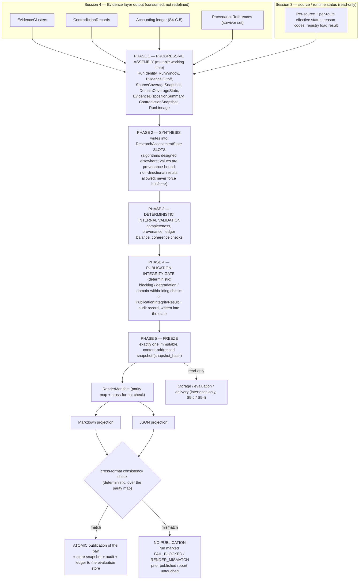

# NQ Premarket Environmental Intelligence Scanner
## Session 5 — Canonical Research State and Publication Integrity Architecture
### Required outputs S5-0, S5-Q, S5-A … S5-L, invariants, restrictions

---

## SESSION SCOPE CONFIRMATION

**Prior sessions read completely, in order:**
- `planning/SESSION_01_ARCHITECTURE_FOUNDATION.md` — full (779 lines; Deliverables
  A–E, unresolved-decision register N.1–N.24, readiness assessment O).
- `planning/SESSION_02_SOURCE_VERIFICATION.md` — full (Deliverables P–S; live
  BLS / Reuters / Treasury reachability; recommended candidate source set).
- `planning/SESSION_03_SOURCE_REGISTRY_ARCHITECTURE.md` — full (Deliverables T–Z;
  registry architecture, authority tiers, lifecycle states, activation /
  deactivation rules, metadata requirements, failure-state classification).
- `planning/SESSION_04_EVIDENCE_ARCHITECTURE.md` — full (S4-0, S4-Q, S4-A … S4-J;
  evidence lifecycle, object inventory, evidence/claim taxonomy, provenance,
  deterministic validation, dedup/syndication/contradiction/clustering,
  eligibility + no-silent-drop ledger, interfaces, owner decisions, slice).

**Agent Reach baseline commit:** `93ae1d18c37b707dec053c7c4f9d91cd8ef8943d`
(2026-08-12 11:39:47 +0800; subject `fix(readme): update sponsor copy`). Verified
present in the local checkout. Agent Reach is referenced only as a pinned external
dependency at this SHA (Session 1 §D.1; master prompt Section 4). No Agent Reach
code was read or changed this session.

**Session type:** architecture / planning only. This session produced **exactly
one new file** — this document. It contains **no scanner code, no Python classes
or modules, no YAML / JSON Schema / SQL / DDL / migrations / databases, no
Markdown report templates, no JSON outputs, no rendered reports, no runtime LLM
prompts, no Agent Reach modification, and no modification of Sessions 1–4.**
Object inventories are *logical concept/responsibility inventories in prose and
tables*, not schema. It **selects no provider**, **activates no source**, and
**settles no owner decision** — every threshold, vocabulary, policy, terms
decision, and provider choice is left explicitly unresolved in **S5-K**.

**Session 4 close-out consumed by this session:** Session 4 ends with
`EvidenceCluster`, `ContradictionRecord`, the per-run evidence accounting ledger
(S4-G.5), and the `ProvenanceReference` survivor set with an outbound interface to
"future canonical report state" (S4-D.1 / S4-H.2). Session 5 designs that
canonical state and the publication-integrity gate that sits between it and the
Markdown / JSON renderers.

**Master-prompt anchors:** Section 6 (trust boundary; no command construction from
external content; secrets never in logs/reports), Sections 15–16 (evidence — the
*input* boundary), Sections 17–19 (synthesis / regime / directional — *slots
only*, no algorithms), Section 20 (report requirements: Markdown + JSON),
Section 28 (publication-integrity gate; fail-visible; Markdown/JSON consistency),
Section 29 (shadow-mode evaluation — fields preserved now), Section 14 (human-
feedback vocabulary — `OWNER`).

**Labels used below:**
- `DESIGN` — a structure or rule originating in this session.
- `INHERITED` — a rule from Sessions 1–4, carried forward; tagged **[settled]**,
  **[proposed]**, or **[owner-dependent]** (S5-0).
- `RECONCILIATION` — a terminology or pipeline-position alignment between prior
  sessions and this one; recorded, not an owner decision.
- `EVIDENCE` — grounded in a Session 2 live-verification result.
- `OWNER` — a decision explicitly deferred; consolidated in **S5-K**.

---

## S5-0 — PRIOR-SESSION RECONCILIATION LEDGER

### S5-0.1 The ten Session 4 clarifications — recorded, accepted, and their effect

Session 4 is **not modified.** Each clarification below is accepted as a forward
rule governing Session 5 and any later implementation. Classification: **REFINES
S4** (narrows or corrects a Session 4 statement), **SHARPENS** (consistent with
Session 4, made explicit), or **CONSUMED + ELABORATED** (already settled in
Session 3/4, extended to run level here).

| # | Clarification | Class | Effect on canonical state and publication |
|---|---|---|---|
| **1** | Distinguish validated / production-eligible / citable / influence-eligible evidence; a record may be valid and auditable while non-production, non-citable, withheld, or non-influencing | **SHARPENS** | The canonical state represents **four independent statuses per evidence record**, never collapsed: `validated` (passed S4 Boundary 5), `production_eligible` (`production = true`), `citable` (terms cleared + authority + `retrieval_integrity = OK`), `influence_eligible` (member of an `INFLUENCING` cluster, S4-G.4). `EvidenceDispositionSummary` (S5-B) reports each as a separate tally with references. No renderer or gate check may merge them. Enforces **invariant 4**. See S5-D.3. |
| **2** | Structural / rule-based extraction must not be represented as LLM extraction; preserve an `extraction_method` distinction (`STRUCTURAL_FIELD_MAPPING`, `RULE_BASED_EXTRACTION`, `LLM_EXTRACTION`, `DETERMINISTIC_OBSERVATION`) — conceptual only, no enumeration schema | **REFINES S4** | `extraction_method` is a first-class provenance concept carried into canonical state and into every output. Session 4's S4-J deterministic feed-title claim is `STRUCTURAL_FIELD_MAPPING`, **never** labelled model output; its `extraction_confidence` and the absence of a `model_version` must be coherent with the method. S5-F adds a **method/confidence coherence** check. `DETERMINISTIC_OBSERVATION` is the method for the `Observation` path (S4-B). See S5-D.3, S5-F. |
| **3** | `WebChannel.read()` is a Jina Reader retrieval path, not a generic direct-HTTP client; canonical state and provenance must distinguish original source URL, retrieval path, actual retrieval endpoint, and component used | **REFINES S4** | Four separate provenance fields kept distinct at run level: `origin_url` (canonical, unprefixed), `retrieval_path`, `retrieval_endpoint`, `fetched_via`. **Coherence rule:** `retrieval_path = JINA_READER` ⇔ `fetched_via = agent_reach.WebChannel.read` and `retrieval_endpoint` is the transient `r.jina.ai/<origin_url>` form; a `DIRECT_HTML` path is a **different component** (a scanner-owned direct fetcher / the constrained HTTP probe), never `WebChannel.read`. Corrects the S4-H.5 wording that paired `WebChannel.read` with `DIRECT_HTML`. S5-F adds a **provenance-coherence** check. See S5-D.3. |
| **4** | URL templates require two-stage validation — definition-time (fixed scheme, host, allowed placeholder positions) and rendered-URL + connect-time address revalidation; external content may never select scheme, host, template, executable, or command | **CONSUMED + ELABORATED** (S3 §X.2 / S4-D.2) | Canonical provenance records the **template id + placeholder values** that produced each `retrieval_endpoint`. S5-F verifies (a) the template's fixed scheme/host were not variable, (b) placeholder values occupy only allowed positions, (c) no placeholder value derived from external content. Enforces **invariant 14**. See S5-D.3, S5-F blocking check. |
| **5** | A normal content change / revision / normalized-hash change is **not** an integrity failure; distinguish authoritative expected-hash mismatch, transport-integrity failure, ordinary content change, revision detected, and parser/normalization change | **REFINES S4** | Canonical state represents **five distinct hash/change conditions** on `SourceCoverageSnapshot` and per evidence lineage: `AUTHORITATIVE_HASH_MISMATCH`, `TRANSPORT_INTEGRITY_FAILURE`, `ORDINARY_CONTENT_CHANGE`, `REVISION_DETECTED`, `PARSER_NORMALIZATION_CHANGE`. Only the **first two are blocking-class** in S5-F; the other three are lineage / degradation events that never block publication. Narrows Session 4's Boundary-1 "hash vs known". See S5-D.2, S5-F. |
| **6** | Quarantined bytes must be represented safely — the state may hold quarantine identifiers, hashes, safe metadata, and reason codes, but must never embed or render quarantined content | **CONSUMED + ELABORATED** (S4-G.5) | Canonical state carries, per quarantined retrieval: `quarantine_ref`, `content_sha256`, `size_bytes`, `reason_code`, `source_id` / `route_id`, `detected_at` — **never** bytes, a decoded excerpt, or a rendered preview. Outputs show only `quarantined retrieval: <reason_code> (ref <id>)`. Enforces **invariant 11**. See S5-D.5, S5-I.7. |
| **7** | Similarity-based grouping is reproducible only if algorithm, model, normalization, threshold, random behavior, and tie-breaking are versioned; do not describe heuristic/model clustering as fully deterministic unless those conditions hold | **REFINES S4** | Canonical state records a `grouping_config_version` naming the pinned algorithm, model (if any), text normalization, similarity threshold, random-seed / determinism mode, and tie-break rule. **Deterministic domain assignment** (registry `coverage_domains` + `claim_type`, S4-F.5) is unaffected and remains fully deterministic. **Intra-domain similarity sub-grouping** is "reproducible under the pinned config", not inherently deterministic; S5-F checks `grouping_config_version` is present and pinned. Corrects the S4-A.5 / S4-F "fully deterministic clustering" phrasing. See S5-D.3, S5-F. |
| **8** | A Tier-1 system-of-record source may establish its own official datum or statement without artificial cross-issuer corroboration; independent corroboration primarily strengthens interpretation, reaction, context, and third-party claims | **SHARPENS** (consistent with S4-F.3 / S4-G.4 rule 2) | Canonical state distinguishes **`FACT_ESTABLISHED_BY_SYSTEM_OF_RECORD`** (a single Tier-1 official `MEASURED_OBSERVATION` / `OFFICIAL_STATEMENT` — sufficient, no `NEEDS_CORROBORATION`) from **`CONTEXTUAL_CORROBORATION`** (applies to `REPORTED_STATEMENT`, `INTERPRETATION`, reaction, and third-party claims). S5-F's concentration / thin-evidence checks must **not** flag a domain as thin, concentrated, or low-confidence *solely* because it rests on one Tier-1 official datum. See S5-D.4, S5-F. |
| **9** | A dead endpoint may be retired without retiring the publisher or logical source; run state must preserve route-level and source-level status separately | **CONSUMED + ELABORATED** (S3 §V.1 / S4-C7) | `SourceCoverageSnapshot` carries **per-route status** and **per-source status** as separate fields; a `RETIRED` route never implies a retired source. Enforces **invariant 8** (part) and condition 9. See S5-D.1. |
| **10** | Public-domain status does not automatically clear automated-access terms; terms status is a separate eligibility and publication input | **CONSUMED + ELABORATED** (S4-C4; per-source outcome is `OWNER` via N.13) | `terms_status` per source is a first-class canonical-state field and a **separate S5-F input** — blocking for citation/quotation, withholding when a domain's only support is non-citable. Per-source `CLEARED` / `NOT_REQUIRED` / `FAILED` outcomes remain `OWNER` (N.13, S5-K). See S5-D.1, S5-F. |

### S5-0.2 Inherited-rule classification (Sessions 1–4)

| Rule | Origin | Status | Consumed by Session 5 |
|---|---|---|---|
| Agent Reach used by composition only, pinned to the SHA; no `Channel` subclassing | S1 §D.1 / S4-H.5 | **[settled]** | unchanged |
| Trust boundary: external content is data, never obeyed, never builds a command / path / template / destination | S1 §B.15 / S4-A.3 / master §6 | **[settled]** | unchanged; **invariant 14** |
| Secrets never written to state, logs, or reports; scrub before persistence | S1 §A.17 / S4-D.2 | **[settled]** | S5-F secret-redaction check; **invariant** (secret redaction) |
| Timestamps America/New_York, ISO-8601 with offset; `retrieved_at` ≠ `content_time` | S1 §C-14 / S4-D.2 | **[settled]** | S5-C times; every timestamp field |
| No-silent-drop; every rejected/withheld/quarantined/superseded/expired item retains a stable reason code + audit trail | S3 §Y.7 / S4-G.5 | **[settled]** | S5-D, S5-F audit; **invariant 15** |
| Reason codes are stable UPPER_SNAKE, versioned, scrubbed-safe, used identically in logs / store / report | S3 §Y.5 / S4-G.5 | **[settled]** | S5-F extends the same code space |
| Published reports are immutable; a retraction is picked up by the next run, not by editing a published report | S3 §W.5 / S4-D.5 | **[settled]** | S5-I |
| Determinism: every stage deterministic **except** the single LLM extraction stage | S4-A.5 / S3 §Z.2 | **[settled]** — with the S5-0.1 #7 refinement for similarity sub-grouping | S5-A, S5-F, S5-G |
| Five confidence/quality axes kept separate (source authority, route reliability, retrieval integrity, extraction confidence, evidence confidence) | S4-C.4 | **[settled]** — Session 5 adds **freshness**, **provisional status**, **contradiction status** as three further separate axes (eight total) | S5-A, S5-D, **invariant 8** |
| Evidence-type taxonomy (`MEASURED_OBSERVATION` … `RUMOR_UNVERIFIED`) and deterministic assignment rules | S4-C.1 | **[proposed]** | referenced by S5-D / S5-F; not settled here |
| Claim-type vocabulary | S4-C.2 | **[proposed]** | referenced; not settled |
| Authority tiers Tier 1–4 and per-tier capability matrix | S3 §U.2 / §U.3 | **[proposed]** | referenced by S5-F eligibility; not settled |
| Coverage-domain and issuer-family vocabularies | S3 §T.5 | **[owner-dependent]** | used as placeholders; S5-K |
| Source concentration computed per `issuer_family`; restatements of one release collapse to one unit | S3 §U.6 / S4-F.2 | **[settled]** principle | S5-D.4, S5-F |
| Concentration numeric limits (`X%`, `N` families) | S3 §U.6 / S4-I.5 | **[owner-dependent]** | S5-K |
| Minimum-evidence-for-cluster-influence rule shape (S4-G.4) | S4-G.4 | **[settled]** shape; **[owner-dependent]** thresholds | S5-F domain-withholding; S5-K |
| Circuit-breaker thresholds, `K` clean cycles, flap-guard `N` | S3 §W.4 | **[owner-dependent]** | referenced via source runtime state; S5-K |
| TTL / expiration durations per (`evidence_type`, `claim_type`, `coverage_domain`) | S4-D.6 / S4-I.6 | **[owner-dependent]** | S5-C expiration, S5-F freshness; S5-K |
| Contradiction → confidence behaviour | S4-F.4 / S4-I.7 | **[owner-dependent]** | S5-F; S5-K |
| Per-source N.13 terms determinations | S1 N.13 / S2 open items / S4-C4 | **[owner-dependent]** | S5-D.1 `terms_status`; S5-K |
| Operational-store / evaluation-store technology | S3 §Z.5 / S1 N (storage) | **[owner-dependent]** | S5-J refers to "the evaluation store" abstractly; S5-K |
| Scheduling mechanism / OS | S1 N.3 / N.4 | **[owner-dependent]** | S5-C run cadence assumes 8:00/9:00/10:00 ET targets exist; the *mechanism* is not chosen here |
| LLM / consensus / market-data providers | S1 N.1 / N.5 / N.6 / N.16–19 | **[owner-dependent]** | S5-E slots are provider-agnostic; `market_time_context` (S5-C) depends on N.16–19; S5-K |
| Report delivery beyond local Markdown/JSON | S1 N.23 | **[owner-dependent]** | S5-G / S5-I define behaviour up to atomic local publication; downstream delivery is an interface only; S5-K |

### S5-0.3 Prior rules consumed without modification

Session 4's `EvidenceRecord`, `EvidenceCluster`, `ContradictionRecord`,
`ValidationResult`, `Observation`, `ProvenanceReference`, and the S4-G.5 ledger
are consumed **as defined** — Session 5 reads their outputs and never redefines
them. The S4 eligibility profile (S4-G.1), the S4 influence gate (S4-G.4), the S4
revision/supersession/retraction mechanics (S4-D.5), and the S4 freshness /
evidence-cutoff mechanics (S4-D.6) are consumed as the *feeder* semantics; S5
adds the **run-level** representation and the **publication** gate on top.

### S5-0.4 Terminology and pipeline reconciliations (RECONCILIATION — not owner decisions)

1. **"Canonical report state" (S1 §D.2 / §C-27, S4-H.2) = "Canonical Research
   State" (this session).** Session 5 names the object **`CanonicalResearchState`**
   and treats Session 1's `ReportState` and Session 4's "future canonical report
   state" as the same concept. The Markdown/JSON split that Session 1 attached
   directly to `ReportState` is mediated here by **`RenderManifest`** (S5-B).
2. **Pipeline position of synthesis vs the canonical state.** Session 1 §D.3 drew
   `SYNTH → DIR → STATE → GATE`; the Session 5 launcher diagram draws
   `clusters → Canonical State → Gate → renderers`. **Resolution:**
   `CanonicalResearchState` is **assembled progressively** — evidence disposition
   and coverage first, then synthesis writes into `ResearchAssessmentState` slots
   (S5-E), then the publication-integrity gate writes `PublicationIntegrityResult`
   — after which the whole state is **frozen into exactly one immutable snapshot**
   before any rendering. Renderers see only the frozen snapshot. This satisfies
   invariants 1–3, 9, 10 and both prior framings.
3. **`WebChannel.read` / `DIRECT_HTML` wording in S4-H.5** — superseded by
   clarification #3 above; Session 4 is not edited, but Session 5 uses the
   corrected coherence rule.
4. **"Fully deterministic clustering" in S4-A.5 / S4-F** — superseded by
   clarification #7 above for the similarity sub-grouping step only; domain
   assignment stays fully deterministic.

### S5-0.5 Conflicts requiring an owner decision

**None identified that block writing this architecture.** All divergences among
Sessions 1–4 are terminology or pipeline-position alignments (S5-0.4) or are
already-open `OWNER` items routed to **S5-K**. No inherited rule is silently
treated as approved.

---

## S5-Q — REQUIRED-QUESTION COVERAGE MAP

| # | Question (abbreviated) | Answered in |
|---|---|---|
| 1 | What the canonical research state is, and is not | **S5-A** |
| 2 | What uniquely identifies a run | **S5-B `RunIdentity`**, **S5-C.1** |
| 3 | How the 8:00 Deep and 9:00 / 10:00 incremental runs relate | **S5-C.4**, **S5-H.1** |
| 4 | What an incremental run may inherit | **S5-H.2** |
| 5 | What an incremental run must revalidate rather than inherit | **S5-H.3** |
| 6 | Run start / evidence cutoff / completion / publication / market-time / expiration represented separately | **S5-B `RunWindow` / `EvidenceCutoff`**, **S5-C.2–C.3** |
| 7 | Active / degraded / suspended / failed / missing / unverified sources at run level | **S5-B `SourceCoverageSnapshot`**, **S5-D.1** |
| 8 | Coverage by domain without implying missing evidence means nothing happened | **S5-B `DomainCoverageState`**, **S5-D.6**, **invariant 5** |
| 9 | Influencing / withheld / rejected / quarantined / non-citable / provisional / expired / superseded / retracted evidence representation | **S5-B `EvidenceDispositionSummary`**, **S5-D.3 / D.5** |
| 10 | Unresolved contradictions preserved and surfaced | **S5-B `ContradictionSnapshot`**, **S5-D.7**, **S5-F** |
| 11 | Distinguish a validated `EvidenceRecord` from evidence eligible to influence a production report | **S5-0.1 #1**, **S5-D.3**, **invariant 4** |
| 12 | Minimum information for the canonical state to be internally valid | **S5-B `CanonicalResearchState`**, **S5-D.8**, **S5-F blocking check 1** |
| 13 | Which integrity failures must block publication completely | **S5-F.2** |
| 14 | Which deficiencies permit publication with visible degradation | **S5-F.3** |
| 15 | Which conditions require a domain withheld or labeled insufficient | **S5-F.4**, **S5-D.6** |
| 16 | How the gate prevents a confident report over thin / stale / concentrated / contradictory / non-citable evidence | **S5-F.6** |
| 17 | How publication decisions and reason codes are made deterministic and auditable | **S5-F.7**, **S5-F.8**, **invariant 15** |
| 18 | How the eight axes are kept separate | **S5-A.4**, **S5-D.3**, **invariant 8** |
| 19 | How Markdown and JSON remain semantically identical | **S5-G.1–G.4** |
| 20 | What information both output formats must contain | **S5-G.5** |
| 21 | How renderer failures are handled without corrupting or partially publishing | **S5-G.7–G.8**, **S5-I.4–I.5** |
| 22 | How prior published reports are preserved when revisions / corrections / retractions arrive | **S5-I.1–I.3** |
| 23 | How the research-only boundary appears in canonical state and every output | **S5-A.3**, **S5-B (`research_only_boundary`)**, **S5-G.5**, **invariant 12** |
| 24 | What fields must be preserved now for shadow-mode evaluation and human feedback | **S5-J** |
| 25 | What owner decisions remain unresolved | **S5-K** |

All 25 questions map to a section that answers them substantively.

---

## S5-A — CANONICAL RESEARCH-STATE PURPOSE AND BOUNDARY

### S5-A.1 What `CanonicalResearchState` owns

`DESIGN` — For one run, `CanonicalResearchState` is the **single, run-level source
of truth** for everything downstream of evidence. It owns:

1. **Run identity and time** — who/what/when the run is (`RunIdentity`,
   `RunWindow`, `EvidenceCutoff`).
2. **Source and coverage truth** — which sources and routes worked, degraded,
   failed, were missing or unverified; which coverage domains are covered,
   partial, insufficient, withheld, unavailable, or had no scheduled activity
   (`SourceCoverageSnapshot`, `DomainCoverageState`).
3. **Evidence disposition** — the run-level roll-up of every `EvidenceRecord`'s
   status across the four independent axes (validated / production-eligible /
   citable / influence-eligible) and every disposition (influencing, withheld,
   rejected, quarantined, non-citable, provisional, expired, superseded,
   retracted, merged-duplicate, upstream data-gap), each with counts, references,
   and reason codes; and the balanced accounting ledger
   (`EvidenceDispositionSummary`).
4. **Contradiction truth** — every `ContradictionRecord`, especially the
   unresolved-surfaced ones, side by side, never averaged (`ContradictionSnapshot`).
5. **Assessment slots** — typed, provenance-bound *containers* for the outputs of
   later synthesis / archetype / regime / directional / confidence stages,
   including explicit non-directional results (`ResearchAssessmentState`, S5-E).
   Session 5 owns the **slots and their contracts**, not the algorithms.
6. **The publication verdict** — the deterministic gate result and its audit
   record (`PublicationIntegrityResult`).
7. **The rendering contract** — the field-level parity map and consistency-check
   result that binds the Markdown and JSON projections to this one snapshot
   (`RenderManifest`).
8. **Lineage** — the relationship to the prior run, the parent Deep run, the
   incremental change set, and any supersession (`RunLineage`).
9. **The research-only boundary** — a required, first-class field that must be
   present in the state and rendered in every output (S5-A.3).

### S5-A.2 What `CanonicalResearchState` must never do

`DESIGN` —
- **Never compute a conclusion.** It *holds* assessment-slot values produced by
  the (separately-designed, deterministically-validated) synthesis stages; it
  never derives narrative, regime, direction, or confidence itself.
- **Never average, reconcile, or hide a contradiction.**
- **Never embed quarantined bytes or a decoded/rendered excerpt of quarantined
  content** — only safe identifiers, hashes, metadata, and reason codes
  (S5-0.1 #6; invariant 11).
- **Never let external content select** a command, executable, path, URL
  template, host, scheme, publication decision, or delivery destination
  (invariant 14).
- **Never present missing evidence as evidence of absence** (invariant 5).
- **Never collapse** source authority, route reliability, retrieval integrity,
  extraction confidence, evidence confidence, freshness, provisional status, or
  contradiction status into one another (invariant 8).
- **Never exist in two divergent copies** for a published run — there is exactly
  one frozen snapshot (invariant 1).
- **Never be mutated after freeze.**
- **Never force a directional (bull / bear) classification** to fill a slot
  (S5-E).

### S5-A.3 Research-only boundary representation

`DESIGN` — `CanonicalResearchState` carries a required `research_only_boundary`
object: a fixed statement that the report is environmental research only and is
not trading advice, a stable `boundary_code`, and the run's `run_id`. It is
**part of the frozen snapshot** and **must be rendered verbatim in every output**
(Markdown closing block and a JSON field), enforced by S5-F (presence check) and
S5-G (parity requirement). A run whose state lacks it is `FAIL_BLOCKED`
(invariant 12).

### S5-A.4 Eight separate axes (question 18)

`DESIGN` — Session 4 kept five axes separate (S4-C.4). Session 5 carries **eight**
distinct, non-collapsible qualities into the canonical state, each with its own
field(s):

| Axis | Meaning | Origin |
|---|---|---|
| Source authority | trust in the *content* from this source, for this route/claim-type | S3 registry + C5 resolution |
| Route reliability | trust that the content can be *obtained* from the route used | S3 `robustness_class` + runtime rolling success |
| Retrieval integrity | was *this* fetch clean and verifiable | S4 Boundary 1 + redirect/hash + partial/size-cap |
| Extraction confidence | confidence that the source asserts this claim | S4 extraction + deterministic heuristics; coherent with `extraction_method` (S5-0.1 #2) |
| Evidence confidence | the downstream label combining the above with corroboration/contradiction | Section 18 (reserved slot, S5-E) |
| Freshness | `now − content_time` vs the source cadence / calendar | S4-D.6 |
| Provisional status | produced on a `COLD_START` / `POST_EVENT_PROVISIONAL` cycle | S4-D.6 / C6 |
| Contradiction status | `NONE` / `INTERNAL` / `EXTERNAL` for the record's cluster(s) | S4-F.4 |

Any downstream stage needing a single score derives it **from these eight
explicitly**, by an `OWNER` rule (S5-K). The canonical state stores the inputs,
not a merged score.

### S5-A.5 Position and lifecycle (boundary-annotated)

**Boundary rules on this diagram:**
- No arrow carries external content into command / path / template construction.
- Phases 1–4 operate on a **mutable working state**; only Phase 5 produces the
  immutable snapshot. Nothing downstream of Phase 5 can change it.
- Renderers (MD, JS) read **only** the frozen snapshot; they compute nothing.
- A mismatch at `XCHK`, or a renderer failure, publishes **neither** format and
  never overwrites the last valid report.

---

## S5-B — LOGICAL RUN-STATE OBJECT INVENTORY

> Logical concepts — responsibilities and relationships in prose and tables.
> Not Python classes, not schema.

### S5-B.1 Summary

| Concept | Responsibility | Produced in | Mutable before freeze? | Never does |
|---|---|---|---|---|
| **RunIdentity** | uniquely name the run and pin every version it depends on | Phase 1 (first) | no (fixed at creation) | change mid-run; be reused |
| **RunWindow** | hold every run timestamp as a separate value | Phase 1, completed through Phase 5 | append-only (each timestamp set once) | infer one timestamp from another |
| **EvidenceCutoff** | the explicit cutoff and its policy basis | Phase 1 | no | be advanced silently within a run |
| **SourceCoverageSnapshot** | run-level per-source **and** per-route status | Phase 1 | yes (assembled) | merge route status into source status |
| **DomainCoverageState** | per coverage-domain coverage level + why | Phase 1–2 | yes | render "no evidence" as "nothing happened" |
| **EvidenceDispositionSummary** | run-level roll-up of the four eligibility axes and every disposition, with the balanced ledger | Phase 1 | yes | collapse validated / production-eligible / citable / influence-eligible |
| **ContradictionSnapshot** | all `ContradictionRecord`s, unresolved ones surfaced side-by-side | Phase 1 | yes | average, discard, or silently prefer a side |
| **ResearchAssessmentState** | typed, provenance-bound slots for synthesis outputs, incl. non-directional results | Phase 2 | yes (slots filled once) | hold a value not backed by evidence refs; be force-filled with a direction |
| **PublicationIntegrityResult** | the deterministic gate verdict + per-check results + audit-record ref | Phase 4 | written once | be produced non-deterministically; omit a reason code |
| **RenderManifest** | the parity map binding both projections to this snapshot + the consistency-check result | Phase 5 | written once | contain a value not present in the snapshot |
| **RunLineage** | prior-run / parent-Deep refs, incremental change set, supersession | Phase 1, updated Phase 4–5 | yes | rewrite a prior run's lineage |
| **CanonicalResearchState** | compose all of the above into one progressively-assembled, gated, then frozen snapshot | Phases 1–5 | Phases 1–4 only | exist twice for one published run; be mutated after freeze; embed quarantined bytes |

### S5-B.2 Per-concept detail

**RunIdentity** — *"exactly which run this is, and against which code and config."*
Holds: `run_id` (stable, unique, never reused); `run_type`
(`DEEP_0800` / `INCREMENTAL_0900` / `INCREMENTAL_1000` — proposed vocabulary,
`OWNER`); `target_report_time` (the ET clock target, e.g. 08:00); pinned version
refs — `agent_reach_sha` (`93ae1d18…`), `registry_snapshot_ref` (the exact
`source_registry` state used, S3 §T.7), `validator_version`, `grouping_config_version`
(S5-0.1 #7), `gate_version`, `thresholds_config_version`, `state_schema_version`,
`renderer_version`. Fixed at creation; any later phase that would need a
different version instead **fails the run** rather than mutating identity.

**RunWindow** — *"every clock fact about the run, kept apart."* Separate,
single-write fields (question 6):

| Field | Meaning |
|---|---|
| `run_start` | when collection/assembly began |
| `evidence_cutoff` | ref to `EvidenceCutoff.cutoff_time` — the boundary for which content is in-scope |
| `collection_complete` | when Phase 1 evidence assembly finished |
| `assessment_complete` | when Phase 2 slots were all filled or explicitly marked unavailable |
| `gate_complete` | when Phase 4 produced the verdict |
| `freeze_time` | when the snapshot became immutable (Phase 5) |
| `publication_time` | when the atomic MD+JSON publication succeeded (unset if it did not) |
| `market_time_context` | the market session phase / clock-relative-to-cash-open descriptor at `evidence_cutoff` — **shape depends on N.16–19 / market-data provider**, so this session defines only that the field exists and is distinct; content is `OWNER` (S5-K) |
| `state_expiration` | when this frozen state is considered stale even absent a newer run — duration is `OWNER` (S5-K) |

None is derived from another; all are recorded explicitly.

**EvidenceCutoff** — *"the line between 'this run' and 'the next run'."* Holds
`cutoff_time` (America/New_York), `cutoff_basis` (how it was chosen for this
`run_type` — e.g. "target_report_time − fixed lead" — the actual policy is
`OWNER`, S5-K), `late_items_held_count` (records with `content_time > cutoff_time`
that were queued for the next run, S5-H.7), and `inherited_cutoff_ref` (for
incremental runs — the parent Deep run's cutoff, so the state can express "this
run covers content between the parent cutoff and this cutoff"). A run never
silently advances its own cutoff.

**SourceCoverageSnapshot** — *"which sources and routes actually contributed,
and why any did not"* (question 7; conditions 9). Two **separate** status maps:

| Per source | Values |
|---|---|
| `source_status` | `ACTIVE` / `ACTIVE_DEGRADED` / `SUSPENDED` / `DISABLED` / `RETIRED` (S3 §V.1) plus run-scoped `FAILED_THIS_RUN`, `MISSING` (expected by registry, no data this run), `UNVERIFIED` (`VERIFIED_READY` but not `ACTIVE`, or verification-run) |
| `source_reason_codes` | stable codes for the status (S3 §Y.5 space) |
| `contributed` | did this source produce ≥1 `EvidenceRecord` this run |
| `expected_by_calendar` | did the calendar predict activity from this source in this window (feeds `DomainCoverageState`, S5-D.6) |

| Per route | Values |
|---|---|
| `route_status` | `OK` / `DEGRADED` / `BLOCKED` / `RETIRED` / `NOT_ATTEMPTED` |
| `route_reason_codes` | stable codes |
| `retrieval_path` / `fetched_via` | the S5-0.1 #3 coherence pair actually used |
| `hash_change_condition` | one of the **five distinct conditions** (S5-0.1 #5): `AUTHORITATIVE_HASH_MISMATCH`, `TRANSPORT_INTEGRITY_FAILURE`, `ORDINARY_CONTENT_CHANGE`, `REVISION_DETECTED`, `PARSER_NORMALIZATION_CHANGE`, or `NONE` |

Also: `registry_load_result` (entries loaded / dropped, with reason codes, S3
§T.7), and `primary_source_floor_met` (bool, computed for S5-F).

**DomainCoverageState** — *"what we can and cannot say about each domain, and why"*
(question 8; invariant 5). Per coverage domain (S3 §T.5 vocabulary,
`[owner-dependent]`):

| Field | Meaning |
|---|---|
| `coverage_level` | `COVERED` / `PARTIAL` / `INSUFFICIENT` / `WITHHELD` / `UNAVAILABLE` / `NO_SCHEDULED_ACTIVITY` |
| `influencing_cluster_refs` | the `EvidenceCluster`s that reached `INFLUENCING` for this domain |
| `withheld_cluster_refs` + `withhold_reason_codes` | clusters present but not influencing, with reasons (S4-G.4 / S5-F.4) |
| `expected_activity_refs` | calendar events that predicted activity in this window (so the state can say "a CPI release was scheduled and we have no usable data" vs "nothing was scheduled") |
| `data_gap_refs` | upstream `DATA_GAP`s reported by the issuer itself (S4-A.4) |
| `absence_interpretation` | one of `NO_EVIDENCE_COLLECTED`, `EVIDENCE_WITHHELD`, `UPSTREAM_DATA_GAP`, `NO_ACTIVITY_EXPECTED` — **never** `NOTHING_HAPPENED` |

The rule (invariant 5): `coverage_level = INSUFFICIENT` or `UNAVAILABLE` with an
explicit `absence_interpretation` — the state and every renderer must say *we do
not have evidence*, never *there were no developments*.

**EvidenceDispositionSummary** — *"the fate of every candidate and record, run-
level, balanced"* (questions 9, 11; invariant 4). Holds:

- **Four independent eligibility tallies**, each a count + reference list:
  `validated`, `production_eligible`, `citable`, `influence_eligible`. A record
  can be in `validated` and none of the others.
- **Disposition tallies** (count + refs + reason codes): `influencing`,
  `withheld`, `rejected`, `quarantined`, `non_citable`, `provisional`, `expired`,
  `superseded`, `retracted`, `merged_duplicate`, `upstream_data_gap`,
  `dropped_malformed`.
- **`extraction_method` breakdown** (S5-0.1 #2): counts per
  `STRUCTURAL_FIELD_MAPPING` / `RULE_BASED_EXTRACTION` / `LLM_EXTRACTION` /
  `DETERMINISTIC_OBSERVATION`.
- **`fact_basis` breakdown** (S5-0.1 #8): `FACT_ESTABLISHED_BY_SYSTEM_OF_RECORD`
  vs `CONTEXTUAL_CORROBORATION` vs `UNCORROBORATED`.
- **The accounting ledger** (S4-G.5) with its balance assertion; `ledger_balanced`
  (bool) is a Phase 3 output and an S5-F blocking input.

**ContradictionSnapshot** — *"every disagreement, preserved"* (question 10;
invariant 6). Holds all `ContradictionRecord`s for the run; for each: `member_refs`,
`axis`, side-by-side `comparison` (assertion + provenance + authority + freshness
+ `event_phase` per side), `disposition` (`EXPLAINED_BY_REVISION` /
`EXPLAINED_BY_SCOPE_DIFFERENCE` / `UNRESOLVED_SURFACED`), `affected_domain_refs`,
`affected_cluster_refs`. No blended value anywhere. `unresolved_count` is an
S5-F input.

**ResearchAssessmentState** — *"typed containers for what synthesis concluded,
each pointing at its evidence"* (S5-E). Slots only. Each slot:
`value` (from an allowed conceptual vocabulary that **includes** `UNAVAILABLE`,
`INSUFFICIENT_EVIDENCE`, `INDETERMINATE`, `CONDITIONAL`, `DEGRADED`, `WITHHELD` —
final vocabularies `OWNER`, S5-K); `supporting_cluster_refs` + `contradiction_refs`
(required — a non-null directional/regime value with no supporting refs is a
Phase 3 failure); `validation_status` (`VALIDATED` / `UNVALIDATED` / `REJECTED`
by the downstream deterministic check); `producer_stage` + `producer_version`;
`assessment_expiration`; `invalidation_conditions`. Slots: `environmental_narrative`,
`morning_archetype`, `regime`, `regime_modifier`, `directional_environmental_status`,
`confidence`, plus the two time slots. **Never force-filled** (S5-E.3).

**PublicationIntegrityResult** — *"the deterministic decision to publish, and its
full reasoning"* (questions 13–17). Holds: `verdict` (proposed vocabulary
`PASS` / `PASS_WITH_WARNINGS` / `PARTIAL_WITHHELD` / `INSUFFICIENT` /
`FAIL_BLOCKED` — `OWNER`, S5-K); `blocking_findings` (list of {check, reason_code,
inputs, threshold, outcome}); `degradation_findings`; `withheld_domains` (list of
{domain, reason_code}); `checks_run` (the full deterministic checklist, S5-F.5,
each with pass/fail/n_a + values); `gate_version` + `thresholds_config_version`;
`evaluated_at`; `audit_record_ref` (content-addressed, S5-F.8). Written into the
state before freeze; part of the frozen snapshot.

**RenderManifest** — *"the contract and the check that make Markdown and JSON one
thing in two shapes"* (S5-G). Holds: `snapshot_hash` (the frozen state it
projects); `parity_map` (every semantic field that must appear in both, S5-G.3);
`allowed_presentation_differences` (S5-G.4); `md_render_status` / `json_render_status`
(`OK` / `FAILED` + reason_code); `cross_format_check_result` (`MATCH` / `MISMATCH`
+ divergence list); `publication_atomicity` (`PUBLISHED_PAIR` / `PUBLISHED_NONE`).
Contains **no** value that is not already in the snapshot.

**RunLineage** — *"how this run relates to the others"* (questions 3–5, 22).
Holds: `prior_run_ref` (the immediately previous run — previous day's last run
for a Deep run; the earlier incremental for `INCREMENTAL_1000`);
`parent_deep_ref` (today's `DEEP_0800` for incrementals; null for the Deep run);
`inherited_refs` (evidence / cluster / contradiction refs carried from the parent
+ subsequent change sets, S5-H.2); `revalidated_refs` (what was re-checked,
S5-H.3); `incremental_change_set` (per-finding `NEW` / `REVISED` / `EXPIRED` /
`CONTRADICTED` / `REMOVED` / `UNCHANGED` vs the parent baseline, S5-H.4);
`what_changed_summary_ref` (a structured, state-computed diff, S5-H.8);
`supersedes` / `superseded_by` (run-level, for corrections, S5-I.2);
`parent_deep_status` (`OK` / `FAILED` — drives S5-H.6).

**CanonicalResearchState** — the composition. Additionally holds
`research_only_boundary` (S5-A.3), `snapshot_hash` (set at freeze; content
address over the whole state), and `frozen` (bool). After `frozen = true` the
object is immutable and is the **only** artifact renderers, storage, delivery,
and evaluation may read. There is exactly one per published run (invariant 1).

### S5-B.3 Relationships

`CanonicalResearchState` **composes** `RunIdentity`, `RunWindow`, `EvidenceCutoff`,
`SourceCoverageSnapshot`, `DomainCoverageState` (one per domain),
`EvidenceDispositionSummary`, `ContradictionSnapshot`, `ResearchAssessmentState`,
`PublicationIntegrityResult`, `RenderManifest`, `RunLineage`, and
`research_only_boundary`. `ResearchAssessmentState` slots **reference**
`EvidenceCluster`s and `ContradictionRecord`s (never copy them). `DomainCoverageState`
**references** clusters and calendar events. `RunLineage` **references** other
runs by `run_id` only. Nothing in the state references quarantined bytes — only
`quarantine_ref` handles (S5-D.5).

---

## S5-C — RUN IDENTITY, TIME, AND LINEAGE

### S5-C.1 Identity fields (question 2)

`DESIGN` — A run is uniquely identified by `run_id` **plus** the pinned version
set in `RunIdentity` (S5-B.2). Two runs with the same `run_type` and
`target_report_time` on the same date are still distinct `run_id`s (e.g. a
re-run, or a correction run — S5-I.2). The `run_id` is the key for storage,
evaluation, lineage, and human feedback (S5-J). `run_type` and
`target_report_time` are descriptive, not identifying.

### S5-C.2 Time fields, kept separate (question 6)

`DESIGN` — All in America/New_York, ISO-8601 with offset (S1 §C-14). The state
never infers one from another:

| Field | Distinct because |
|---|---|
| `run_start` | operational start; not when evidence is valid from |
| `evidence_cutoff` | semantic in-scope boundary; a run can start before and finish after it |
| `collection_complete` / `assessment_complete` / `gate_complete` / `freeze_time` | pipeline milestones; latency and stalls are visible |
| `publication_time` | may never be set (blocked / failed run) — its absence is meaningful |
| `market_time_context` | the market clock context, **not** a wall-clock time; shape `OWNER` (S5-K) |
| `state_expiration` | when the *state* is stale; separate from evidence `expires_at` (per-record, S4-D.6) and from `assessment_expiration` (per-slot, S5-E) |

### S5-C.3 Expiration — three separate horizons

`DESIGN` — The state distinguishes:
1. **Per-evidence `expires_at`** (S4-D.6) — an `EvidenceRecord`'s TTL.
2. **Per-slot `assessment_expiration`** (S5-E) — how long a narrative / regime /
   directional value is considered valid.
3. **Run-level `state_expiration`** (`RunWindow`) — after which the whole frozen
   snapshot is "stale, awaiting the next run".
All three durations are `OWNER` (S5-K); Session 5 fixes only that they are
separate fields with separate meanings.

### S5-C.4 The 8:00 / 9:00 / 10:00 relationship (question 3)

`DESIGN` — `[owner-dependent]` inheritance *policy*; the *structure* is:

| Run | `run_type` | `parent_deep_ref` | `prior_run_ref` | Role |
|---|---|---|---|---|
| 08:00 ET | `DEEP_0800` | null | previous day's last run (continuity only, **no inheritance**) | the day's **baseline**: full collection, full assessment, full gate |
| 09:00 ET | `INCREMENTAL_0900` | today's `DEEP_0800` | today's `DEEP_0800` | incremental: inherits from the Deep baseline (S5-H.2), revalidates (S5-H.3), **re-derives every assessment slot**, **re-runs the gate**, reports what changed since 08:00 |
| 10:00 ET | `INCREMENTAL_1000` | today's `DEEP_0800` | today's `INCREMENTAL_0900` | incremental: inherits from the **Deep baseline plus the 09:00 change set, applied in order**; revalidates; re-derives assessment; re-runs the gate; reports what changed since 09:00 and cumulatively since 08:00 |

**Design choice (flagged, `OWNER` to confirm — S5-K):** the 10:00 run's *parent*
is the 08:00 Deep (a single stable baseline), and its *prior* is the 09:00 run
(for change tracking). Inheritance is "Deep baseline + ordered incremental change
sets", not "chain from the 09:00 snapshot". The alternative (chain strictly from
09:00) is a policy knob in S5-K.

### S5-C.5 Lineage fields

`DESIGN` — `RunLineage` (S5-B.2) records `inherited_refs`, `revalidated_refs`,
`incremental_change_set`, `what_changed_summary_ref`, `supersedes` /
`superseded_by`, and `parent_deep_status`. A Deep run's `incremental_change_set`
is empty and `what_changed_summary_ref` resolves to "baseline run — no prior run
today". Lineage is **append-only per run**; a later run never edits an earlier
run's lineage (invariant 13; S5-I).

---

## S5-D — CANONICAL COVERAGE AND EVIDENCE DISPOSITION

### S5-D.1 Working and failed sources; terms status (question 7)

`DESIGN` — `SourceCoverageSnapshot` (S5-B.2) carries **per-source** and
**per-route** status as separate maps (S5-0.1 #9). Each source additionally
carries `terms_status` (`CLEARED` / `NOT_REQUIRED` / `PENDING` / `FAILED` —
per-source outcome is `OWNER` via N.13, S5-K), used as a **separate** S5-F input
(S5-0.1 #10). `MISSING` (registry expected it, no data this run) and `UNVERIFIED`
(not `ACTIVE`) are represented explicitly and are distinct from `FAILED_THIS_RUN`.

### S5-D.2 Route degradation and the five hash/change conditions (S5-0.1 #5)

`DESIGN` — Per route, `route_status` and `hash_change_condition` are separate.
Only `AUTHORITATIVE_HASH_MISMATCH` and `TRANSPORT_INTEGRITY_FAILURE` are
**blocking-class** (S5-F.2) when they touch an influencing item.
`ORDINARY_CONTENT_CHANGE`, `REVISION_DETECTED`, and `PARSER_NORMALIZATION_CHANGE`
are recorded on the lineage of the affected evidence (S4-D.5) and, at most,
raise a **degradation** warning (S5-F.3) — never a block.

### S5-D.3 Evidence disposition and the four eligibility axes (questions 9, 11; invariant 4)

`DESIGN` — `EvidenceDispositionSummary` (S5-B.2) reports:
- the **four independent tallies** — `validated`, `production_eligible`,
  `citable`, `influence_eligible` — each with a reference list. A record present
  only in `validated` is retained, auditable, and visible in the state, but
  **does not influence the report and is not cited**.
- every **disposition** with count + refs + stable reason code (S4-G.5 code
  space, extended in S5-F.9).
- the `extraction_method` breakdown (S5-0.1 #2) and the `fact_basis` breakdown
  (S5-0.1 #8).
- `provenance_complete_for_all_influencing` (bool) — a Phase 3 output and an S5-F
  blocking input.
- `grouping_config_version` presence (S5-0.1 #7) — an S5-F blocking input when
  similarity sub-grouping was used.

### S5-D.4 Source concentration and system-of-record establishment (S5-0.1 #8)

`DESIGN` — Concentration is computed per `issuer_family` (S3 §U.6). The state
records, per influencing cluster: `concentration_ratio`, `independent_support_count`,
and `fact_basis`. **A cluster whose fact is `FACT_ESTABLISHED_BY_SYSTEM_OF_RECORD`
(a single Tier-1 official `MEASURED_OBSERVATION` / `OFFICIAL_STATEMENT`) is not
flagged as thin or over-concentrated by S5-F on source-count grounds alone.**
Concentration flags apply to `CONTEXTUAL_CORROBORATION` and to interpretation /
reaction / third-party material.

### S5-D.5 Quarantined retrievals — safe representation only (S5-0.1 #6; invariant 11)

`DESIGN` — The state holds, per quarantined retrieval: `quarantine_ref`,
`content_sha256`, `size_bytes`, `reason_code`, `source_id` / `route_id`,
`detected_at`. **No bytes, no decoded text, no excerpt, no preview.** Renderers
receive only these fields and emit only `quarantined retrieval: <reason_code>
(ref <quarantine_ref>)`. The quarantine store itself is outside the canonical
state.

### S5-D.6 Domain coverage without "nothing happened" (question 8; invariant 5)

`DESIGN` — `DomainCoverageState` (S5-B.2). Rules:
- A domain with no collected evidence → `coverage_level ∈ {INSUFFICIENT,
  UNAVAILABLE}` with `absence_interpretation ∈ {NO_EVIDENCE_COLLECTED,
  EVIDENCE_WITHHELD, UPSTREAM_DATA_GAP, NO_ACTIVITY_EXPECTED}`. The value
  `NOTHING_HAPPENED` **does not exist**.
- If `expected_activity_refs` is non-empty and coverage is `INSUFFICIENT`, the
  state explicitly says "*scheduled activity, no usable evidence*" — a stronger,
  visible gap.
- If `expected_activity_refs` is empty, `absence_interpretation =
  NO_ACTIVITY_EXPECTED` — still "*we have nothing to report on*", never "*there
  were no developments*".
- Upstream `DATA_GAP` (S4-A.4) → `absence_interpretation = UPSTREAM_DATA_GAP`,
  surfaced with the issuer's own gap statement referenced.

### S5-D.7 Unresolved contradictions (question 10)

`DESIGN` — `ContradictionSnapshot` (S5-B.2). Every `UNRESOLVED_SURFACED`
contradiction is carried side by side, attached to its `affected_domain_refs` and
`affected_cluster_refs`, and passed to S5-F. The gate must render it (S5-F.6);
the renderers must show both sides (S5-G.5). No stage blends the values
(invariant 6).

### S5-D.8 Minimum information for the state to be internally valid (question 12)

`DESIGN` — The Phase 3 deterministic internal validation requires **all** of:
`RunIdentity` complete (every pinned version present); `RunWindow` has
`run_start`, `evidence_cutoff`, `collection_complete`, `assessment_complete`;
every `DomainCoverageState` has a `coverage_level` and, if absent evidence, an
`absence_interpretation`; `EvidenceDispositionSummary.ledger_balanced = true`;
`provenance_complete_for_all_influencing = true`; every filled
`ResearchAssessmentState` slot has `supporting_cluster_refs` **or** an explicit
non-directional value (`UNAVAILABLE` / `INSUFFICIENT_EVIDENCE` / `INDETERMINATE`
/ …); `research_only_boundary` present; `grouping_config_version` present if
similarity sub-grouping was used; no secret-shaped string anywhere in the state
(S5-F secret-redaction). A state failing any of these cannot be frozen and the
run is `FAIL_BLOCKED` (S5-F.2).

---

## S5-E — CANONICAL ASSESSMENT BOUNDARY

### S5-E.1 Scope

`DESIGN` — Session 5 designs the **slots and their contracts** in
`ResearchAssessmentState`, not the narrative, archetype, regime, directional, or
confidence **algorithms** (those are Sections 16–19, a later session). The
canonical state must be able to *hold* whatever those stages produce, including
explicit "we cannot say" results, with full provenance.

### S5-E.2 The slots and their contracts

| Slot | Holds (conceptually) | Allowed value families (final vocab `OWNER`, S5-K) | Provenance requirement |
|---|---|---|---|
| `environmental_narrative` | a structured, evidence-bound account of the research environment | a normal narrative **or** `UNAVAILABLE` / `INSUFFICIENT_EVIDENCE` / `DEGRADED` / `WITHHELD` | every narrative element references ≥1 `INFLUENCING` `EvidenceCluster`; contradictions referenced where relevant |
| `morning_archetype` | the selected premarket archetype | an archetype label **or** `INDETERMINATE` / `INSUFFICIENT_EVIDENCE` / `UNAVAILABLE` | references the clusters / contradictions that drove the selection; deterministic-validation status recorded |
| `regime` | the environmental regime | a regime label **or** `INDETERMINATE` / `INSUFFICIENT_EVIDENCE` / `UNAVAILABLE` | supporting cluster refs required |
| `regime_modifier` | a qualifier on the regime | a modifier label **or** `NONE` / `INDETERMINATE` | supporting refs |
| `directional_environmental_status` | the long/short **environmental** status (research framing, not a trade) | `LONG_FAVOURABLE` / `SHORT_FAVOURABLE` / `BALANCED` / `CONDITIONAL` / `INDETERMINATE` / `INSUFFICIENT_EVIDENCE` / `UNAVAILABLE` / `WITHHELD` — **exact set `OWNER`** | supporting cluster refs **and** any `UNRESOLVED_SURFACED` contradiction refs required; a value here without refs is a Phase 3 failure |
| `confidence` | the deterministically-validated confidence label for the assessment | a label **or** `NOT_ASSESSED` / `CAPPED_BY_<reason>` | records which of the eight axes (S5-A.4) and which caps applied; formula is `OWNER` (S5-K) |
| `assessment_expiration` | when the assessment ceases to be valid | a timestamp | derived from the driving evidence's `expires_at` and the calendar |
| `invalidation_conditions` | named conditions that would invalidate the assessment before expiry | a list of conditions, each referencing the evidence/contradiction it depends on | each condition references its evidence |

Every slot also carries `validation_status` (`VALIDATED` / `UNVALIDATED` /
`REJECTED`), `producer_stage`, `producer_version`.

### S5-E.3 Never force a direction (invariant, condition)

`DESIGN` — If the evidence does not support a directional or regime call, the
slot **must** take an explicit non-directional value (`INSUFFICIENT_EVIDENCE`,
`INDETERMINATE`, `CONDITIONAL`, `DEGRADED`, `WITHHELD`, `UNAVAILABLE`). The state
has no default direction, no "neutral = slightly bullish", no tie-break toward a
call. A synthesis stage that returns a bare direction with no supporting
`INFLUENCING` cluster refs is **rejected** at Phase 3 and the slot is set to
`INSUFFICIENT_EVIDENCE` with the rejection recorded.

### S5-E.4 Assessment ↔ evidence binding (invariant 3)

`DESIGN` — Every non-null, directional slot value points to the specific
`EvidenceCluster`s and `ContradictionRecord`s that support it. Renderers project
these citations; they never add, drop, or re-derive them (S5-G).

---

## S5-F — PUBLICATION-INTEGRITY GATE

### S5-F.1 Nature and inputs

`DESIGN` — The gate is a **pure, deterministic function** of: the assembled +
internally-validated `CanonicalResearchState` (pre-freeze), the pinned
`gate_version`, and the pinned `thresholds_config_version`. Same inputs → same
`PublicationIntegrityResult`. It reads; it never mutates evidence, sources, or
assessment values. It writes exactly one `PublicationIntegrityResult` (+ audit
record) into the state, after which the state is frozen (S5-A.5).

Deterministic inputs it consumes: `EvidenceDispositionSummary` (all four
eligibility tallies, dispositions, ledger balance, `extraction_method` /
`fact_basis` breakdowns, `grouping_config_version` presence);
`SourceCoverageSnapshot` (per-source + per-route status, `terms_status`,
`registry_load_result`, `primary_source_floor_met`, `hash_change_condition`s);
`DomainCoverageState` per domain; `ContradictionSnapshot.unresolved_count` + refs;
provisional share; `RunWindow.evidence_cutoff` + `late_items_held_count`;
per-influencing-evidence freshness / `expires_at`; `research_only_boundary`
presence; the Phase 3 secret-redaction scan result; and (post-render, S5-G) the
`RenderManifest.cross_format_check_result`.

### S5-F.2 Blocking checks → `FAIL_BLOCKED` (question 13)

`DESIGN` — Any one of these blocks publication completely. The run still produces
a **visible, labelled failure** artifact (S5-I.5); it is never silently dropped.

| Blocking check | Reason code (proposed) |
|---|---|
| Canonical-state incompleteness — any S5-D.8 requirement unmet | `STATE_INCOMPLETE` |
| Provenance completeness — any `INFLUENCING` evidence with an incomplete `ProvenanceReference` (missing survivor field, S4-D.1) | `PROVENANCE_INCOMPLETE_INFLUENCING` |
| Evidence-ledger imbalance (`ledger_balanced = false`) | `LEDGER_IMBALANCE` |
| Research-only boundary absent from the state | `RESEARCH_BOUNDARY_MISSING` |
| Secret-redaction failure — a secret-shaped string detected anywhere in the state or in either draft output | `SECRET_REDACTION_FAILURE` |
| `AUTHORITATIVE_HASH_MISMATCH` on an item feeding an `INFLUENCING` cluster | `AUTHORITATIVE_HASH_MISMATCH` |
| `TRANSPORT_INTEGRITY_FAILURE` on an item feeding an `INFLUENCING` cluster (should be impossible — S4 quarantines pre-boundary; defensive) | `TRANSPORT_INTEGRITY_IN_INFLUENCE` |
| External content influenced a command / executable / path / URL template / host / scheme / publication decision / delivery destination (invariant 14) | `EXTERNAL_CONTENT_CONTROL` |
| URL-template two-stage validation failed for any influencing item (S5-0.1 #4) | `URL_TEMPLATE_VALIDATION_FAILED` |
| `grouping_config_version` absent while similarity sub-grouping was used (S5-0.1 #7) | `GROUPING_CONFIG_UNPINNED` |
| `extraction_method` / confidence / `model_version` incoherence for any influencing item (S5-0.1 #2) — e.g. `LLM_EXTRACTION` with no `model_version`, or `STRUCTURAL_FIELD_MAPPING` labelled as model output | `EXTRACTION_METHOD_INCOHERENT` |
| `retrieval_path` / `fetched_via` incoherence (S5-0.1 #3) — e.g. `JINA_READER` with `fetched_via ≠ WebChannel.read` | `RETRIEVAL_PATH_INCOHERENT` |
| Renderer / cross-format consistency mismatch (S5-G.6) | `RENDER_MISMATCH` |
| A required renderer failed and no consistent pair can be produced (S5-G.7) | `RENDER_FAILED` |

### S5-F.3 Degradation checks → `PASS_WITH_WARNINGS` (question 14)

`DESIGN` — The run publishes, with **visible** warnings carried in the state and
both outputs. Thresholds are `OWNER` (S5-K).

| Degradation check | Reason code (proposed) |
|---|---|
| Some registry entries dropped at load, but `primary_source_floor_met = true` | `REGISTRY_PARTIAL_LOAD` |
| Some `INFLUENCING` evidence near or at `expires_at` (still valid) | `FRESHNESS_MARGINAL` |
| Stale inherited evidence detected and correctly demoted (S5-H.4) — reported for transparency | `STALE_INHERITED_DEMOTED` |
| Concentration above the **soft** threshold for `CONTEXTUAL_CORROBORATION` material (not for `FACT_ESTABLISHED_BY_SYSTEM_OF_RECORD`, S5-0.1 #8) | `CONCENTRATION_SOFT` |
| Provisional share elevated but below the withhold threshold | `PROVISIONAL_ELEVATED` |
| One or more domains `PARTIAL` (some but not full coverage) | `DOMAIN_PARTIAL` |
| `UNRESOLVED_SURFACED` contradictions present, confined to non-decision-critical domains, and surfaced | `CONTRADICTION_SURFACED_CONFINED` |
| `ORDINARY_CONTENT_CHANGE` / `PARSER_NORMALIZATION_CHANGE` on an influencing item's lineage | `CONTENT_CHANGE_NOTED` |
| `market_time_context` unavailable (provider not configured — N.16–19) | `MARKET_CONTEXT_UNAVAILABLE` |
| Late items held for the next run (`late_items_held_count > 0`) | `LATE_ITEMS_HELD` |

### S5-F.4 Domain-withholding checks → domain `WITHHELD` / `INSUFFICIENT` (question 15)

`DESIGN` — Applied per domain. A withheld domain does **not** by itself fail the
run; it sets that `DomainCoverageState.coverage_level` and contributes to the
overall verdict (S5-F.5). Thresholds `OWNER` (S5-K).

| Condition | Domain result | Reason code |
|---|---|---|
| No eligible `MEASURED_OBSERVATION` / `OFFICIAL_STATEMENT` member in any cluster for the domain | `WITHHELD` | `WITHHELD_NO_MEASURED` |
| The domain's only support is non-citable (terms `PENDING` / `FAILED`) | `WITHHELD` | `WITHHELD_NON_CITABLE` |
| Domain majority-`provisional` and decision-critical | `WITHHELD` | `WITHHELD_PROVISIONAL` |
| Concentration beyond the **hard** limit **and** `fact_basis ≠ FACT_ESTABLISHED_BY_SYSTEM_OF_RECORD` | `WITHHELD` | `WITHHELD_CONCENTRATION` |
| `UNRESOLVED_SURFACED` contradiction in a decision-critical domain that the (`OWNER`) contradiction policy says must withhold | `WITHHELD` | `WITHHELD_CONTRADICTION` |
| Evidence present but none reached `INFLUENCING`, and none of the above specific reasons apply | `INSUFFICIENT` | `INSUFFICIENT_NO_INFLUENCE` |
| No evidence collected, activity was expected | `INSUFFICIENT` | `INSUFFICIENT_EXPECTED_MISSING` |
| No evidence collected, no activity expected | `UNAVAILABLE` | `UNAVAILABLE_NO_ACTIVITY` |
| Upstream `DATA_GAP` | `UNAVAILABLE` | `UNAVAILABLE_DATA_GAP` |

### S5-F.5 Publication verdicts (proposed vocabulary — `OWNER`, S5-K)

`DESIGN` — Distinct outcomes, never conflated:

| Verdict | Meaning | Publishes? |
|---|---|---|
| `PASS` | all blocking checks pass; no degradation; all decision-critical domains covered | yes — full report |
| `PASS_WITH_WARNINGS` | all blocking checks pass; ≥1 degradation finding; decision-critical coverage still met | yes — report with visible warnings |
| `PARTIAL_WITHHELD` | all blocking checks pass; ≥1 domain `WITHHELD` / `INSUFFICIENT`; **at least one decision-critical domain still `COVERED`** | **`OWNER` decision (S5-K): may this publish, or must it degrade to `INSUFFICIENT` / be held?** Default proposal: publishes, with the withheld domains explicitly labelled |
| `INSUFFICIENT` | all blocking checks pass, the state is internally valid and honest, but **no decision-critical domain is `COVERED`** — there is not enough evidence to characterise the environment | yes — an **honest "insufficient" report**; this is **not** a failure |
| `FAIL_BLOCKED` | ≥1 blocking check failed (S5-F.2) | **no** — a visible, labelled failure artifact is produced (S5-I.5); the prior published report is untouched |

`INSUFFICIENT` ≠ `FAIL_BLOCKED`: the former is a valid published research
statement that the environment cannot be characterised; the latter is a refusal
to publish because publishing would be unsafe or dishonest.

### S5-F.6 Preventing a confident report over thin / stale / concentrated / contradictory / non-citable evidence (question 16)

`DESIGN` — The gate enforces, deterministically:
- **Thin:** a decision-critical domain with no `INFLUENCING` cluster → domain
  `INSUFFICIENT` (S5-F.4); the `confidence` slot is capped / set `NOT_ASSESSED`
  for that domain (formula `OWNER`).
- **Stale:** influencing evidence past `expires_at` is already `EXPIRED` (S4-D.6)
  and excluded; near-expiry → `FRESHNESS_MARGINAL` warning; a domain whose only
  support is stale → `INSUFFICIENT`.
- **Concentrated:** hard-limit concentration on non-system-of-record material →
  domain `WITHHELD` (S5-F.4); soft-limit → warning. System-of-record facts are
  exempt (S5-0.1 #8).
- **Contradictory:** `UNRESOLVED_SURFACED` contradictions are surfaced in the
  state and both outputs; per the (`OWNER`) policy they cap `confidence` and/or
  withhold the domain — the gate never lets a slot read "high confidence" over an
  open contradiction it depends on.
- **Non-citable:** a domain supported only by non-citable evidence → `WITHHELD`;
  non-citable records are never cited or quoted (S4-D.3) and never counted toward
  `citable_share`.
- **Force-fill prevention:** a directional slot with no supporting refs is
  rejected at Phase 3 and set to `INSUFFICIENT_EVIDENCE` (S5-E.3).

### S5-F.7 Determinism and auditability (question 17)

`DESIGN` — The gate's inputs are all fields of the (pre-freeze) state plus two
pinned config refs. No clock-dependent branch except comparisons against the
run's own recorded timestamps. No network, no LLM. Re-running the gate on the
same stored pre-freeze state with the same `gate_version` and
`thresholds_config_version` reproduces the `PublicationIntegrityResult` exactly.
After freeze the verdict is fixed in the snapshot; "re-evaluation" only occurs as
part of a **new run** (S5-I.2).

### S5-F.8 Audit record

`DESIGN` — `PublicationIntegrityResult.audit_record_ref` points to a
content-addressed record containing, per check: the check id, the exact input
values read (scrubbed), the threshold value and its `thresholds_config_version`,
the pass/fail/n_a outcome, the reason code, and `gate_version`; plus the ordered
list of checks and the final verdict derivation. The audit record is persisted to
the evaluation store (S5-J) with the frozen snapshot.

### S5-F.9 Reason-code space

`DESIGN` — Extends the Session 3 §Y.5 / Session 4 §S4-G.5 stable UPPER_SNAKE
space with the codes in S5-F.2–F.4 above plus `PASS`, `PASS_WITH_WARNINGS`,
`PARTIAL_WITHHELD`, `INSUFFICIENT`, `FAIL_BLOCKED`, `PUBLISH_FAILED`,
`RENDER_FAILED`, `RENDER_MISMATCH`, `SUPERSEDED_BY_RUN`, `STATE_EXPIRED`. Every
code is scrubbed-safe and used identically in the state, the audit record, logs,
and both outputs.

---

## S5-G — MARKDOWN AND JSON CONSISTENCY ARCHITECTURE

### S5-G.1 One frozen snapshot, two projections (invariants 2, 9)

`DESIGN` — Markdown and JSON are **projections of the single frozen
`CanonicalResearchState` snapshot** identified by `snapshot_hash`. Neither
renderer reads evidence, the registry, the operational store, the clock (beyond
formatting timestamps already in the snapshot), or any other input. Neither
renderer **calculates, infers, reinterprets, or introduces** a conclusion, fact,
claim, citation, confidence value, direction, reason code, or coverage judgement.
Everything a renderer emits already exists as a field or relationship in the
snapshot.

### S5-G.2 Renderers do not calculate

`DESIGN` — A renderer may: select, order, label, format, and lay out snapshot
values; expand a stable reason code with a fixed human gloss (the code itself
still appears); format an ISO timestamp already in the snapshot into a display
string. A renderer may **not**: aggregate, average, threshold, rank by a computed
score, derive a direction or confidence, generate a citation, decide a domain's
coverage level, or omit a caveat that is in the snapshot.

### S5-G.3 Field-level semantic parity (question 19)

`DESIGN` — `RenderManifest.parity_map` enumerates every **semantic field** that
must appear in **both** outputs with identical meaning and identical value:
the publication verdict and its reason codes; each `DomainCoverageState`
(`coverage_level` + `absence_interpretation` + withhold reason codes); every
filled `ResearchAssessmentState` slot (value + `validation_status` + supporting
cluster/contradiction refs + `assessment_expiration` + `invalidation_conditions`);
every `UNRESOLVED_SURFACED` contradiction (both sides); the four eligibility
tallies and every disposition tally with reason codes; `evidence_cutoff` and
`late_items_held_count`; every citation (S5-G.5); the `research_only_boundary`;
`run_id`, `run_type`, `RunWindow` timestamps; `RunLineage` (`parent_deep_ref`,
`prior_run_ref`, `incremental_change_set` summary, `supersedes` / `superseded_by`);
`snapshot_hash`; the pinned version set from `RunIdentity`; and every quarantine
reference in safe form (S5-D.5).

### S5-G.4 Allowed presentation-only differences

`DESIGN` — Permitted: section ordering and grouping for human readability;
prose framing in Markdown vs key/value in JSON; human labels for enum codes
(code still present); timestamp display formatting (same underlying ISO value);
whitespace, headings, tables vs arrays. **Not permitted:** a value in one format
and not the other; different rounding or precision; a citation, caveat, warning,
reason code, or contradiction shown in one format only; any additional fact or
inference in either.

### S5-G.5 What both formats must contain (question 20)

`DESIGN` — Minimum shared content, from the parity map:
1. `run_id`, `run_type`, `target_report_time`, all `RunWindow` timestamps,
   `evidence_cutoff`, `state_expiration`, `snapshot_hash`, and the pinned version
   set.
2. The publication verdict and every blocking / degradation / withholding reason
   code.
3. Per coverage domain: `coverage_level`, `absence_interpretation` (if any),
   influencing cluster refs, withhold reasons, expected-activity refs.
4. Every filled assessment slot with value, validation status, supporting
   evidence/contradiction refs, `assessment_expiration`, `invalidation_conditions`
   — including explicit `INSUFFICIENT_EVIDENCE` / `INDETERMINATE` / `CONDITIONAL`
   / `DEGRADED` / `WITHHELD` / `UNAVAILABLE` values.
5. Every `UNRESOLVED_SURFACED` contradiction, both sides, no blended value.
6. Evidence disposition: the four eligibility tallies and every disposition tally
   with counts and reason codes.
7. Citations for every influencing evidence item: `origin_url`, `content_time`,
   `source_id`, `retrieved_at`, `retrieval_path`, `extraction_method` (S4-D.3;
   S5-0.1 #2/#3).
8. Quarantine references in safe form only (S5-D.5).
9. `RunLineage`: parent / prior refs, "what changed since prior run" (incremental
   runs), supersession relationship (if any).
10. The `research_only_boundary` statement, verbatim (invariant 12).

### S5-G.6 Cross-format consistency check

`DESIGN` — After both renderers produce output, a deterministic comparator
extracts the parity-map fields from each output and compares them. Any divergence
(missing field, differing value, extra inferred content) → `cross_format_check_result
= MISMATCH` with a divergence list → verdict `FAIL_BLOCKED` / `RENDER_MISMATCH`
→ **no publication** (S5-F.2). A match → `PUBLISHED_PAIR` proceeds.

### S5-G.7 Renderer failure behaviour (question 21)

`DESIGN` — If either renderer raises, times out, or produces malformed output:
the pair is aborted; `md_render_status` / `json_render_status` records the
failure and a reason code; the run is `FAIL_BLOCKED` with `RENDER_FAILED`. The
frozen snapshot is **already persisted** (Phase 5 precedes rendering), so it is
not corrupted; a later retry re-renders from the same `snapshot_hash`
deterministically. The prior published report is untouched (S5-I.5).

### S5-G.8 Atomic publication, no partial publication (invariant 10)

`DESIGN` — Publication of the Markdown + JSON pair is atomic: both are written to
their final location together, or neither is. Never MD without JSON or vice
versa; never a pair whose cross-format check failed; never an overwrite of a
prior valid report with a partial or mismatched one. Downstream delivery
(N.23) consumes the published pair; delivery is an interface, not designed here
(S5-I.6, S5-K).

---

## S5-H — INCREMENTAL-RUN SEMANTICS

### S5-H.1 The relationship, restated (question 3)

`DESIGN` — See S5-C.4. `DEEP_0800` is the day's baseline; `INCREMENTAL_0900` and
`INCREMENTAL_1000` each take `parent_deep_ref = DEEP_0800`, re-derive every
assessment slot, and re-run the gate. Inheritance is additive over the Deep
baseline; policy knobs are `OWNER` (S5-K).

### S5-H.2 What an incremental run MAY inherit (question 4) — `[owner-dependent]` policy

`DESIGN` — Subject to the S5-H.3 revalidation, an incremental run may inherit
from the Deep baseline (+ earlier incremental change sets):
- `EvidenceRecord`s whose `content_time ≤ parent evidence_cutoff`, **and** not
  `EXPIRED` at this run's clock, **and** whose source is still
  `ACTIVE` / `ACTIVE_DEGRADED`, **and** with no `REVISION_DETECTED` /
  `retracted_by` since, **and** not newly in an `UNRESOLVED_SURFACED`
  contradiction — carried with a link to the parent record.
- `FACT_ESTABLISHED_BY_SYSTEM_OF_RECORD` facts that have not been revised.
- Prior `ContradictionRecord`s still unresolved.
- Prior assessment-slot values **as prior context only** (`RunLineage`), never as
  this run's current values.
- The parent `SourceCoverageSnapshot` **as a starting point** for diffing, not as
  truth.

### S5-H.3 What an incremental run MUST revalidate, not inherit (question 5)

`DESIGN` — Always re-checked or re-fetched:
- Every source's **current** runtime / lifecycle state (a breaker may have
  opened; a route may have retired) — from the live registry + operational store.
- **Freshness and `expires_at`** of every inherited `EvidenceRecord` against this
  run's clock.
- Any series / release with a **scheduled update** between the parent cutoff and
  this run's cutoff (calendar-driven) — re-fetch.
- Any `POST_EVENT_PROVISIONAL` record — re-fetch to catch a revision.
- Any domain that was `WITHHELD` / `INSUFFICIENT` in the parent — re-attempt
  collection.
- `terms_status` for every contributing source (N.13 outcomes may have changed).
- **The entire assessment** (`environmental_narrative`, `morning_archetype`,
  `regime`, `regime_modifier`, `directional_environmental_status`, `confidence`,
  `assessment_expiration`, `invalidation_conditions`) — re-derived from this
  run's current cluster set. Never inherited.
- **The publication-integrity gate** — always re-run in full.
- Secret-redaction — re-scanned on this run's state and outputs.

### S5-H.4 Representing new / revised / expired / contradicted / removed evidence

`DESIGN` — `RunLineage.incremental_change_set` classifies every finding vs the
parent baseline:

| Class | Meaning | State handling |
|---|---|---|
| `NEW` | not present in the parent | normal `EvidenceRecord`; may `INFLUENCE` |
| `REVISED` | `revision_of` points to a parent record | new record; parent → `SUPERSEDED`; `revision_delta` recorded (S4-D.5) |
| `EXPIRED` | inherited record now past `expires_at` | → `EXPIRED`; removed from influence; **retained**; reason `EXPIRED_TTL` |
| `CONTRADICTED` | inherited record now in a new `UNRESOLVED_SURFACED` contradiction | stays a record; `contradiction_status` updated; surfaced (S5-D.7) |
| `REMOVED` | inherited record whose source went `SUSPENDED` / `DISABLED` or whose route `RETIRED` | dropped from influence with reason `REMOVED_SOURCE_STATE`; **retained**; linked to the parent record and the source-state change |
| `UNCHANGED` | carried forward, still valid | linked to the parent record |

### S5-H.5 Preventing stale inherited evidence from influencing (question 5)

`DESIGN` — An inherited `EvidenceRecord` may enter an `INFLUENCING` cluster in
the incremental run **only if it passes this run's own** freshness + `expires_at`
+ source-state + revision + terms checks (S5-H.3). Anything failing moves to
`EXPIRED` / `REMOVED` / `CONTRADICTED` disposition and is **excluded from
influence** — it never silently carries forward as current, live support.
`STALE_INHERITED_DEMOTED` is reported as a degradation for transparency
(S5-F.3).

### S5-H.6 When the parent Deep run failed (`FAIL_BLOCKED`, no frozen snapshot)

`DESIGN` — `RunLineage.parent_deep_status = FAILED`. There is **nothing valid to
inherit**. Options (`OWNER`, S5-K):
- **(a)** the incremental run promotes itself to a full Deep-equivalent
  collection (if the run budget allows).
- **(b) [recommended]** the incremental run proceeds **standalone** — no
  inheritance — with an explicit lineage note "*parent Deep run failed; this run
  is standalone*"; it is likely `INSUFFICIENT` until it has collected enough on
  its own.
- **(c)** skip the incremental run and wait for the next one.

Under all options the run **never fabricates inheritance from a failed parent**
and the failure is visible in `RunLineage` and both outputs.

### S5-H.7 A late source release after the cutoff (question — S5 scope bullet)

`DESIGN` — An `EvidenceRecord` with `content_time > this run's evidence_cutoff`
is **not** included in this run; it is queued and picked up by the **next
scheduled run** whose `evidence_cutoff` covers it (the 09:00 run picks up
content after the 08:00 cutoff, the 10:00 run after the 09:00 cutoff). The
current run records `late_items_held_count` and (degradation) `LATE_ITEMS_HELD`
so the deferral is visible, not lost.

### S5-H.8 "What changed since the prior run" (question — S5 scope bullet)

`DESIGN` — For every incremental run, `RunLineage.what_changed_summary_ref`
resolves to a **state-computed** structured diff (not a renderer computation):
the `incremental_change_set` grouped by class (S5-H.4), plus, per assessment
slot, `changed_from_parent` (bool) + `change_reason` + `parent_slot_ref`. Both
outputs project this as a "changes since the prior run" section (S5-G.5 item 9).
For a Deep run the summary is "baseline run — no prior run today".

---

## S5-I — PUBLICATION PRESERVATION, REVISION, AND ROLLBACK BEHAVIOUR

### S5-I.1 Published reports are immutable historical artifacts (question 22; invariant 13)

`DESIGN` — A published output set (Markdown + JSON + the frozen snapshot +
audit record) is written once, to an addressable, dated location keyed by
`run_id` and `snapshot_hash`. It is **never edited, overwritten, or deleted in
place.**

### S5-I.2 Later corrections create a new run / revision relationship

`DESIGN` — A correction, revision, or retraction that arrives after a report is
published does **not** mutate that report. It is picked up by:
- the **next scheduled run** (normal case — S4-D.5, S3 §W.5), **or**
- an explicitly-triggered **correction run** (a distinct `run_id`,
  `run_type` e.g. `CORRECTION` — `OWNER` vocabulary),

whose `RunLineage.supersedes = <prior run_id>` and `supersession_reason`
(reason code, e.g. `SUPERSEDED_BY_REVISION` / `RETRACTED_UPSTREAM`). The prior
run's `superseded_by` is set (a lineage link only — the prior snapshot is not
touched).

### S5-I.3 Superseded conclusions remain auditable

`DESIGN` — The prior frozen snapshot, its `PublicationIntegrityResult`, its
assessment slots, its `EvidenceDispositionSummary`, and its audit record are all
retained and retrievable, clearly labelled "*superseded by run `<id>`*". The
lineage chain (`supersedes` / `superseded_by`, and the underlying evidence
`revision_of` / `retracted_by`) is fully walkable.

### S5-I.4 Failed rendering does not corrupt the canonical state

`DESIGN` — Freeze (Phase 5) precedes rendering. A render failure leaves the
frozen snapshot intact and persisted; the run is marked `RENDER_FAILED`; a retry
re-renders from the same `snapshot_hash` deterministically. No half-written
output is left in the published location (S5-G.8).

### S5-I.5 Failed publication does not destroy the prior valid report

`DESIGN` — Publication is atomic and **additive**. A `FAIL_BLOCKED` or
`PUBLISH_FAILED` run:
- produces a **visible, labelled failure artifact** (the frozen snapshot + the
  `PublicationIntegrityResult` + audit record are still stored under the new
  `run_id`, marked failed) so the failure is inspectable and never silent;
- **leaves the previous successfully-published report as the current one**;
- records the failure with a reason code in the failed run's lineage and in the
  operational log.

### S5-I.6 No automatic silent replacement (invariant 13)

`DESIGN` — A newer run never silently becomes "the report" in place of an older
one without an explicit, visible `supersedes` relationship and a "supersedes run
`<id>`" label in the new outputs. A consumer requesting "the latest report" gets
the newest **successfully published** run **and** a visible marker of what it
superseded and why. A run that failed to publish never appears as "the latest".

### S5-I.7 Safe reference to quarantined material (S5-0.1 #6; invariant 11)

`DESIGN` — Restated at the publication layer: the frozen snapshot and every
published output may reference quarantined retrievals only by `quarantine_ref`,
`content_sha256`, `size_bytes`, `reason_code`, `source_id` / `route_id`,
`detected_at`. No bytes, no decoded text, no excerpt, no preview, ever, in the
state or any output.

---

## S5-J — EVALUATION AND FEEDBACK PRESERVATION CONTRACT

`DESIGN` — Session 5 fixes **which run-level fields must survive** for later
evaluation and human feedback. It does **not** design the scoring, calibration,
or trading-performance algorithms (Section 29 — deferred).

### S5-J.1 Persisted per run (to the evaluation store — technology `OWNER`)

- The full **frozen `CanonicalResearchState` snapshot**, content-addressed by
  `snapshot_hash` — the single source for all later evaluation.
- `RunIdentity` (every pinned version), `RunWindow` (every timestamp),
  `EvidenceCutoff`.
- `PublicationIntegrityResult` + the audit record.
- `EvidenceDispositionSummary` (four eligibility tallies, every disposition,
  `extraction_method` / `fact_basis` breakdowns) + the S4-G.5 accounting ledger.
- Per **influencing** evidence item: the eight axes (S5-A.4), `evidence_type` /
  `claim_type`, `extraction_method`, `source_id` / `route_id`, `retrieval_path`,
  `ValidationResult.verdict` + reason codes, cluster `independent_support_count` /
  `concentration_ratio` / `contradiction_status`, `event_phase`,
  `revision_status`, `expires_at`, `provisional` / `runtime_posture`,
  `model_version` / `validator_version` (the S4-H.4 `shadow_fields`, rolled to
  run level).
- Per **domain**: `coverage_level`, `absence_interpretation`, influencing cluster
  refs, withhold reason codes.
- `ContradictionSnapshot` — every record with its `disposition` and side-by-side
  comparison.
- Per **assessment slot**: `value`, `validation_status`, supporting cluster /
  contradiction refs, `producer_version`, `assessment_expiration`,
  `invalidation_conditions`, `changed_from_parent`.
- `RunLineage` — parent / prior refs, `incremental_change_set`,
  `what_changed_summary_ref`, `supersedes` / `superseded_by`,
  `parent_deep_status`.
- `SourceCoverageSnapshot` — per-source **and** per-route status + reason codes +
  `hash_change_condition`s + `registry_load_result`.

### S5-J.2 Human-feedback attachment points (Section 14 vocabulary — `OWNER`)

`DESIGN` — Feedback is attached **without mutating the frozen snapshot**. The
contract provides stable addressable anchors: `run_id` + `snapshot_hash`, plus
per-cluster, per-contradiction, and per-assessment-slot refs. A feedback record
carries: the anchor it targets, a label from the (`OWNER`) Section 14 vocabulary
(e.g. correct / incorrect / missed / premature / stale), a free-text note
(scrubbed), and its own timestamp and author handle. Feedback records are stored
alongside — never inside — the snapshot.

### S5-J.3 Outcome-comparison hooks

`DESIGN` — The snapshot carries `assessment_expiration`, `invalidation_conditions`,
and `market_time_context` so a later process can compare the environmental
assessment against what actually occurred, keyed by `run_id`. The comparison
logic and any performance metric are **out of scope** (Section 29).

---

## S5-K — UNRESOLVED OWNER DECISIONS

`OWNER` — none settled by this document. Format follows Session 1 Deliverable N.
"Blocks first slice" = blocks the S5-L validation slice. "Blocks a real report" =
must be resolved before a genuine production run.

### S5-K.1 Final publication-verdict vocabulary
- **Options:** (a) adopt `PASS` / `PASS_WITH_WARNINGS` / `PARTIAL_WITHHELD` /
  `INSUFFICIENT` / `FAIL_BLOCKED` as proposed; (b) merge `PASS_WITH_WARNINGS`
  into `PASS` with a warnings list; (c) add a distinct `HELD` (produced but not
  delivered) verdict.
- **Tradeoffs:** more verdicts = clearer downstream handling, more policy surface.
- **Recommendation:** adopt (a); it maps cleanly to the distinct behaviours in
  S5-F.5.
- **Owner approval:** Yes. **Blocks first slice:** No (the slice can use the
  proposed set). **Blocks a real report:** Yes.

### S5-K.2 Minimum source and domain coverage thresholds
- **Decision:** the primary-source floor; which coverage domains are
  "decision-critical"; the `PARTIAL` vs `INSUFFICIENT` boundary; how many
  decision-critical domains must be `COVERED` for `PASS`.
- **Tradeoffs:** stricter → more `INSUFFICIENT` runs, fewer false-confident
  reports; looser → the reverse.
- **Recommendation:** set after the S5-L slice and the N.14/N.15 run-budget
  rehearsal.
- **Owner approval:** Yes. **Blocks first slice:** No. **Blocks a real report:** Yes.

### S5-K.3 Concentration thresholds (soft warn %, hard withhold %, N minimum issuer families)
- Inherited S3 §U.6 / S4-I.5; still `OWNER`. Interacts with S5-0.1 #8 (system-of-
  record exemption).
- **Owner approval:** Yes. **Blocks first slice:** No. **Blocks a real report:** Yes.

### S5-K.4 Contradiction-related confidence behaviour
- Inherited S4-I.7. **Options:** (a) hard confidence cap on any domain with an
  `UNRESOLVED_SURFACED` contradiction; (b) narrative-only disclosure;
  (c) domain-scoped withhold for decision-critical domains only.
- **Recommendation:** (c) for decision-critical domains, (a) as the cap elsewhere.
- **Owner approval:** Yes. **Blocks first slice:** No. **Blocks a real report:** Yes.

### S5-K.5 Provisional-share limits
- **Decision:** the warn threshold, the withhold threshold, and the "decision-
  critical domain majority-provisional → withhold" rule.
- **Owner approval:** Yes. **Blocks first slice:** No. **Blocks a real report:** Yes.

### S5-K.6 TTL and expiration policy
- Inherited S4-I.6. Three separate horizons (S5-C.3): per-evidence `expires_at`,
  per-slot `assessment_expiration`, run-level `state_expiration` — each needs a
  duration policy.
- **Recommendation:** one conservative default per horizon for the first real
  runs, refined with shadow-mode data.
- **Owner approval:** Yes. **Blocks first slice:** No (slice uses a single
  placeholder). **Blocks a real report:** Yes (at least a default).

### S5-K.7 Incremental inheritance policy
- **Decision:** what 09:00 / 10:00 may inherit (S5-H.2); whether 10:00's parent
  is the Deep baseline (recommended) or a chain from 09:00 (S5-C.4); behaviour
  when the parent Deep failed (S5-H.6 options a/b/c — recommend b).
- **Owner approval:** Yes. **Blocks first slice:** No (slice is a single run).
  **Blocks a real report:** Yes for the 09:00/10:00 runs; not for a standalone
  08:00 run.

### S5-K.8 May a `PARTIAL_WITHHELD` report publish?
- **Options:** (a) publish with withheld domains explicitly labelled
  (proposed default); (b) degrade to `INSUFFICIENT`; (c) hold (produce, do not
  deliver).
- **Tradeoffs:** (a) maximises useful signal with honest gaps; (b)/(c) more
  conservative, less useful.
- **Recommendation:** (a).
- **Owner approval:** Yes. **Blocks first slice:** No (the slice demonstrates
  both a warning-path and a withheld/insufficient path regardless). **Blocks a
  real report:** Yes.

### S5-K.9 Delivery behaviour after a renderer mismatch or gate `FAIL_BLOCKED`
- **Fixed by this design:** no publication of a mismatched/blocked run; the prior
  valid report stays current; the failure is visible.
- **`OWNER`:** the *notification/alert* behaviour on such a failure, any retry
  cadence, and whether a `FAIL_BLOCKED` incremental run also invalidates
  inheritance for the next run (S5-K.16). Depends on N.23 (delivery).
- **Owner approval:** Yes. **Blocks first slice:** No. **Blocks a real report:**
  Partly (a real deployment needs a defined alert path).

### S5-K.10 Report-retention and correction policy
- **Decision:** how long frozen snapshots + outputs + audit records are retained;
  when a **correction run** is triggered vs waiting for the next scheduled run;
  the `run_type` vocabulary for corrections. Ties to `retention.yaml` (S1 §E).
- **Owner approval:** Yes. **Blocks first slice:** No. **Blocks a real report:**
  Yes (at least a retention floor and a correction trigger rule).

### S5-K.11 Final canonical result vocabularies
- **Decision:** the allowed value sets for `directional_environmental_status`,
  `regime`, `regime_modifier`, `morning_archetype`, `confidence`, and the shared
  "cannot say" family (`UNAVAILABLE` / `INSUFFICIENT_EVIDENCE` / `INDETERMINATE`
  / `CONDITIONAL` / `DEGRADED` / `WITHHELD`). Inherited S1 §E, S3 §T.5,
  S4-I.1 / I.2 / I.12.
- **Owner approval:** Yes. **Blocks first slice:** No (slice uses
  `INSUFFICIENT_EVIDENCE` / `INDETERMINATE` placeholders). **Blocks a real
  report:** Yes.

### S5-K.12 Source terms decisions inherited from N.13
- **Decision:** per-source `CLEARED` / `NOT_REQUIRED` / `FAILED` determinations
  (Fed, BLS, BEA, Treasury and any others). Inherited S1 N.13 / S2 open items /
  S4-C4.
- **Owner approval:** Yes. **Blocks first slice:** No (the slice demonstrates
  both a `CLEARED` path and a `PENDING`→withheld path). **Blocks a real report:**
  Yes — a production run may cite only sources with cleared terms.

### S5-K.13 Similarity-grouping configuration definition and versioning (S5-0.1 #7)
- **Decision:** the actual pinned config — algorithm, model (if any), text
  normalization, similarity threshold, determinism mode / seed, tie-break rule —
  and the `grouping_config_version` scheme.
- **Recommendation:** start with a pure-deterministic lexical method (no model)
  so `grouping_config_version` is trivially reproducible; introduce a model only
  with an explicit version + seed.
- **Owner approval:** Yes. **Blocks first slice:** No (slice uses single-member
  clusters — no similarity grouping). **Blocks a real report:** Yes.

### S5-K.14 `market_time_context` definition
- **Decision:** which market-session / clock-relative fields the state records;
  depends on the instrument scope (N.16–19) and the market-data provider.
- **Owner approval:** Yes. **Blocks first slice:** No (slice records
  `MARKET_CONTEXT_UNAVAILABLE`). **Blocks a real report:** Partly — a real
  premarket report benefits from it but can degrade without it.

### S5-K.15 `state_expiration` policy
- **Decision:** how long a frozen `CanonicalResearchState` is "current" before it
  is stale absent a newer run (distinct from evidence and assessment expiry,
  S5-C.3).
- **Owner approval:** Yes. **Blocks first slice:** No. **Blocks a real report:**
  Yes for scheduled multi-run operation.

### S5-K.16 Effect of an incremental-run failure on the next run's inheritance
- **Decision:** if `INCREMENTAL_0900` is `FAIL_BLOCKED`, does `INCREMENTAL_1000`
  still inherit from the Deep baseline (recommended), inherit from the last good
  incremental, or run standalone?
- **Recommendation:** inherit from the Deep baseline + only the change sets of
  **successfully published** incrementals.
- **Owner approval:** Yes. **Blocks first slice:** No. **Blocks a real report:**
  Yes for the 10:00 run.

### S5-K.17 Carried-forward, still-unresolved from earlier sessions
Session 4 S4-I.1–I.12 (evidence-type taxonomy, claim-type vocabulary, five-axis→
score rule, cluster-influence thresholds, concentration limits, TTLs,
contradiction policy, quotation edges, content-risk handling, LLM provider,
operational store, coverage/issuer vocabularies) and Session 1 N.1–N.24 remain
open where not superseded above. This session adds no resolution to any of them.

---

## S5-L — RECOMMENDED NARROW NEXT VALIDATION SLICE (described, not implemented)

`DESIGN` — A single deterministic walk, **no LLM, no code, no artifacts**, that
carries one verified Federal Reserve feed item from retrieval through a frozen
canonical state, a gate verdict, and a render manifest — demonstrating **both** a
publishable/warning path and a withheld/insufficient path.

**Source:** `fed.press.monetary` (Session 2 Q — `federalreserve.gov/feeds/press_monetary.xml`,
Tier-1, native RSS). One feed entry (the newest FOMC-related item). No adapter is
built; the walk is a spec.

**Common steps (both paths):**
1. **RetrievedItem** — RSS route; `origin_url` = the canonical feed URL
   (unprefixed, S5-0.1 #3); `retrieval_path = NATIVE_RSS`; `fetched_via` = the
   RSS adapter; `retrieval_endpoint` = the feed URL; `content_sha256`;
   `transport_integrity = OK`; `hash_change_condition = NONE`.
2. **Evidence** — deterministic, `extraction_method = STRUCTURAL_FIELD_MAPPING`
   (S5-0.1 #2 — **not** model output): one `EvidenceRecord`, `evidence_type =
   OFFICIAL_STATEMENT`, effective authority Tier 1, `fact_basis =
   FACT_ESTABLISHED_BY_SYSTEM_OF_RECORD` (S5-0.1 #8), `span_ref` = the entry
   title, `extraction_confidence = LOW` (title only, coherent with the method),
   full `ProvenanceReference`.
3. **Cluster** — one single-member `EvidenceCluster` in `MONETARY_POLICY_RATES`;
   `independent_support_count = 1`; `concentration_ratio = 1.0` — **not flagged
   thin** because `fact_basis = FACT_ESTABLISHED_BY_SYSTEM_OF_RECORD`;
   `grouping_config_version` = n/a (single member, no similarity grouping).
4. **CanonicalResearchState** — Phase 1 assembles `RunIdentity` (all versions
   pinned), `RunWindow`, `EvidenceCutoff`, `SourceCoverageSnapshot` (one source
   `ACTIVE`, one route `OK`), `DomainCoverageState` for every domain (one
   evaluated, the rest `NO_ACTIVITY_EXPECTED` / `INSUFFICIENT` with explicit
   `absence_interpretation`), `EvidenceDispositionSummary` (four eligibility
   tallies), `ContradictionSnapshot` (empty), `RunLineage`
   (`run_type = DEEP_0800`, no parent). Phase 2 fills assessment slots. Phase 3
   internal validation. Phase 4 gate. Phase 5 freeze → `snapshot_hash`.
5. **RenderManifest** — a `parity_map` over {verdict + reason codes; each
   `DomainCoverageState`; each assessment slot; the citation; the four eligibility
   tallies; `evidence_cutoff`; `research_only_boundary`; `run_id` / `run_type` /
   version set}. **No Markdown or JSON text is produced** — the manifest is the
   contract; the cross-format check is described, not run.
6. **Ledger** — balances on both paths (S4-G.5 form).

**Path A — publishable / warning:** assume the source's `terms_status = CLEARED`
and `production = true`, and this is a run with prior runtime history (not
cold-start). The cluster reaches `INFLUENCING`. Assessment slots:
`environmental_narrative` = a minimal factual note referencing the cluster;
`regime` = `INDETERMINATE` (one domain — deliberately not forced);
`directional_environmental_status` = `INSUFFICIENT_EVIDENCE` (one domain, no
market confirmation) — **demonstrating "never force bull/bear"** (S5-E.3);
`confidence` = `NOT_ASSESSED`. Gate: all blocking checks pass; degradation
findings `DOMAIN_PARTIAL` (only one domain covered) and
`MARKET_CONTEXT_UNAVAILABLE`; no decision-critical domain beyond the one is
covered → **verdict `PASS_WITH_WARNINGS`** (or `PARTIAL_WITHHELD` depending on
the S5-K.2 decision-critical-domain set — flagged). Ledger: fetched 1, validated
1, influence-eligible 1, withheld 0.

**Path B — withheld / insufficient:** identical inputs, but `terms_status =
PENDING` (N.13 not cleared for this source). The `EvidenceRecord` is `validated`
but **not `citable`** and **not `influence_eligible`**; the cluster's
`citable_share = 0` → cluster `WITHHELD` with reason `WITHHELD_NON_CITABLE`
(S5-F.4). `DomainCoverageState[MONETARY_POLICY_RATES].coverage_level = WITHHELD`.
No decision-critical domain is `COVERED` → **verdict `INSUFFICIENT`** — an honest
"insufficient" report, **not** `FAIL_BLOCKED`. Both projections (per the parity
map) carry the `INSUFFICIENT` verdict, the withheld domain + reason code, the
`research_only_boundary`, and the `evidence_cutoff`. Ledger: fetched 1, validated
1, influence-eligible 0, withheld 1.

**What the slice proves:** progressive assembly → single freeze → one snapshot;
`RenderManifest` binds two projections to one `snapshot_hash` with a field-level
parity map; the gate produces **distinct** `PASS_WITH_WARNINGS` vs `INSUFFICIENT`
verdicts **deterministically** from the same code on different terms status;
`WITHHELD` / `INSUFFICIENT` ≠ `FAIL_BLOCKED`; a missing/withheld domain is
rendered honestly, never as "nothing happened"; the four eligibility axes stay
distinct (a `validated` non-citable record is visible but non-influencing); the
ledger balances on both paths; **no renderer computed anything.**

**Explicitly not produced:** the feed adapter, any state object, any Markdown or
JSON text, templates, tests, schemas, or any production artifact.

---

## CANONICAL-STATE INVARIANTS — RESTATED WITH ENFORCEMENT POINTS

| # | Invariant | Enforced by |
|---|---|---|
| 1 | Exactly one canonical state snapshot for a published run | S5-A.5 Phase 5 freeze; `snapshot_hash`; `frozen` flag (S5-B.2) |
| 2 | Markdown and JSON are projections of that snapshot, not independent analyses | S5-G.1; `RenderManifest.snapshot_hash`; S5-G.6 cross-format check |
| 3 | Every conclusion / assessment slot points to supporting `EvidenceCluster`s, `ContradictionRecord`s, and provenance | S5-E.4; S5-D.8 Phase 3 check; S5-F.2 `STATE_INCOMPLETE` |
| 4 | A validated record can remain non-production, non-citable, withheld, or non-influencing without disappearing | S5-0.1 #1; S5-D.3 four independent tallies; S4-G.5 no-silent-drop |
| 5 | Missing evidence does not mean evidence of absence | S5-D.6 `absence_interpretation`; no `NOTHING_HAPPENED` value; S5-F.4 |
| 6 | Contradictions are preserved and surfaced | S5-D.7 `ContradictionSnapshot`; S5-F.6; S5-G.5 item 5; no blended value anywhere |
| 7 | Superseded, expired, retracted, and revised evidence remains auditable | S5-H.4; S5-I.3; S4-D.5 chain walkability |
| 8 | Source authority, route reliability, retrieval integrity, extraction confidence, evidence confidence, freshness, and publication eligibility are separate concepts | S5-A.4 eight axes; S5-D.1–D.3; S5-0.1 #9 route vs source |
| 9 | No renderer may introduce new facts, claims, confidence values, directions, or citations | S5-G.1–G.2; S5-G.6 cross-format check; S5-F.2 `RENDER_MISMATCH` |
| 10 | No partial or mismatched Markdown/JSON pair is published | S5-G.6–G.8 atomic publication; S5-F.2 `RENDER_MISMATCH` / `RENDER_FAILED` |
| 11 | Quarantined content is never embedded in canonical state or report output | S5-0.1 #6; S5-D.5; S5-I.7 |
| 12 | Research-only constraints are represented in canonical state and rendered in every output | S5-A.3; S5-B `research_only_boundary`; S5-F.2 `RESEARCH_BOUNDARY_MISSING`; S5-G.5 item 10 |
| 13 | Publication failure is visible and never silently replaced by the last successful result without clear labelling | S5-I.5–I.6; S5-F.5 `FAIL_BLOCKED` produces a labelled failure artifact |
| 14 | No external content can control command construction, tools, paths, templates, publication decisions, or delivery destinations | S5-A.2; S5-0.1 #4; S5-F.2 `EXTERNAL_CONTENT_CONTROL` / `URL_TEMPLATE_VALIDATION_FAILED`; master §6 |
| 15 | Every blocking, warning, withholding, degradation, or failure result has a stable reason code and audit trail | S5-F.2–F.4 reason codes; S5-F.8 audit record; S5-F.9 shared code space; S4-G.5 no-silent-drop |

---

## RESTRICTIONS HONORED

- No scanner code; no Python classes or modules.
- No YAML, JSON Schema, SQL, DDL, migrations, databases, Markdown report
  templates, JSON outputs, or rendered reports — S5-B/S5-D/S5-E/S5-G are logical
  prose-and-table inventories and contracts.
- No runtime LLM prompts.
- No narrative-synthesis, regime-classification, directional-assessment, or
  trading-logic design — S5-E defines only the canonical-state slots, their
  provenance requirements, validation status, and allowed conceptual state
  values.
- No LLM, consensus, market-data, storage, scheduler, or delivery provider
  selected — those remain `OWNER` (S5-K); `market_time_context`, the evaluation
  store, and delivery are interfaces only.
- No Agent Reach modification; AR referenced only by composition at the pinned
  SHA `93ae1d18c37b707dec053c7c4f9d91cd8ef8943d`.
- No source activated; the S5-L source is a Session 2 candidate used only in a
  described, non-production slice with both a `CLEARED` and a `PENDING` path.
- No social channels touched, authenticated, configured, or probed.
- No owner decision made — every threshold, vocabulary, policy, terms decision,
  and provider choice is explicitly unresolved in S5-K; inherited rules are
  labelled settled / proposed / owner-dependent in S5-0.
- No recommendation silently converted into a requirement — recommendations in
  S5-C.4, S5-H.6, S5-K.x are marked as recommendations pending owner approval.
- No synthetic evidence used as real — S5-L's deterministic claim is explicitly
  `STRUCTURAL_FIELD_MAPPING`, `extraction_confidence = LOW`, and is `WITHHELD` on
  Path B.
- No installs, no dependency changes, no commits, no pushes.
- Exactly one new file created: `planning/SESSION_05_CANONICAL_STATE_AND_PUBLICATION_INTEGRITY.md`.
  Sessions 1–4 unmodified; no other file or directory created or changed.

---

**End of Session 5 deliverable package (S5-0, S5-Q, S5-A … S5-L, invariants,
restrictions).** This session stops here. It does **not** begin Session 6 or any
implementation. The natural next steps are: an **owner-decision working session**
to close S5-K (and the still-open Session 1 N-register / Session 3 §Z.5 /
Session 4 S4-I items), then the **synthesis / regime / directional architecture**
session (Sections 16–19) which fills the `ResearchAssessmentState` slots defined
in S5-E, and then the **deterministic implementation of the S5-L slice** once
N.13 clears an initial source.
